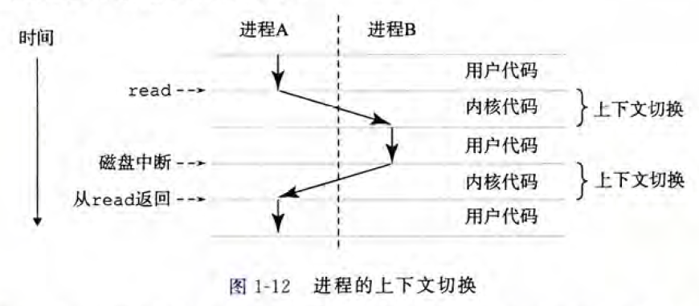

# 第一章-计算机系统漫游

## 源程序是如何存储的

hello.c源程序：

```c
#include <stdio.h>
int main()
{
	printf("hello,world\n");
	return 0;
}
```

源程序实际上就是一个由值**0和1组成的位（又称为比特）序列**，8个位被组织成一组，称为字节。每个字节表示程序中的某些文本字符。现代计算机都使用ASCII标准来表示文本字符。


hello.c程序是以**字节序列**的方式储存在文件中的。

hello.c的表示方法说明了一个基本思想：系统中所有的信息——包括磁盘文件、内存中的程序、内存中存放的用户数据以及网络上传送的数据，都是**由一串比特表示的**。区分不同数据对象的唯一方法是我们读到这些数据对象的**上下文**。

## 编译过程


### 预编译

1、处理所有的注释，以空格代替

2、将所有#define删除，并展开所有宏定义，字符串替换

3、处理条件编译指令#if，#ifdef，#elif，#else，#endif

4、处理#include，并展开被包含的文件，把头文件中的声明，全部拷贝到文件中。

5、保留编译器需要使用的#pragma指令

如何观察变化：输入预处理指令，可以看看不同文件经过预处理后变成什么样了，预处理指令：`gcc -E file.c -o file.i`  注意：-C -E一起使用是预编译的时候保留注释。

### 编译

1、对预处理文件进行一系列词法分析，语法分析和语义分析

-  词法分析：主要分析关键字，标示符，立即数等是否合法
-  语法分析：主要分析表达式是否遵循语法规则
-  语义分析：在语法分析的基础上进一步分析表达式是否合法

2、分析结束后进行代码优化生成相应的汇编代码文件，编译指令：`gcc -S file.c -o file.s`

### 汇编

汇编器将汇编代码转变为机器可以执行的指令，每个汇编语句几乎都对应一条机器指令，其实机器指令就是机器码，就是2进制码。

汇编指令：`gcc -c file.c -o file.o` 注意：-c是编译汇编不连接。

### 链接

再把产生的.o文件，进行链接就可以生成可执行文件。连接指令：`gcc file.o file1.o -o file` 这句指令是链接file.o和file1.o两个编译并汇编的文件，并生成可执行文件file。

链接分两种：**静态链接和动态链接**，静态链接是在编译器完成的，动态链接是在运行期完成的。静态链接的指令是：`gcc -static file.c -o file`对于一些没有动态库的嵌入式系统，这是常用的。

一般要想通过一条指令生成可执行文件的指令是：  `gcc file.c -o file`

## shell是什么

shell是一个命令行解释器，它输出一个提示符，等待输入一个命令行，然后执行这个命令。

如果该命令行的第一个单词不是一个内置的shell命令，那么 shell就会假设这是个可执行文件的名字，它将加载并运行这个文件。

## 系统的硬件组成


### CPU

中央处理单元（CPU），简称处理器，是执行存储在主存中指令的引擎。处理器的核心是一个大小为一个字的存储设备（或寄存器），称为程序计数器（PC）。在任何时刻，**PC都指向主存中的某条机器语言指令**（即含有该条指令的地址）。

处理器从程序计数器指向的内存处读取指令，解释指令中的位，执行该指令指示的简单操作，然后更新PCÿ 使其指向下一条指令，
而这条指令并不一定和在内存中刚刚执行的指令相邻。

这样的简单操作并不多，它们围绕着主存、寄存器文件（register file)和算术/逻辑单元(ALU)进行。寄存器文件是一个小的存储设备，由一些单个字长的寄存器组成，每个
寄存器都有唯一的名字。ALU 计算新的数据和地址值。

CPU可能执行以下这些操作：

- 加载：从主存复制一个字节或者一个字到寄存器，以覆盖寄存器原来的内容
- 存储：从寄存器复制一个字节或者一个字到主存的某个位置，以覆盖这个位置上原来的内容
- 操作：把两个寄存器的内容复制到ALU, ALU 对这两个字做算术运算，并将结果存放到一个寄存器中，以覆盖该寄存器中原来的内容
- 跳转：从指令本身中抽取一个字，并将这个字复制到程序计数器（PC）中，以覆盖
  PC 中原来的值

### Main memory

主存是一个临时存储设备，在处理器执行程序时，用来存放程序和程序处理的数据。

- 从物理上来说，主存是由一组动态随机存取存储器(DRAM)芯片组成的。
- 从逻辑上来说，存储器是一个线性的字节数组，每个字节都有其唯一的地址（数组索引），这些地址是从零开始的。

一般来说，组成程序的每条机器指令都由不同数量的字节构成。与C 程序变量相对应的数据项的大小是根据类型变化的。比如，在运行Linux 的X86-64 机器上，short 类型的数据
需要2 个字节，int 和float 类型需要4 个字节，而long 和double 类型需要8 个宇节。

### IO device

I/O(输入/输出）设备是系统与外部世界的联系通道。

- 输入：鼠标、键盘
- 输出：显示器、用于长期存储数据和程序的磁盘驱动器(简单地说就是磁盘）。最开始，可执行程序hello 就存放在磁盘上。

每个I/O 设备都通过一个控制器或适配器与I/O 总线相连，功能是在I/O总线和I/O设备之间传递信息。（控制器或适配器在于封装方式不同）

- 控制器是I/O 设备本身或者系统的主印制电路板（通常称作主板）上的芯片组
- 适配器则是一块插在主板插槽上的卡

### 总线

贯穿整个系统的是一组**电子通道**，称作总线。通常总线中传输的是**固定长度的字节块**，也就是字（word）。字中的字节数（字长）是一个基本的**系统参数**。不同系统字长不同。比如32位系统的字长为4个字节，64位系统的字长为8个字节。

## 运行helloc程序

shell读取到我们从键盘输入的“./hello”后，计算机中的信息流向如下图红线所示：

键盘->USB控制器->I/O总线->I/O桥->系统总线->寄存器

寄存器->系统总线->I/O桥->内存总线->主存

shell程序需要把用户输入的内容作为一个变量使用，而这个变量一定在内存中有个地址，所以它最终会到达内存。


当我们在键盘上敲回车键时， shell程序就知道我们已经结束了命令的输入。然后shell执行一系列指令来加载可执行的hello文件，这些指令将hello目标文件中的**代码和数据从磁盘复制到主存**。数据包括最终会被输出的字符串“ hello,world\n”。信息流向如下所示。


加载完hello文件后，CPU将会开始从hello程序的主函数处执行指令。这些指令将“hello,world\n”**字符串中的字节从主存复制到寄存器文件，再从寄存器文件中复制到显示设备**，最终显示在屏幕上。信息流向如下图所示。

主存->寄存器->系统总线->I/O桥->I/O总线->图形适配器->显示器


## 高速缓存

通过运行hello程序，我们可以知道，指令和数据需要多次在寄存器、主存、磁盘之间来回复制，这些复制其实就是开销，减慢了程序工作的速度。这个时候我们就需要**高速缓存存储器**（cache memory）来解决这个问题。


L1高速缓存的容量可以达到数万字节，访问速度几乎和访问寄存器文件一样快。

L2高速缓存容量为数十万到数百万字节，通过一条特殊的总线连接到处理器。进程访问L2高速缓存的时间要比访问L1高速缓存的时间长5倍，但是这仍然比访问主存的时间快5~10倍。

L1和L2高速缓存是用一种叫做 静态随机访问存储器（SRAM） 的硬件技术实现的。

**高速缓存局部性原理**：程序具有访问局部区域中的数据和代码的趋势。因此，高速缓存存储器作为**暂时的**集结区域，存放处理器**近期可能会需要的信息**。


存储器层次结构的主要思想是上一层的存储器作为低一层存储器的高速缓存。因此，
寄存器文件就是L1 的高速缓存，L1 是L2 的高速缓存，L2 是L3 的高速缓存，L3 是主存
的高速缓存，而主存又是磁盘的高速缓存。在某些具有分布式文件系统的网络系统中，本
地磁盘就是存储在其他系统中磁盘上的数据的高速缓存。

正如可以运用不同的高速缓存的知识来提高程序性能一样，程序员同样可以利用对整
个存储器层次结构的理解来提高程序性能。

## 操作系统管理硬件

当shell 加载和运行hello 程序时，以及hello 程序输出自己的消息时，shell 和hello 程序都没有直接访问键盘、显示器、磁盘或者主存。真正实现操作的是操作系统。

操作系统是应用程序和硬件之间插入的一层软件。所有应用程序对硬件的操作尝试都必须通过操作系统。

**操作系统有两个基本功能**：  
（1）防止硬件被失控的应用程序滥用；  
（2）向应用程序提供简单一致的机制来控制复杂而又通常大不相同的底层硬件设备。


**操作系统通过几个基本的抽象概念**（进程、虛拟内存和文件）来实现这两个功能：  
（1）文件是对I/O设备的抽象表示，  
（2）虚拟内存是对主存和磁盘I/O设备的抽象表示，  
（3）进程则是对处理器、主存和I/O设备的抽象表示。


## 进程&线程

进程是操作系统对一个正在运行的程序的一种抽象。在一个系统上可以**同时运行多个进程**，而每个进程都好像在**独占地使用硬件**。而并发运行，则是说一个进程的指令和另个进程的指令是交错执行的。

上下文：操作系统保持和跟踪进程运行所需的所有状态信息（PC值，主存的内容等）。

上下文切换：操作系统通过控制处理器在**进程间切换**以达到交错执行的目的。

示例场景中有两个并发的进程：shell 进程和hello 进程。最开始，只有shell 进程在运行，即等待命令行上的输人。当我们让它运行hello 程序时，shell 通过调用一个专门的函数，即系统调用，来执行我们的请求，系统调用会将控制权传递给操作系统。  
操作系统保存shell 进程的上下文，创建一个新的hello 进程及其上下文，然后将控制权传给新的hello 进程。hello 进程终止后，操作系统恢复shell 进程的上下文，并将控制权传回给它，shell 进程会继续等待下一个命令行输人。


如图1-12 所示，一个进程到另一个进程的转换是由操作系统内核（ kernel）管理的。内核是操作系统代码常驻主存的部分。  
当应用程序需要操作系统的某些操作时，比如读写文件，它就执行一条特殊的系统调用（system call）指令，将控制权传递给内核。然后内核执行被请求的操作并返回应用程序。  
注意，内核不是一个独立的进程。相反，它是系统管理全部进程**所用代码和数据结构的集合**。



一个进程由多个称为线程的执行单元组成，**每个线程都运行在进程的上下文中，并共享同样的代码和全局数据**。多线程比多进程更容易共享数据，而且线程间切换所有的开销要远小于进程切换。


## 虚拟内存

虚拟内存是一个抽象概念，它为每个进程提供了一个假象，即**每个进程都在独占地使用主存**。每个**进程看到的内存都是一致的**，称为虚拟地址空间。

下图将虚拟地址空间分为了若干个部分，并用箭头表示该部分的扩展方向。最下端地址为0，向上地址逐渐增长。每个部分作用如下：

**程序代码和数据:** 存放可执行程序代码和代码中的全局变量。

**堆:** 用于动态申请的内存变量，比如`malloc`函数申请的动态内存空间，可以向上扩展。

**共享库:** 用于存放C语言库函数的代码和数据。本例中即`printf`的代码和数据。

**栈：** 位于虚拟地址空间的顶部，用于函数调用、存放局部变量等。当我们调用一个函数时，栈会向下扩展，返回时，向上收缩。

**内核虚拟内存**: 地址空间顶部的区域是为内核保留的。不允许应用程序读写这个区域的内容或者直接调用内核代码定义的函数。相反，它们必须调用内核来执行这些操作。对于一个64位的操作系统来说，用户空间为0-3G,内核空间为3G-4G。


## 文件

文件就是字节序列，仅此而已。每个I/O 设备，包括磁盘、键盘、显示器，甚至网络，都可以看成是文件。系统中的所有输入输出都是通过使用一小组称为Unix I/O 的系统函数调用读写文件来实现的。


## 系统之间利用网络通信

1、当我们在ssh的客户端中输入hello字符串并且敲下回车之后

2、客户端的软件就会通过网络将字符串发送到ssh服务端

3、ssh服务端从网络端接收到这个字符串以后，会将这个字符串传递给远程主机上的shell程序，然后shell负责hello程序的加载，运行结果返回给ssh的服务端

4、最后ssh的服务端通过网络将程序的运行结果发送给ssh的客户端

5、ssh客户端在屏幕上显示运行结果


## 重要主题

### 阿姆达尔定律


当我们对系统的某一部分进行加速时，被加速部分的重要性和加速程度时影响整个系统性能的关键因素。

笼统地将程序分为两部分，一部分时不可加速的，一部分可加速：

可加速部分的执行时间为`a*Told`，不可加速部分的执行时间为`Told-a*Told`


程序经过优化后，可加速部分性能提升比例为K，那么经过加速后，可加速部分花费时间为`(a*Told)/k`


因此程序经过加速后所花费的时间Tnew为：


此时加速比S=Told/Tnew：


假设a=0.6，k=3，得出加速比为1.67：


考虑极限情况，K趋向于无穷大，就是把60%的部分加速到几乎不花时间的程度，整个系统获得静加速比为2.5，


因此在计算机世界里，如果把性能提升2被或者更多，只有优化大部分的组件才能获得。

**如何获得更高的计算能力**：

- 线程级并发
- 指令级并行
- 单指令，多数据并行

### 线程级并发

**增加CPU核心数**：

下图中处理器芯片具有四个CPU核心，每个CPU核心都有自己的L1 cache和L2 cache，四个CPU核心共享L3 cache，这4个CPU核心集成在一颗芯片上。  
对于服务器的高性能芯片，单颗芯片集成的CPU数量高达几十个，甚至上百个；通过增加CPU的核心数，可以提高系统的性能。


**超线程**：

单个CPU核心实现超线程：在CPU内部，像程序计数器和寄存器文件这样的硬件部件有多个备份，而像浮点运算部件这个样的硬件还是只有一份。  
常规单线程处理器在做线程切换时，大概需要20000个时钟周期。而超线程处理器可以在单周期的基础上决定执行哪一个线程，CPU可以更好地利用它的处理资源。  
当一个线程因为读取数据而进入等待状态时，CPU可以去执行另外一个线程，其中线程之间的切换只需要极少的时间代价。


### 指令级并行

现代处理器可以同时执行多条指令的属性称为指令级并行。

每条指令从开始到结束需要长得多的时间，大约20 个或者更多周期，但是处理器使用了非常多的聪明技巧来同时处理多达100条指令。

近几年的处理器可以保持每个周期2~4条指分的执行速率.


### 单指令多数据

在最低层次上，许多现代处理器拥有特殊的硬件，允许一条指令产生多个可以并行执行的操作，这种方式称为单指令、多数据，即SIMD 并行。

SIMD 指令多是为了提高处理影像、声音和视频数据应用的执行速度。

虽然有些编译器会试图从C 程序中自动抽取SIMD 并行性，但是更可靠的方法是用编译器支持的特殊的向量数据类型来写程序，比如GCC 就支持向量数据类型。


### 并行&并发

**并行**：指在同一时刻，有**多条指令在多个处理器上同时执行**。所以无论从微观还是从宏观来看，二者都是一起执行的。


**并发**：指在同一时刻只能有一条指令执行，但多个进程指令被快速的**轮换执行**，使得在宏观上具有多个进程同时执行的效果，但在微观上并不是同时执行的，只是**把时间分成若干段，使多个进程快速交替的执行**。


### 虚拟机

虚拟机是对整个计算机系统的抽象，包括操作系统、处理器以及程序  


