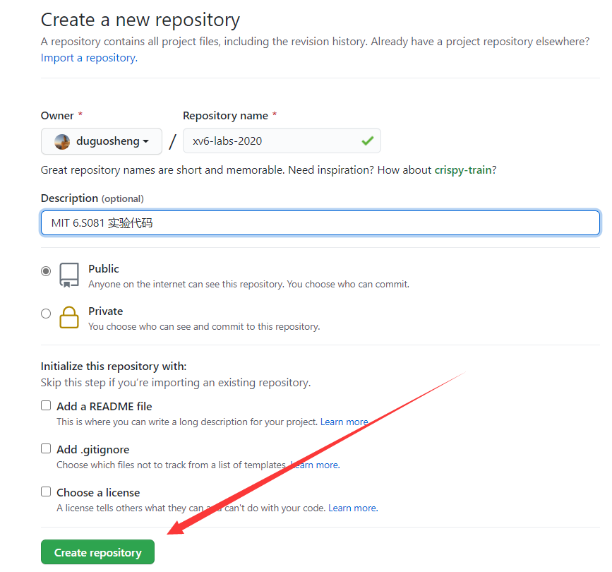
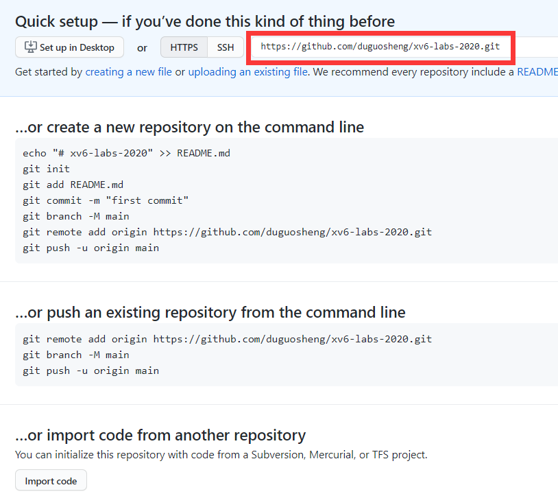
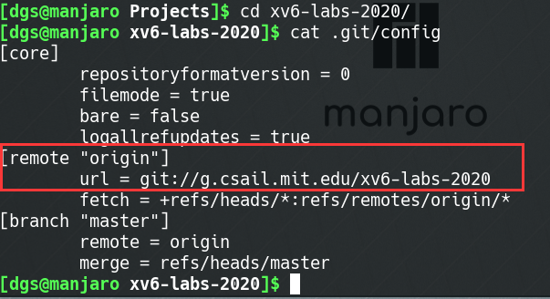
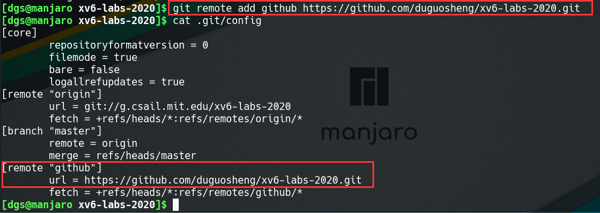
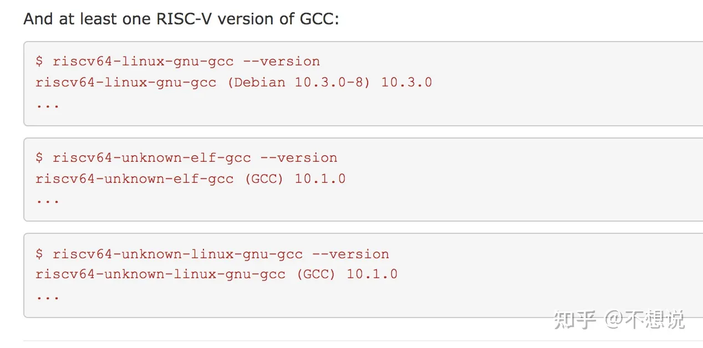
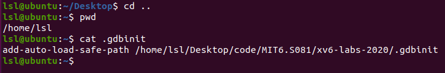
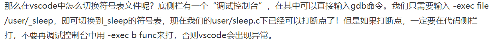
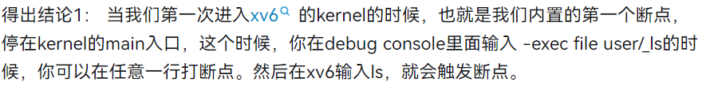

# 将实验代码提交到github

> [!DANGER]
> MIT 6.S081 这门课程每个lab对应一个git分支，所以请不要擅自将***.git***目录删除或更改origin指向的仓库地址

(1).  **首先将mit的实验代码克隆到本地**

```bash
git clone git://g.csail.mit.edu/xv6-labs-2020
```

(2). **在github创建一个新的空仓库**

创建完成后会有提示代码，请**不要**根据提示代码操作，并且记下右图中红色标注的仓库地址




(3). **添加git仓库地址**

查看本地仓库的git配置文件，可以看到***origin***主机名下已经有了对应的上游仓库地址

```bash
cd xv6-labs-2020/
cat .git/config
```



因此我们不要使用***origin***，可以使用其他主机名对应到github仓库，例如，我使用***github***

```bash
git remote add github 你的仓库地址
cat .git/config
```




(4). **`git push`命令**

- **功能**：`git push`命令用于从将本地的分支版本上传到远程并合并。
- **命令格式**：

```bash
git push <远程主机名> <本地分支名>:<远程分支名>
```

如果本地分支名与远程分支名相同，则可以省略冒号：

```bash
git push <远程主机名> <本地分支名>
```

更多用法请自行搜索


(5). **将实验代码推送github仓库**

例如：将实验1用到的***util***分支推送到github

```bash
git checkout util
git push github util:util
```

需要你输入账户密码，提交就成功了

其他实验仓库的提交同理


(6). **xv6实验git分支建议**

建议是每个实验创建一个测试分支，例如对于***util***来说

```bash
git checkout util         # 切换到util分支
git checkout -b util_test # 建立并切换到util的测试分支
```

当你在***util_test***分支中每测试通过一个作业，请提交（`git commit`）你的代码，并将所做的修改合并（`git merge`）到***util***中，然后提交（`git push`）到github

```bash
git add .
git commit -m "完成了第一个作业"
git checkout util
git merge util_test
git push github util:util
```

(7). **其他**

你还可以添加gitee，防止github有时无法访问的问题

# 在Ubuntu20.04上搭配好环境

安装所有的依赖软件包

```bash
sudo apt-get install git build-essential gdb-multiarch qemu-system-misc gcc-riscv64-linux-gnu binutils-riscv64-linux-gnu 
```

成功的验证：

```bash
# in the xv6 directory
$ make qemu
# ... lots of output ...
init: starting sh
$
```

```bash
$ qemu-system-riscv64 --version
QEMU emulator version 5.1.0
```



# vscode debug环境配置

## 在终端调试

第一个shell

```bash
make qemu-gdb # qemu会卡住，等待gdb与它连接
```

退出 qemu : `Ctrl-a x`。

第二个shell

在调试前需要设置.gbdinit路径



```bash
gdb-multiarch

# 执行make qemu，ls.c会被编译成el文件_ls，并保存在xv6的文件系统中
(gdb) file user/_ls # ls的符号表位于user/_ls，首先载入符号表
(gdb) b main # 在main函数上打断点
(gdb) c # continue继续执行
```

退出gdb调试：1）q 回车   2）ctrl+d	

## 在vscode调试

### 1、配置task.json和launch.json

task.json

```json
// .vscode/tasks.json
{
    "version": "2.0.0",
    "tasks": [
        {
            "label": "xv6build",
            "type": "shell",
            "isBackground": true,
            "command": "make qemu-gdb",
            "problemMatcher": [
                {
                    "pattern": [
                        {
                            "regexp": ".",
                            "file": 1,
                            "location": 2,
                            "message": 3
                        }
                    ],
                    "background": {
                        "beginsPattern": ".*Now run 'gdb' in another window.",
                        // 要对应编译成功后,一句echo的内容. 此处对应 Makefile Line:170
                        "endsPattern": "."
                    }
                }
            ]
        }
    ]
}
```

launch.json

```json
// .vscode/launch.json
{
    // 使用 IntelliSense 了解相关属性。 
    // 悬停以查看现有属性的描述。
    // 欲了解更多信息，请访问: https://go.microsoft.com/fwlink/?linkid=830387
    "version": "0.2.0",
    "configurations": [
        {
            "name": "xv6debug",
            "type": "cppdbg",
            "request": "launch",
            "program": "${workspaceFolder}/kernel/kernel",
            "stopAtEntry": true,
            "cwd": "${workspaceFolder}",
            "miDebuggerServerAddress": "127.0.0.1:26000", //见.gdbinit 中 target remote xxxx:xx
            "miDebuggerPath": "/usr/bin/gdb-multiarch", // which gdb-multiarch
            "MIMode": "gdb",
            "preLaunchTask": "xv6build"
        }
    ]
}
```

### 2、make qemu会产生.gdbinit文件

### 3、修改.gdbinit和.gdbinit.tmpl-riscv文件

.gdbinit

连接会被建立两次，一次有vscode触发，一次由.gdbinit触发，会出错，所以要注释掉(或者@REM)

```
set confirm off
set architecture riscv:rv64
#target remote 127.0.0.1:26000 
symbol-file kernel/kernel
set disassemble-next-line auto
set riscv use-compressed-breakpoints yes
```

.gdbinit.tmpl-riscv

```
set confirm off
set architecture riscv:rv64
target remote 127.0.0.1:1234
symbol-file kernel/kernel
set disassemble-next-line auto
set riscv use-compressed-breakpoints yes
```

### 4、vscode进入第一个缎带你

在vscode中点击调试按钮，程序即可到达我们内置的第一个断点，kernel main的入口：




