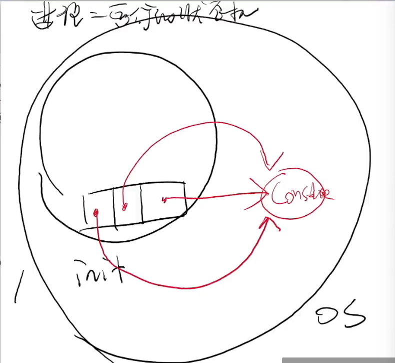
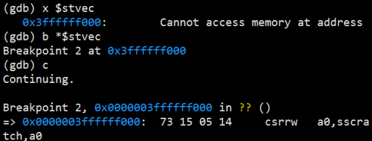

## overview

- 应用视角的操作系统：对象+API
  - 把操作系统当成提供服务的”黑盒子“

操作系统就是一组操作系统里的对象,和一组可以控制这些对象的API对吧

- 这些对象可以是进程
  也就是状态机
- 可以是可以进程之间通信的管道
- 也可以是一个数据文件，只允许你使用那些计算的指令的话, 你其实是做不到这一点的, 你必须要借助一条系统调用的指令

## 启动

make qemu：启动了一个qemu-system-riscv64 -machine virt的虚拟机

## 操作系统调用

xv6中有最常用的系统调用，不算网络编程的，这个api就足够完成所有lab

- 就是这些api，支撑了操作系统相当大的一部分功能

## 项目的构建与运行

- mkfs：是文件系统的工具
- kernel是操作系统的内核
- user就是一些用户程序

RTFSC: Makefile

- 相比 AbstractMachine (跨平台/体系结构) 容易很多

- 先找到构建目标

  - 然后老规矩: `make -nB`，方便查看编译的所有过程

    ```markdown
    -n（--dry-run）:
    
    模拟运行：显示 make 将要执行的命令，但不会实际执行任何操作（如编译、文件修改）。
    
    用途：检查构建流程是否正确，或查看哪些目标会被重新构建。
    
    -B（--always-make）:
    
    强制重建：无视文件时间戳，强制重新构建所有目标（即使文件已是最新）。
    
    用途：确保所有步骤从头开始执行（类似 make clean && make，但更直接）。
    
    组合效果 -nB
    显示强制重建时的完整命令流程，但不会实际执行这些命令。
    
    相当于回答：“如果我现在强制全部重新构建，会执行哪些操作？”
    ```

  - 你可以根据需要修改一些配置

    - 优化等级、CPU 数、编译指令等
    - smp：多处理器的个数，改为1，方便调试；在不希望调多处理器并行的时候；大幅简化调试流程

编译操作系统实际上就是编译、链接，然后加载的过程

------

复习：“程序的执行 (状态变化序列) 有时比代码 (状态机) 更容易理解”

- 可以用于配制 vscode
  - Quick quiz: 如何自动生成 `compile_commands.json`?

> - 文件有编译选项，每个文件的编译选项（就是宏）可能不一样，在vscode可能不生效
>
> - 系统有一个Bear工具，叫Build Ear
>
>   - 专门为编译生成所有的编译选项，试图去劫持编译器，把编译选项扒出来
>
>   - 相当于把这个程序包起来，这个程序相当于子进程，（bear应该是用hook实现的）
>
>     ```shell
>     bear make qemu
>     ```
>
>     这个时候compile_commands.json就都有了，比如说编译kalloc.c的选项是这些，这样vscode里的宏就会生效
>
>     ```json
>     {
>         "arguments": [
>             "riscv64-linux-gnu-gcc",
>             "-c",
>             "-Wall",
>             "-Werror",
>             "-O",
>             "-fno-omit-frame-pointer",
>             "-ggdb",
>             "-DSOL_UTIL",
>             "-mcmodel=medany",
>             "-ffreestanding",
>             "-fno-common",
>             "-nostdlib",
>             "-mno-relax",
>             "-I.",
>             "-fno-stack-protector",
>             "-fno-pie",
>             "-no-pie",
>             "-o",
>             "kernel/kalloc.o",
>             "kernel/kalloc.c"
>         ],
>         "directory": "/home/lsl/Desktop/code/study/MIT6.S081/xv6-labs-2020",
>         "file": "kernel/kalloc.c"
>     },
>     ```
>
>   - 工具就是第一生产力，

.gdbinit这个文件是xv6生成的：gdb刚启动需要做很多gdb的命令，每次需要重新输；这个文件可以在每次gdb运行的时候，都默认执行这些脚本（学习打断点之类的操作，如果每次都需要做，甚至可以直接写入到该文件中）

```
set confirm off
set architecture riscv:rv64
# target remote 127.0.0.1:26000
symbol-file kernel/kernel
set disassemble-next-line auto
set riscv use-compressed-breakpoints yes
```


## 代码导读

### init

user/init.c：第一个用户态的进程

```c
// init: The initial user-level program

#include "kernel/types.h"
#include "kernel/stat.h"
#include "kernel/spinlock.h"
#include "kernel/sleeplock.h"
#include "kernel/fs.h"
#include "kernel/file.h"
#include "user/user.h"
#include "kernel/fcntl.h"

char *argv[] = { "sh", 0 };

int
main(void)
{
  int pid, wpid;

  // 打开一个叫console的文件
  // 打开失败，创造一个，然后再打开
  if(open("console", O_RDWR) < 0){
    mknod("console", CONSOLE, 0);
    open("console", O_RDWR);
  }
  dup(0);  // stdout
  dup(0);  // stderr

  for(;;){
    printf("init: starting sh\n");
    pid = fork();
    if(pid < 0){
      printf("init: fork failed\n");
      exit(1);
    }
    if(pid == 0){
      exec("sh", argv);
      printf("init: exec sh failed\n");
      exit(1);
    }

    for(;;){
      // this call to wait() returns if the shell exits,
      // or if a parentless process exits.
      wpid = wait((int *) 0);
      if(wpid == pid){
        // the shell exited; restart it.
        break;
      } else if(wpid < 0){
        printf("init: wait returned an error\n");
        exit(1);
      } else {
        // it was a parentless process; do nothing.
      }
    }
  }
}

```

进程=运行的状态机，然后这个进程在初始的时候，他其实一个文件描述符都没有对吧

操作系统上运行的所有程序都有stdin，stdout和stderr这3个文件描述符

- 操作系统刚启动时可能什么东西都没有，它要调用几个系统调用，
- 先要试图去打开console，打开失败先用系统调用把console创建出来，再系统调用open打开
- 然后两个dup(0)，打开stdout、stderr

最初的进程开始init执行代码以后，就做了以上这些事情



然后不断地fork、exec，不断重复这个循环，就是sh程序

每次ctrl+D结束输入的话，这个sh会再次启用，所以程序不会终止，操作系统是不会终止的，


可以看看用户程序是怎么编译出来的，

```json
{
    "arguments": [
        "riscv64-linux-gnu-gcc",
        "-c",
        "-Wall",
        "-Werror",
        "-O",
        "-fno-omit-frame-pointer", // 可以做back trace
        "-ggdb",
        "-DSOL_UTIL",
        "-mcmodel=medany",
        "-ffreestanding",
        "-fno-common",
        "-nostdlib", // 没有标准库
        "-mno-relax",
        "-I.",
        "-fno-stack-protector",
        "-fno-pie",
        "-no-pie",
        "-o",
        "user/ln.o",
        "user/ln.c"
    ],
    "directory": "/home/lsl/Desktop/code/study/MIT6.S081/xv6-labs-2020",
    "file": "user/ln.c"
},
```

一个可执行的二进制文件shell

- -e entry，入口地址是main
- -Ttext，是0，它期望加载是0的地方
- -o user/_sh，所以说所有下划线开头的才是真正的可执行文件
- 然后把底下的四个文件都链接到一起


xv6的进程有一个这样的初始状态，就是操作系统进程的地址空间

- trampoline、trapframe是操作系统持有的，进程是访问不了的


### initcode

可执行文件前头没有下划线，所以它不会被加载到操作系统，而是在xv6里

- userinit()会在系统基本接近于初始化完毕的时候，会创建出第一个进程，这个进程就是initcode  

  ```c
  // kernel/proc.c
  
  // a user program that calls exec("/init")
  // od -t xC initcode
  uchar initcode[] = {
    0x17, 0x05, 0x00, 0x00, 0x13, 0x05, 0x45, 0x02,
    0x97, 0x05, 0x00, 0x00, 0x93, 0x85, 0x35, 0x02,
    0x93, 0x08, 0x70, 0x00, 0x73, 0x00, 0x00, 0x00,
    0x93, 0x08, 0x20, 0x00, 0x73, 0x00, 0x00, 0x00,
    0xef, 0xf0, 0x9f, 0xff, 0x2f, 0x69, 0x6e, 0x69,
    0x74, 0x00, 0x00, 0x24, 0x00, 0x00, 0x00, 0x00,
    0x00, 0x00, 0x00, 0x00
  };
  ```

  `riscv64-linux-gnu-objdump -d initcode.out`: 这条命令的作用是使用 **RISC-V 架构的交叉工具链** 中的 `objdump` 工具，对 `initcode.out` 文件进行**反汇编**，并显示其汇编代码

  把7放到寄存器a7里面，执行ecall指令

  ```
  lsl@ubuntu:~/Desktop/code/study/MIT6.S081/xv6-labs-2020/user$ riscv64-linux-gnu-objdump -d initcode.out
  
  initcode.out：     文件格式 elf64-littleriscv
  
  
  Disassembly of section .text:
  
  0000000000000000 <start>:
     0:	00000517          	auipc	a0,0x0
     4:	02450513          	addi	a0,a0,36 # 24 <init>
     8:	00000597          	auipc	a1,0x0
     c:	02358593          	addi	a1,a1,35 # 2b <argv>
    10:	00700893          	li	a7,7
    14:	00000073          	ecall
  
  0000000000000018 <exit>:
    18:	00200893          	li	a7,2
    1c:	00000073          	ecall
    20:	ff9ff0ef          	jal	ra,18 <exit>
  
  0000000000000024 <init>:
    24:	696e692f          	0x696e692f
    28:	0074                	addi	a3,sp,12
  	...
  
  000000000000002b <argv>:
    2b:	0024                	addi	s1,sp,8
    2d:	0000                	unimp
    2f:	0000                	unimp
    31:	0000                	unimp
  	...
  
  ```

- xv6在操作系统里创建的第一个状态机，实际上就是一小段汇编代码；这一小段initcode会执行exec，然后执行`_init`，然后`_init`在执行init节中的代码  
  
- initcode这一小部分跳板代码，直接用uvminit创建一个新的地址空间，然后把initcode这部分代码搬进来，搬进来，然后就可以让第一个进程去执行

```c
// Set up first user process.
void
userinit(void)
{
  struct proc *p;

  p = allocproc();
  initproc = p;
  
  // allocate one user page and copy init's instructions
  // and data into it.
  uvminit(p->pagetable, initcode, sizeof(initcode));
  p->sz = PGSIZE;

  // prepare for the very first "return" from kernel to user.
  p->trapframe->epc = 0;      // user program counter
  p->trapframe->sp = PGSIZE;  // user stack pointer

  safestrcpy(p->name, "initcode", sizeof(p->name));
  p->cwd = namei("/");

  p->state = RUNNABLE;

  release(&p->lock);
}
```

然后继续调试，`(gdb) x/10i 0`（x: examine命令，查看内存内容；`/10i`: 指定显式的格式和数量，10：显式10个条目，i以指令的形式显式内存内容，及反汇编；0：内存地址，表示从地址0开始查看）

si：执行当前程序中的下一条机器码指令


**然后继续**

```shell
(gdb) p $a7 # 状态机a7是7
$1 = 7
```

ecall：跳转到stvec，然后改变它的值


然后在寄存器stvec打一个断点，continue，此时只执行了一条ecall指令



此时查看状态，


本质：一条指令有它自己固定的含义，ecall指令就是提高程序的权限，但是要跳转到一个特定的地方，这个地方就是trampoline

**Trampoline (跳板)**

trampoline.S (汇编代码)

- 对 ecall 瞬间的状态做快照，就是保存到trapframe中（保存到地址空间的下一段3ffffff000）

  - 填充 `struct trapframe` (proc.h)

  - 利用 \$sscratch (S-mode scratch) 保存所有寄存器

  - 切换到内核栈 (相当于切换到进程对应的 “内核线程”, [L2](https://jyywiki.cn/OS/2022/labs/L2.html))

  - 切换到内核地址空间

    - 修改 \$satp (S-mode address translation and protection)
    - sfence.vma

  - 跳转到

    ```
    tf->kernel_trap
    ```

    - 痛苦时间解除，进入 C 代码

**继续**

对于xv6的进程，执行ecall，xv6进程的地址空间上面有两页，

- ecall完了以后，pc就指向最上面，trampoline跳板，trampoline.s的内容
- 然后是trapframe宏

现在有一个临时寄存器的可以用，就是sscratch，该寄存器就赋值成了trapframe的地址

这个sscratch寄存器，用户进程是看不见的，操作系统留了一个寄存器在自己手上，这时发生作用，和a0寄存器的值临时交换

```
layout asm
```


然后si一直执行下去，把当前ecall瞬间所有的寄存器都保存到trapframe那个寄存器里面去

然后再把sscratch那个寄存器换回来了，又把a0换回来了


然后会执行一个csrw，会把satp这个寄存器（系统模式下和页地址翻译相关的寄存器）

总结：执行了一系列的指令，这些指令会把ecall所有用户的寄存器现场都保存到trapframe，  
然后执行一个satp，把页表切回内核的页表，这时的地址空间就发生了变化


观察可发现：`0000003ffffff000 0000000080007000 0000000000001000 r-x--a-`：代码还在（才能继续执行程序），但是多了很多一一映射的地址，  
这个时候其实我们已经切换到了内核代码执行了

然后进入了usertrap的C语言代码


通过vscode也可以看到进程trapframe，然后可以看到进程里面的各种变量；此时可以完整地调试操作系统的C语言程序代码，（刚才有一段很小的汇编，把ecall瞬间所有的状态寄存器保存了下来，存下来后就可以以普通的数据结构的方式去访问他了）


- 打开中断
- 执行syscall的函数

```c
intr_on();

syscall();
```

- 会把系统调用的编号取出来，num这里是7
- 然后去查一张表syscalls，找到SYS_exec对应于sys_exec（第7个系统调用）
- 然后就会进入sys_exec，

```c
void
syscall(void)
{
  int num;
  struct proc *p = myproc();

  num = p->trapframe->a7;
  if(num > 0 && num < NELEM(syscalls) && syscalls[num]) {
    p->trapframe->a0 = syscalls[num]();
  } else {
    printf("%d %s: unknown sys call %d\n",
            p->pid, p->name, num);
    p->trapframe->a0 = -1;
  }
}

static uint64 (*syscalls[])(void) = {
[SYS_fork]    sys_fork,
[SYS_exit]    sys_exit,
[SYS_wait]    sys_wait,
[SYS_pipe]    sys_pipe,
[SYS_read]    sys_read,
[SYS_kill]    sys_kill,
[SYS_exec]    sys_exec,
[SYS_fstat]   sys_fstat,
[SYS_chdir]   sys_chdir,
[SYS_dup]     sys_dup,
[SYS_getpid]  sys_getpid,
[SYS_sbrk]    sys_sbrk,
[SYS_sleep]   sys_sleep,
[SYS_uptime]  sys_uptime,
[SYS_open]    sys_open,
[SYS_write]   sys_write,
[SYS_mknod]   sys_mknod,
[SYS_unlink]  sys_unlink,
[SYS_link]    sys_link,
[SYS_mkdir]   sys_mkdir,
[SYS_close]   sys_close,
};
```

然后解析参数，exec要执行的是/init


```c
uint64
sys_exec(void)
{
  char path[MAXPATH], *argv[MAXARG];
  int i;
  uint64 uargv, uarg;

  if(argstr(0, path, MAXPATH) < 0 || argaddr(1, &uargv) < 0){
    return -1;
  }
```

汇编做的事情知道了，然后C的事情就是它得到了一个这样的状态机

- 被封存到了一段内存trapframe中（这段内存是preprocess）


**进入qemu的monitor**

可以看到整个计算机系统当前的状态

- 我们的进程从0开始的内存是可读可写可执行，而且user可以访问，所以我们的pc访问0x14是合法的
- 但是0x3ffffff00是可读可执行，且user是访问不了的，说明处理器做了存储保护

以下就是内存地址空间，u就是用户可以访问的，然后下面两个就是内核才可以访问的

`0000003ffffff000 0000000080007000 0000000000001000 r-x--a-`：代码

`0000003fffffe000 0000000087f76000 0000000000001000 rw---a-`：数据


**例子：**

syscall是一个黑盒，我们不知道操作系统里面干了什么，但是它可以把我们进程里的一部分状态改变；比如说read buf，buf里被操作系统写入了值


## 调试

使用vscode调试时，要将.gdbinit的以下行注释掉，与vscode有一点冲突（因为gdb连接被建立两次，一次vscode触发，一次gdbinit触发，会出错；只使用gdb调试就不需要）：

```
set confirm off
set architecture riscv:rv64
# target remote 127.0.0.1:26000
symbol-file kernel/kernel
set disassemble-next-line auto
set riscv use-compressed-breakpoints yes
```

然后vscode直接F5调试，会在main.c的第一行停下来

## qemu快捷键

`ctrl+a` 然后`c`可以切换到monitor

`ctrl+a` 然后`x`可以推出qemu

xv6是运行在一个qemu的模拟器里面的，  
qemu是有一个monitor的, 然后如果有一个图形界面的话, 如果如果有一个图形界面的话, 那么你你可以按CTRL加二进入那个monitor, 但是你即便没有图形界面, 实际上你也可以在这里进入monitor

monitor

- 然后可以info mem，可以看到所有的地址空间  
  虚拟地址 物理地址 size attr  
- info register

## 项目文件

### kernel

- kernel.ld：链接的脚本

-  最终所有的文件链接成一个叫做kernel的二进制代码  

  ```shell
  lsl@ubuntu:~/Desktop/code/study/MIT6.S081/xv6-labs-2020$ file kernel/kernel
  kernel/kernel: ELF 64-bit LSB executable, UCB RISC-V, version 1 (SYSV), statically linked, with debug_info, not stripped
  # 64位的可执行文件，然后RISC-V
  ```

#### user


- 有shell
- initcode

这就是用户态的各种各样的程序

- 用了硬编码，如果是以下划线开头的可执行文件，就会拷到文件系统里
- make fs时创建文件系统时，就会把这些可执行文件拷到文件系统里，操作系统内核就可以看到这些文件，然后加载它们

xv6在编译的过程中，产生：

- sh.o：目标文件
- sh.d：用了gcc的编译选项，生成了dependence文件，  使得makefile能够识别依赖关系 
- sh.asm：整个文件的汇编，方便调试阅读

