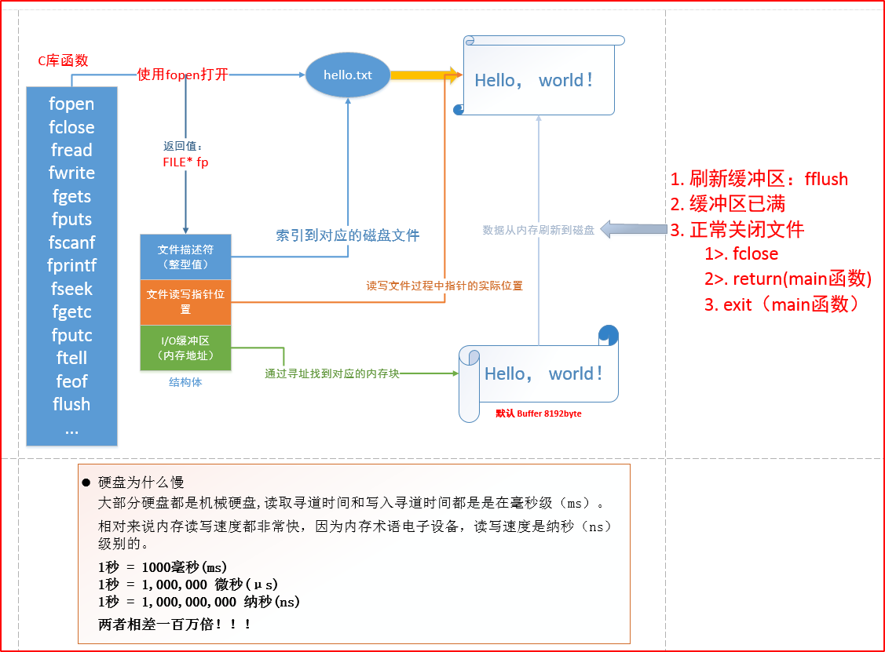

## Linux系统IO函数

### C库IO函数工作流程



缓存满了再刷到硬盘上，提高效率

- fflush：不管满没满直接刷到硬盘上
- 满了自动写到硬盘上
- 调用close不管满没满，都会写到硬盘上；
  main函数中的return，exit也会把缓冲区的数据写到硬盘上


### 库函数和系统函数的关系

FILE* 返回值


FD：文件描述符

FP_POS：文件读写指针位置

BUFFER：I/O缓冲区（内存地址），C库函数帮我们维护的一个缓冲区

> write只能对用户空间（0-3G）操作，sys_write能对内核空间（3-4G）操作
>
> 内核里面维护了一些驱动，就会调用设备驱动，硬盘、键盘、显示器之类
>
> 这里调用显示器的驱动，让驱动把这个字符串做一个显示，显示器就能在硬件层面上把printf打印的字符创输出到屏幕上

重点：

- fopen是C库IO函数，返回的是一个执行文件结构的指针FILE*
- 而write是系统调用，返回的是文件句柄，文件的句柄是文件在文件描述符表里的索引，int类型


### 1.pcb和文件描述符

位于内核区

1、文件描述符

- int 类型
- 一个进程最多可打开多少文件

2、pcb

- 进程控制块
- ==在其中有一个文件描述符表 ——数组[s1024]==


### 2.虚拟地址空间

程序启动起来之后，从硬盘上会有一块虚拟内存给程序分配出来，并不是实际4G，而是用了多少就多少，没有被使用的还放着。

- 3G-4G内核区，不允许用户去操作的
- 0-3G用户区，有用户操作
- 代码段，main函数就从代码段开始执行；静态库每次放的位置都是固定的，绝对地址
  已被初始化的全局变量，已初始化不等于0
  未被初始化的全局变量，未初始化等于0
  堆 —— 分配空间从下往上，new malloc
  共享库      动态库加载的位置不定，相对地址
  栈 —— 分配空间从上往下
  命令行参数
  环境变量
  内核区


0-4k的受保护地址不允许用户区访问

```bash
file hello.txt ## 可以查看文件的类型
```


> cpu 为什么要使用虚拟地址空间与物理地址空间映射？解决了什么样的问题？

1.方便编译器和操作系统安排程序的地址分布。
		程序可以使用==一系列相邻的虚拟地址来访问物理内存中不相邻的大内存缓冲区==。
2.方便进程之间隔离
		不同进程使用的虚拟地址彼此隔离。一个进程中的代码无法更改正在由另一进程使用的物理内存。	
3.方便OS使用你那可怜的内存。
		程序可以使用一系列虚拟地址来访问大于可用物理内存的内存缓冲区。当物理内存的供应量变小时，
		内存管理器会将物理内存页（通常大小为 4 KB）保存到磁盘文件。数据或代码页会根据需要在物理内存与磁盘之间移动。


4、读大文件 —— 写入另一个文件

两种方式：

read write —— 每次读1个byte

getc putc —— 每次读1个byte —— ==效率高==

- 标准c库函数，内部有一个缓冲区


## 系统IO函数/系统调用

系统调用函数都必须考虑返回值

### open

```c
函数原型：
int open(const char *pathname, int flags);
int open(const char *pathname, int flags, mode_t mode);
	pathname：文件的相对或绝对路径
	flags：打开方式
		必选项
			O_RDONLY 只读打开
			O_WRONLY 只写打开
			O_RDWR 可读可写打开
			互斥
		可选项
			O_APPEND 表示追加。
				如果文件已有内容，这次打开文件所写的数据附加到文件的末尾而不覆盖原来的内容。
			O_CREAT 若此文件不存在则创建它。
				使用此选项时需要提供第三个参数mode，表示该文件的访问权限。
				文件权限由open的mode参数和当前进程的umask掩码共同决定
					0777 & (~0002) = 0775
                     111111111
                     111111101
                         &
                     111111101
			O_EXCL 如果同时指定了O_CREAT，并且文件已存在，则出错返回。
			O_TRUNC 如果文件已存在，则将其长度截断（Truncate）为0字节。
			O_NONBLOCK 设置文件为非阻塞状态
常见错误
	1. 打开文件不存在 
	2. 以写方式打开只读文件(打开文件没有对应权限)
	3. 以只写方式打开目录
```


### close

```c
参数：open函数的返回值
返回值
	0 --> 正常关闭
	-1 --> 关闭出现错误
```


### read

```C
从打开的设备或文件中读取数据。
返回值
	-1 --> 错误
	>0 --> 读出的字节数
	=0 --> 文件读取完毕
函数原型：ssize_t read(int fd, void *buf, size_t count);  
	fd：文件描述符
	buf：数据缓冲区
	count：请求读取的字节数
```


### write

```
向打开的设备或文件中写数据。
ssize_t write(int fd, const void *buf, size_t count);
	fd：文件描述符
	buf：需要输出的缓冲区
	count：最大输出字节数
返回值
	-1 --> 失败
	>=0 --> 写入文件的字节数
```


### lseek

1、获取文件大小

2、移动文件指针

3、文件拓展

```C
函数作用
	 修改文件偏移量(读写位置)
原型
	off_t lseek(int fd, off_t offset, int whence)
		int fd --> 文件描述符
		off_t offset --> 偏移量
		int whence --> 偏移位置
			SEEK_SET - 从文件头向后偏移
			SEEK_CUR - 从当前位置向后偏移
			SEEK_END - 从文件尾部向后偏移
返回值
	较文件起始位置向后的偏移量
	允许超过文件结尾设置偏移量，文件会因此被拓展。
	失败返回 -1
应用
	拓展文件空间
	获取文件长度
		lseek(fd, 0, SEEK_END);	
			返回值即为文件长度
```


## errno

定义在头文件 errno.h 中

- ​	全局变量
- ​	任何标准C库函数都能对其进行修改（Linux系统函数更可以）
- 在linux C发生异常时，系统自动复制的全局变量

错误宏定义位置

- ​	第 1 - 34 个错误定义：
  /usr/include/asm-generic/errno-base.h
- ​	第 35 - 133 个错误定义：
  /usr/include/asm-generic/errno.h

是记录系统的最后一次错误代码。代码是一个int型的值

- 每个errno值对应着以字符串表示的错误类型

- 当调用"某些"函数出错时，该函数会重新设置 errno 的值

### perror

```c
头文件
	stdio.h
函数定义
	void perror(const char *s)
函数说明
	用来将上一个函数发生错误的原因输出到标准设备(stderr)
	参数 s 所指的字符串会先打印出,后面再加上错误原因字符串
	此错误原因依照全局变量errno 的值来决定要输出的字符串。
```

### stderr和errno的区别

1. errno表示错误代码。 记录系统的最后一次错误代码。代码是一个int型的值，在errno.h中定义。系统每一次出错都会对应一个出错代码，例如12表示“Cannot allocate memory"。
   ==errno是由系统调用或线程库等函数产生的错误信息。==

2. stderr是linux(unix)标准出错输出。linux中的一个进程启动时，都会打开三个文件：标准输入、标准输出和标准出错处理。通常这三个文件都与终端联系。这三个文件分别对应文件描述符0、1、2。系队统自定义了三个文件指针stdin、stdout、stderr，分别指向标准输入、标准输出和标准出错输出。通常结合fprintf使用：fprintf(stderr,"error message")。
   ==stderror是操作系统或标准库产生的错误信息==

   

## linux 文件操作相关函数

### stat

获取文件属性（从inode上获取）

```c
int stat(const char *pathname, struct stat *statbuf);

返回值
	成功：0
	失败：-1
文件属性  stat结构体
	struct stat {
    dev_t         st_dev;       //文件的设备编号
    ino_t         st_ino;       //节点
    mode_t        st_mode;      //文件的类型和存取的权限
    nlink_t       st_nlink;     //连到该文件的硬连接数目，刚建立的文件值为1
    uid_t         st_uid;       //用户ID
    gid_t         st_gid;       //组ID
    dev_t         st_rdev;      //(设备类型)若此文件为设备文件，则为其设备编号
    off_t         st_size;      //文件字节数(文件大小)
    blksize_t     st_blksize;   //块大小(文件系统的I/O 缓冲区大小)
    blkcnt_t      st_blocks;    //块数
    time_t        st_atime;     //最后一次访问时间
    time_t        st_mtime;     //最后一次修改时间
    time_t        st_ctime;     //最后一次改变时间(指属性)
};
特性
	能够穿透（跟踪）符号链接
		vi 编译器
```


stat函数

​	穿透（追踪）函数 —— 软链接

lstat函数

​	不穿透（追踪）


### fstat

头文件：

```C
#include <sys/stat.h>
#include <unistd.h>
```

函数声明：

```c
int fstat(int fd, struct stat *statbuf);
```

描述：

fstat() 用来将参数fd所指向的文件状态复制到参数buf 所指向的结构中(struct stat), fstat() 与stat() 作用完全相同，不同之处在于传入的参数为已打开的文件描述符。

返回值：

执行成功返回0，失败返回-1，错误代码保存在errno中。


fstat()与stat()相同，只是要检索的文件的信息由文件名指定。
       要检索的信息是由文件描述符fd指定的。


### lseek

```c
#include<sys/types.h>
#include<unistd.h>
off_t lseek(int fildes,off_t offset ,int whence);
```

描述：

每一个已打开的文件都有一个读写位置, 当打开文件时通常其读写位置是指向文件开头, 若是以附加的方式打开文件(如O_APPEND), 则读写位置会指向文件尾。当read()或write()时, 读写位置会随之增加, **lseek()便是用来控制该文件的读写位置**。参数**fildes** 为已打开的文件描述词, 参数**offset** 为根据参数**whence**来移动读写位置的位移数。

参数：

```C
whence为下列其中一种:
SEEK_SET 参数offset即为新的读写位置。
SEEK_CUR 以目前的读写位置往后增加offset个位移量。
SEEK_END 将读写位置指向文件尾后再增加offset个位移量。
当whence 值为SEEK_CUR 或SEEK_END时, 参数offet允许负值的出现。
下列是教特别的使用方式:
1) 欲将读写位置移到文件开头时:lseek(int fildes,0,SEEK_SET);
2) 欲将读写位置移到文件尾时:lseek(int fildes, 0,SEEK_END);
3) 想要取得目前文件位置时:lseek(int fildes, 0,SEEK_CUR);
```

返回值：

当调用成功时则返回目前的读写位置, 也就是距离文件开头多少个字节。若有错误则返回-1, errno 会存放错误代码。


### truncate

```c
int truncate(const char *path, off_t length);
```

描述：

指定文件路径截断/扩展到指定的长度

### ftruncate

```c
int ftruncate(int fd, off_t length);
```

描述：

将一个文件描述符fd指向的文件截断/扩展到指定的长度


### access

测试指定文件是否拥有某种权限

```
int access(const char *pathname, int mode);
	参数
		pathname --> 文件名
		mode --> 权限类别
			R_OK 是否有读权限
			W_OK 是否有写权限
			X_OK 是否有执行权限
			F_OK 测试一个文件是否存在
	返回值
		0 --> 所有欲查核的权限都通过了检查
		-1 --> 有权限被禁止
```


### fgets

```c
#include<stdio.h>
char * fgets(char * s,int size,FILE * stream);
```

描述：

fgets()用来从参数**stream**所指的文件内读入字符并存到参数**s**所指的内存空间, 直到出现换行字符、读到文件尾或是已读了**size-1**个字符为止, 最后会加上NULL作为字符串结束。

返回值：

gets()若成功则返回s指针, 返回NULL则表示有错误发生。

其他：

C中空格是‘ ’，ASCII码为0x20

空字符是‘\0’，NULL，ASCII码为0x00


### fcntl

改变已经打开的文件的属性

​	打开文件的时候：只读

​	修改文件的时候：添加追加O_APPEND

```c
根据文件描述符来操作文件的状态 -- #include <fcntl.h>

函数原型
	int fcntl（int fd, int cmd）；
	int fcntl（int fd, int cmd, long arg）；
	int fcntl（int fd, int cmd, struct flock *lock）；
	
功能
	复制一个现有的描述符 -- cmd
		F_DUPFD
	
	获得／设置文件描述符标记 -- cmd
		F_GETFD
		F_SETFD
	
	获得／设置文件状态标记 -- cmd
		F_GETFL
			只读打开
				O_RDONLY
			只写打开
				O_WRONLY
			读写打开
				O_RDWR
			执行打开
				O_EXEC
			搜索打开目录
				O_SEARCH
			追加写
				O_APPEND
			非阻塞模式
				O_NONBLOCK
		F_SETFL
			可更改的几个标识
				O_APPEND
				O_NONBLOCK
	
	获得／设置异步I/O所有权 -- cmd
		F_GETOWN
		F_SETOWN
	
	获得／设置记录锁 -- cmd
		F_GETLK
		F_SETLK
		F_SETLKW
```


```c
#include<unistd.h>
#include<fcntl.h>
int fcntl(int fd , int cmd);
int fcntl(int fd,int cmd,long arg);
int fcntl(int fd,int cmd,struct flock * lock);
```


## 文件内容操作

### fflush

定义：

```cpp
#include<stdio.h>

int fflush(FILE* stream);
```

说明：

fflush()会强迫将缓冲区内的数据写回参数stream指定的文件中。如果参数stream为NULL, fflush()会将所有打开的文件数据更新。

返回值：

成功返回0, 失败返回EOF, 错误代码存于errno中。

相关函数：

write, fopen, fclose, setbuf

错误代码：

EBADF 参数stream 指定的文件未被打开, 或打开状态为只读。其它错误代码参考write()。


### fputs

```c
#include<stdio.h>
int fputs(const char * s,FILE * stream);
```

描述：

fputs()用来将参数**s**所指的字符串写入到参数**stream**所指的文件内。

返回值：

若成功则返回写出的字符个数, 返回EOF则表示有错误发生。


### feof

定义：

```c
#include<stdio.h>
int feof(FILE * stream);
```

说明：

feof()用来侦测是否读取到了文件尾, 尾数stream为fopen()所返回之文件指针。如果已到文件尾则返回非零值, 其他情况返回0。

返回值：

返回非零值代表已到达文件尾。

相关函数：

fopen, fgetc, fgets, fread


### fwrite

定义：

```cpp
#include<stdio.h>
size_t fwrite(const void * ptr,size_t size,size_t nmemb,FILE * stream);
```

说明：

fwrite()用来将数据写入文件流中。参数stream为已打开的文件指针, 参数ptr 指向欲写入的数据地址, 总共写入的字符数以参数size*nmemb来决定。Fwrite()会返回实际写入的nmemb数目。

返回值：

返回实际写入的nmemb数目。

相关函数：

fopen, fread, fseek, fscanf

示例：

```cpp
#include<stdio.h>
#define set_s (x,y) {strcoy(s[x].name,y);s[x].size=strlen(y);}
#define nmemb 3
struct test
{
	char name[20];
	int size;
}s[nmemb];

main()
{
	FILE * stream;
	set_s(0,"Linux!");
	set_s(1,"FreeBSD!");
	set_s(2,"Windows2000.");
	stream=fopen("/tmp/fwrite","w");
	fwrite(s,sizeof(struct test),nmemb,stream);
	fclose(stream);
}
		
```

执行：

参考fread()。


## linux目录操作相关函数

### chdir 

修改的是当前进程的路径


## 内存及字符串操作

### memcpy

```c
void *memcpy(void *dest, const void *src, size_t n);
int strcmp(const char *s1,const char *s2);
```

描述：

memcpy()用来拷贝src所指的内存内容前n个字节到dest所指的内存地址上。与strcpy()不同的是, memcpy()会完整的复制n个字节, 不会因为遇到字符串结束'\0'而结束。

返回值：

返回指向dest的指针

### memmove

定义：

```c
#include <string.h>
void * memmove(void *dest,const void *src,size_t n);
```

说明：

memmove()与memcpy()一样都是用来拷贝src所指的内存内容前n个字节到dest所指的地址上。不同的是, 当src和dest所指的内存区域重叠时, memmove()仍然可以正确的处理, 不过执行效率上会比使用memcpy()略慢些。

返回值：

返回指向dest的指针。

相关函数：

bcopy, memccpy, memcpy, strcpy, strncpy

附加说明：

指针src和dest所指的内存区域可以重叠。

### memset

```c
#include <string.h>
void * memset (void *s ,int c, size_t n);
```

描述：

memset()会将参数s所指的内存区域前n个字节以参数c填入, 然后返回指向s的指针。在编写程序时, 若需要将某一数组作初始化, memset()会相当方便。

返回值：

返回指向s的指针

### strsep

```c
#include <string.h>

char *strsep(char **stringp, const char *delim);
```

参数：

stringp：指向字符串的指针的指针， 要被分割的字符串地址，
elim：指向字符的指针 ，分割符

描述：

函数返回分割后的第一个字符串。函数执行的过程，是在 *stringp 中查找分割符，并将其替换为“\0”，返回分割出的第一个字符串指针 （NULL 表示到达字符串尾），并更新 *stringp 指向下一个字符串。 


### strcpy

```c
#include <string.h>
char *strcpy(char *dest,const char *src);
```

描述：

strcpy()会将参数**src**字符串拷贝至参数**dest**所指的地址。

返回值：

返回参数dest的字符串起始地址。


### strcmp

```c
#include <string.h>
int strcmp(const char *s1,const char *s2);
```

描述：

strcmp()用来比较参数**s1**和**s2**字符串。字符串大小的比较是以ASCII 码表上的顺序来决定, 此顺序亦为字符的值。strcmp()首先将s1第一个字符值减去s2第一个字符值, 若差值为0则再继续比较下个字符, 若差值不为0则将差值返回。例如字符串"Ac"和"ba"比较则会返回字符"A"(65)和'b'(98)的差值(－33)。

返回值：

若参数s1和s2字符串相同则返回0。s1若大于s2则返回大于0的值。s1若小于s2则返回小于0 的值。


### strtok

```c
#include <string.h>
char * strtok(char *s,const char *delim);
```

描述：

strtok()用来将字符串分割成一个个片段。参数**s**指向欲分割的字符串, 参数**delim**则为分割字符串, 当strtok()在参数s的字符串中发现到参数delim的分割字符时则会将该字符改为\0 字符。在第一次调用时, strtok()必需给予参数s字符串, 往后的调用则将参数s设置成NULL。每次调用成功则返回下一个分割后的字符串指针

返回值：

返回下一个分割后的字符串指针, 如果已无从分割则返回NULL。


## 环境变量：

### getenv

```c
#include <stdlib.h>

char * getenv(const char *name);
```

说明：

getenv()用来取得参数name环境变量的内容。参数name为环境变量的名称, 如果该变量存在则会返回指向该内容的指针。环境变量的格式为name＝value。

返回值：

执行成功则返回指向该内容的指针, 找不到符合的环境变量名称则返回NULL。

示例：

```c
#include<stdlib.h>
mian()
{
    char *p;
    if((p = getenv("USER")))
        printf("USER=%s\n",p);
}
```

执行：

USER = root


## 内存控制

### calloc

```c
#include <stdlib.h>
void *calloc(size_t nmemb, size_t size);
```

描述：

calloc()用来配置**nmemb**个相邻的内存单位, 每一单位的大小为**size**, 并返回指向第一个元素的指针。这和使用下列的方式效果相同:malloc(nmemb*size);不过, 在利用calloc(**)配置内存时会将内存内容初始化为0**。

返回值：

若配置成功则返回一指针, 失败则返回NULL。


### mmap

```c
void *mmap(void *addr, size_t length, int prot, int flags,
                  int fd, off_t offset);
```

描述：

​		创建映射区，使一个磁盘文件与存储空间中的一个缓冲区相映射

参数：    

​         addr:       建立映射区的首地址，由Linux内核指定。使用时，直接传递NULL

​         length： 欲创建映射区的大小

​         prot：      映射区权限PROT_READ、PROT_WRITE、PROT_READ|PROT_WRITE

​         flags：     标志位参数(常用于设定更新物理区域、设置共享、创建匿名映射区)

​                        MAP_SHARED:  会将映射区所做的操作反映到物理设备（磁盘）上。

​                        MAP_PRIVATE: 映射区所做的修改不会反映到物理设备。

​         fd：         用来建立映射区的文件描述符

​         offset：  映射文件的偏移(4k的整数倍)

返回：

- 成功：返回创建的映射区首地址；
- **失败：** **MAP_FAILED宏**

其他：

同malloc函数申请内存空间类似的，mmap建立的映射区在使用结束后也应调用类似free的函数来释放。

### munmap

```c
int munmap(void *start, size_t length);  成功：0； 失败：-1
```

描述：

- munmap()用来取消参数**start**所指的映射内存起始地址, 参数l**ength**则是欲取消的内存大小。当进程结束或利用exec相关函数来执行其他程序时, 映射内存会自动解除, 但关闭对应的文件描述词时不会解除映射。

返回值：

- 如果解除映射成功则返回0, 否则返回－1, 错误原因存于errno中错误代码EINVAL


## 终端控制

### getopt

定义：

```c
#include<unistd.h>
int getopt(int argc,char * const argv[ ],const char * optstring);
```

说明：

getopt()用来分析命令行参数。参数argc和argv是由main()传递的参数个数和内容。参数optstring 则代表欲处理的选项字符串。此函数会返回在argv 中下一个的选项字母, 此字母会对应参数optstring 中的字母。如果选项字符串里的字母后接着冒号":", 则表示还有相关的参数, 全域变量optarg 即会指向此额外参数。如果getopt()找不到符合的参数则会印出错信息, 并将全域变量optopt设为"?"字符, 如果不希望getopt()印出错信息, 则只要将全域变量opterr设为0即可。

返回值：

如果找到符合的参数则返回此参数字母, 如果参数不包含在参数optstring 的选项字母则返回"?"字符, 分析结束则返回-1。

示例：

```c
#include<stdio.h>
#include<unistd.h>
int main(int argc,char **argv)
{
	int ch;
	opterr = 0;
	while((ch = getopt(argc,argv,"a:bcde"))!= -1)
	switch(ch)
	{
		case 'a':
			printf("option a:'%s'\n",optarg);
			break;
		case 'b':
			printf("option b :b\n");
			break;
		default:
			printf("other option :%c\n",ch);
	}
	printf("optopt +%c\n",optopt);
}

		
```

执行：

```bash
$./getopt –b
option b:b
$./getopt –c
other option:c
$./getopt –a
other option :?
$./getopt –a12345
option a:'12345'
```


## 进程控制

### execvp

```c
#include<unistd.h>
int execvp(const char *file ,char * const argv []);
```

描述：

execvp()会从PATH 环境变量所指的目录中查找符合参数**file** 的文件名, 找到后便执行该文件, 然后将第二个参数**argv**传给该欲执行的文件。

返回值：

如果执行成功则函数不会返回, 执行失败则直接返回-1, 失败原因存于errno中。


### eixt

C 库函数 **void exit(int status)** 立即终止调用进程。任何属于该进程的打开的文件描述符都会被关闭，该进程的子进程由进程 1 继承 ==init(1)==，初始化，且会向父进程发送一个 SIGCHLD 信号。

声明

下面是 exit() 函数的声明。

```c
void exit(int status)
```

#### 参数

- **status** -- 返回给父进程的状态值。

#### 返回值

该函数不返回值。


### fprintf

```c
#include<stdio.h>
int fprintf(FILE * stream, const char * format,.......);
```

描述：

fprintf()会根据参数**format**字符串来转换并格式化数据, 然后将结果输出到参数**stream**指定的文件中, 直到出现字符串结束('\0')为止。

返回值：

关于参数format字符串的格式请参考printf()。成功则返回实际输出的字符数, 失败则返回-1, 错误原因存于errno中。


### wait

```c
#include <sys/types.h>
#include <sys/wait.h>
pid_t wait (int * status);
```

描述：

- wait()会暂时停止目前进程的执行, 直到有信号来到或子进程结束。
- 如果在调用wait()时子进程已经结束, 则wait()会立即返回子进程结束状态值。子进程的结束状态值会由参数status 返回, 而子进程的进程识别码也会一快返回。
- 如果不在意结束状态值, 则参数status可以设成NULL。子进程的结束状态值请参考waitpid()。

返回值：

- 如果执行成功则返回子进程识别码(PID), 如果有错误发生则返回-1。失败原因存于errno中。


## 线程控制

### pthread_create

```c
#include<pthread.h>
int pthread_create(pthread_t *thread,
                   const pthread_attr_t *attr,
                   void *(*start_routine) (void *),
                   void *arg);
```

描述：

创建线程

参数：

- pthread_t *thread：传递一个 pthread_t 类型的指针变量，也可以直接传递某个 pthread_t 类型变量的地址。pthread_t 是一种用于表示线程的数据类型，每一个 pthread_t 类型的变量都可以表示一个线程。
- const pthread_attr_t *attr：用于手动设置新建线程的属性，例如线程的调用策略、线程所能使用的栈内存的大小等。大部分场景中，我们都不需要手动修改线程的属性，将 attr 参数赋值为 NULL，pthread_create() 函数会采用系统默认的属性值创建线程。
-  void \*(\*start_routine) (void \*)：以函数指针的方式指明新建线程需要执行的函数，该函数的参数最多有 1 个（可以省略不写），==形参和返回值的类型都必须为 void\* 类型==。==void* 类型又称空指针类型==，表明指针所指数据的类型是未知的。==使用此类型指针时，我们通常需要先对其进行强制类型转换，然后才能正常访问指针指向的数据。==
- void *arg：指定传递给 start_routine 函数的实参，当不需要传递任何数据时，将 arg 赋值为 NULL 即可。

返回值：

如果成功创建线程，pthread_create() 函数返回数字 0，反之返回非零值。各个非零值都对应着不同的宏，指明创建失败的原因，常见的宏有以下几种：

- EAGAIN：系统资源不足，无法提供创建线程所需的资源。

- EINVAL：传递给 pthread_create() 函数的 attr 参数无效。

- EPERM：传递给 pthread_create() 函数的 attr 参数中，某些属性的设置为非法操作，程序没有相关的设置权限。

- > 上这些宏都声明在 <errno.h> 头文件中，如果程序中想使用这些宏，需提前引入此头文件。

### pthread_join

```c
int pthread_join(pthread_t thread, void ** retval);
```

描述：

阻塞等待线程退出，获取线程退出状态

**thread** 参数用于指定接收哪个线程的返回值；**retval** 参数表示接收到的返回值，如果 thread 线程没有返回值，又或者我们不需要接收 thread 线程的返回值，可以将 retval 参数置为 NULL。


## 文件权限控制

### access

```c
#include<unistd.h>
int access(const char * pathname,int mode);
```

描述：

- access()会检查是否可以读/写某一已存在的文件。
- 参数**mode**有几种情况组合, R_OK, W_OK, X_OK 和F_OK。
- R_OK, W_OK与X_OK用来检查文件是否具有读取、写入和执行的权限。
- F_OK则是用来判断该文件是否存在。
- 由于access()只作权限的核查, 并不理会文件形态或文件内容, 因此, 如果一目录表示为"可写入", 表示可以在该目录中建立新文件等操作, 而非意味此目录可以被当做文件处理。例如, 你会发现DOS的文件都具有"可执行"权限, 但用execve()执行时则会失败。

返回值：

- 若所有欲查核的权限都通过了检查则返回0值, 表示成功, 只要有一权限被禁止则返回-1。

错误代码：

```c
EACCESS 参数pathname 所指定的文件不符合所要求测试的权限。
EROFS 欲测试写入权限的文件存在于只读文件系统内。
EFAULT 参数pathname指针超出可存取内存空间。
EINVAL 参数mode 不正确。
ENAMETOOLONG 参数pathname太长。
ENOTDIR 参数pathname为一目录。
ENOMEM 核心内存不足
ELOOP 参数pathname有过多符号连接问题。
EIO I/O 存取错误。
```


## 信号处理

### mkfifo

```c
#include<sys/types.h>
#include<sys/stat.h>
int mkfifo(const char * pathname,mode_t mode);
```

描述：

- mkfifo()会依参数pathname建立特殊的FIFO文件, 该文件必须不存在, 而参数mode为该文件的权限(mode%~umask), 因此umask值也会影响到FIFO文件的权限。
- Mkfifo()建立的FIFO文件其他进程都可以用读写一般文件的方式存取。当使用open()来打开FIFO文件时, O_NONBLOCK旗标会有影响
  1. 当使用O_NONBLOCK 旗标时, 打开FIFO 文件来读取的操作会立刻返回, 但是若还没有其他进程打开FIFO 文件来读取, 则写入的操作会返回ENXIO 错误代码。
  2. 没有使用O_NONBLOCK 旗标时, 打开FIFO 来读取的操作会等到其他进程打开FIFO文件来写入才正常返回。同样地, 打开FIFO文件来写入的操作会等到其他进程打开FIFO 文件来读取后才正常返回。

返回值：

若成功则返回0, 否则返回-1, 错误原因存于errno中。


### sigaction

```c
#include<signal.h>
int sigaction(int signum,const struct sigaction *act ,struct sigaction *oldact);
```

描述：

sigaction()会依参数**signum**指定的信号编号来设置该信号的处理函数。参数signum可以指定SIGKILL和SIGSTOP以外的所有信号。

`act`是一个指向`struct sigaction`类型的指针，指向新的信号处理函数；`oldact`是一个指向`struct sigaction`类型的指针，用于保存旧的信号处理函数

```c
参数结构sigaction定义如下
struct sigaction
{
    void (*sa_handler) (int);
    sigset_t sa_mask;
    int sa_flags;
    void (*sa_restorer) (void);
}
sa_handler此参数和signal()的参数handler相同, 代表新的信号处理函数, 其他意义请参考signal()。
sa_mask 用来设置在处理该信号时暂时将sa_mask 指定的信号搁置。
sa_restorer 此参数没有使用。
sa_flags 用来设置信号处理的其他相关操作, 下列的数值可用：
    OR 运算(|)组合
    A_NOCLDSTOP : 如果参数signum为SIGCHLD, 则当子进程暂停时并不会通知父进程
    SA_ONESHOT/SA_RESETHAND:当调用新的信号处理函数前, 将此信号处理方式改为系统预设的方式。
    SA_RESTART:被信号中断的系统调用会自行重启
    SA_NOMASK/SA_NODEFER:在处理此信号未结束前不理会此信号的再次到来。
    如果参数oldact不是NULL指针, 则原来的信号处理方式会由此结构sigaction 返回。
```

返回值：

执行成功则返回0, 如果有错误则返回-1。

错误代码：

EINVAL 参数signum 不合法, 或是企图拦截SIGKILL/SIGSTOPSIGKILL信号
EFAULT 参数act, oldact指针地址无法存取。
EINTR 此调用被中断


### sigfillset

```c
#include<signal.h>
int sigfillset(sigset_t * set);
```

描述：

sigfillset()用来将参数**set**信号集初始化, 然后把所有的信号加入到此信号集里。

返回值：

执行成功则返回0, 如果有错误则返回-1。

附加说明：

EFAULT 参数set指针地址无法存取

### strerror

```c
#include<string.h>
char * strerror(int errnum);
```

说明：

strerror()用来依参数**errnum**的错误代码来查询其错误原因的描述字符串, 然后将该字符串指针返回。

返回值：

返回描述错误原因的字符串指针。


## 其他

### assert

```
<assert.h>
void assert(int expression);
```

描述：

C 库宏 **void assert(int expression)** 允许诊断信息被写入到标准错误文件中。换句话说，它可用于在 C 程序中添加诊断。

参数：

- **expression** -- 这可以是一个变量或任何 C 表达式。如果 **expression** 为 TRUE，assert() 不执行任何动作。如果 **expression** 为 FALSE，assert() 会在标准错误 stderr 上显示错误消息，并中止程序执行。

返回值：

这个宏不返回任何值

### snprintf

```cpp
int snprintf(char* str, size_t size, const char* format, ...);
```

snprintf：是一个C标准库函数，用于格式化字符串并将结果输出到指定的缓冲区中。它的函数原型如下：

参数说明：

- `str`：指向目标缓冲区的指针，用于存储格式化后的字符串。
- `size`：目标缓冲区的大小，包括结尾的空字符`\0`。确保缓冲区足够大以容纳格式化后的字符串，以防止缓冲区溢出。
- `format`：格式字符串，指定输出的格式。
- `...`：可变参数，根据格式字符串中的格式指示符进行替换。

`snprintf`函数的工作方式与`printf`类似，但**不是将结果输出到标准输出，而是将结果格式化并存储到指定的缓冲区中**。

返回值：

它返回写入缓冲区的字符数（不包括结尾的空字符`\0`），如果写入的字符数超过了缓冲区的大小，则返回欲写入的字符数（不包括结尾的空字符`\0`）。


### usleep

简单地说， usleep 函数实现的功能是 让程序休眠若干「微秒」，时间的最小刻度是「微秒」，10的负6次方 秒。

返回值：

网上查到的是：成功返回0，出错返回-1。