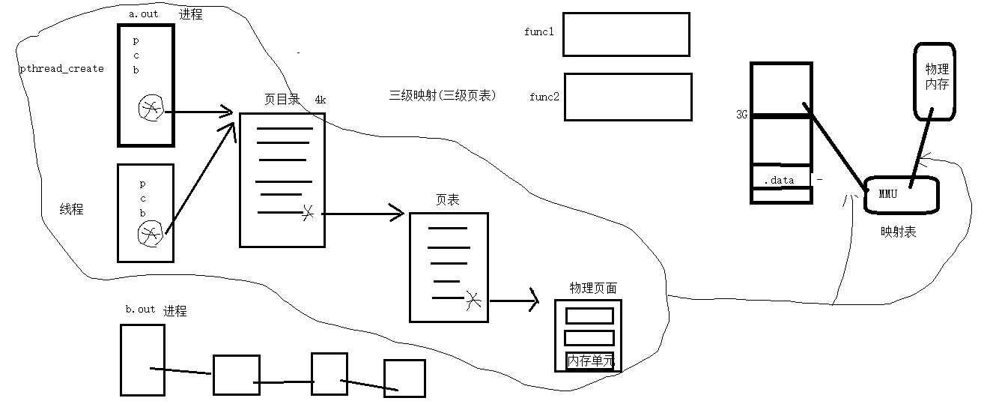
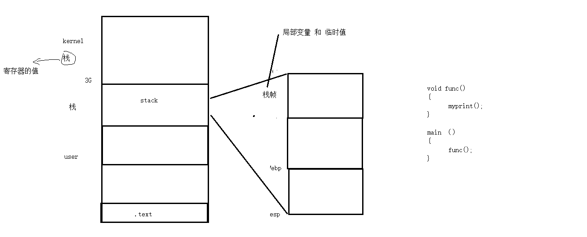
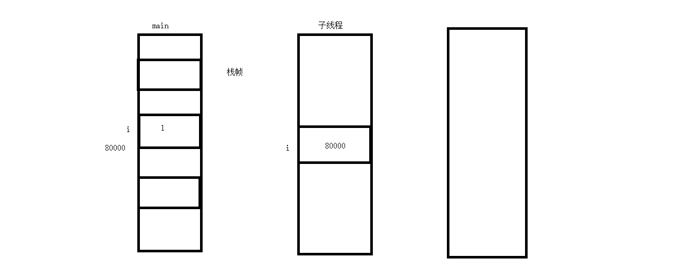
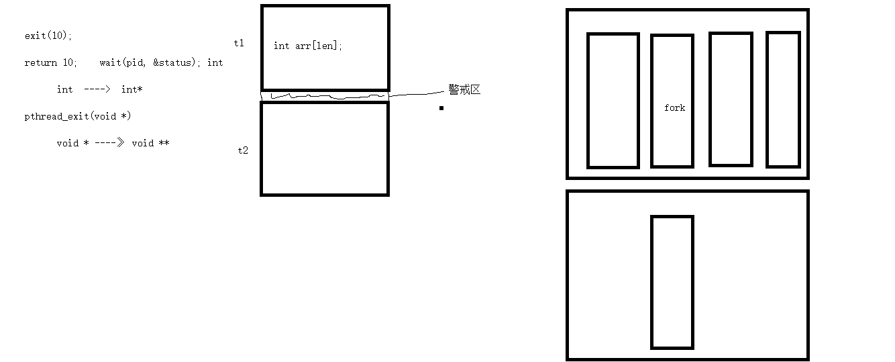
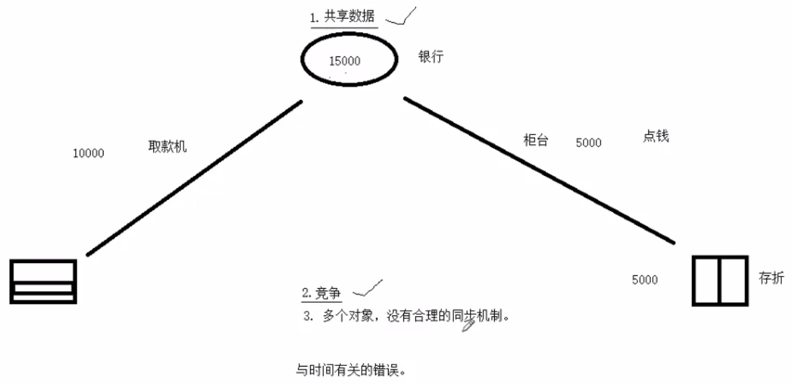
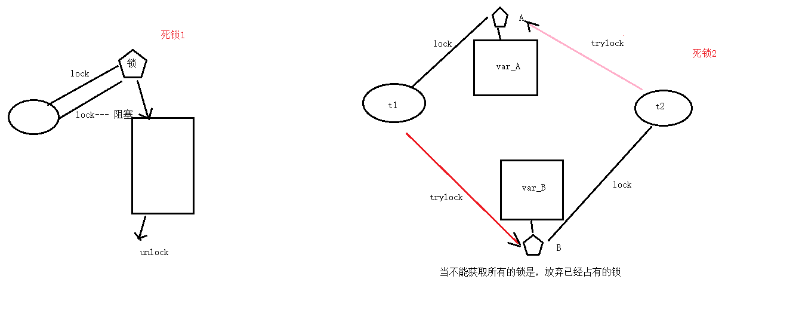
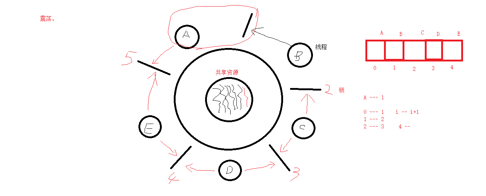

## 三级映射（三级页表）



函数名、变量这些代码肯定是不同的

从内核里看进程和线程是一样的，都有各自不同的PCB，但是PCB中指向内存资源的三级页表是相同的


## 栈空间



每一个函数有属于自己运行的栈帧空间，存放局部变量和临时值


线程号和线程id是不一样的

线程号：cpu分配时间轮片的依据

线程id：在进程内区分线程





exit将进程退出

在线程中用pthread_exit(NULL)，将线程退出

return 返回到调用者


return(10);         wait(pid, &status);   int *

​			int ——> int *

pthread_exit(void *);

​			void * ——> void **


线程共享全局变量


回收进程只能父进程来做，

回收线程都行


## 线程控制原语

```c
pthread_self
	create
	exit
	join

对比记忆 

	fork		pthead_create

	exit(10)	pthead_exit(void *);

	wait(int *)	pthread_join（， void **）   阻塞     分离 22 ； cancel -1

	kill()		pthread_cancel();	不能马上杀死，要到取消点(检查点)：系统调用

						man 7 pthreads 

						pthread_testcancel(); 系统调用
	getpid()	pthread_self();

			pthread_detach();  分离。 --线程结束时自动清理pcb。
```




线程均分栈大小





建议锁（不具有强制性）


**在访问共享资源前加锁，访问结束后立即解锁。锁的“粒度”应越小越好。**


## 死锁





震荡也是死锁的一种


写独占，读共享，写锁优先级高


读写锁用在线程间

文件锁用在进程间