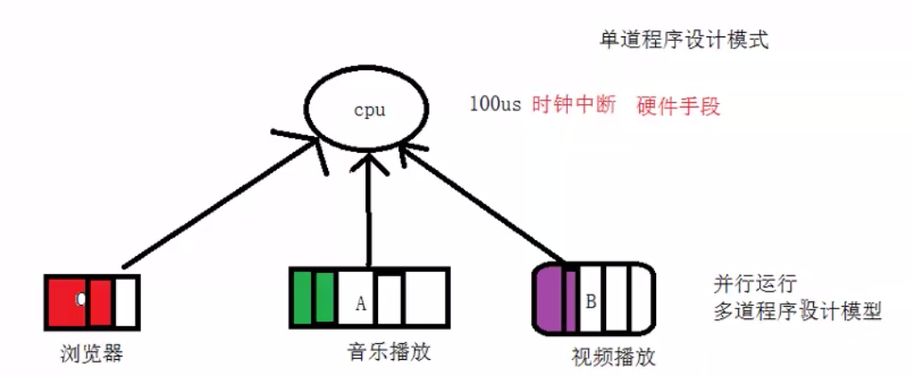
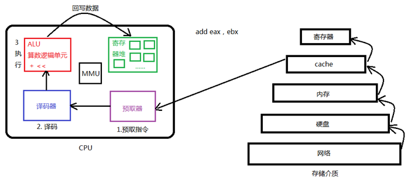
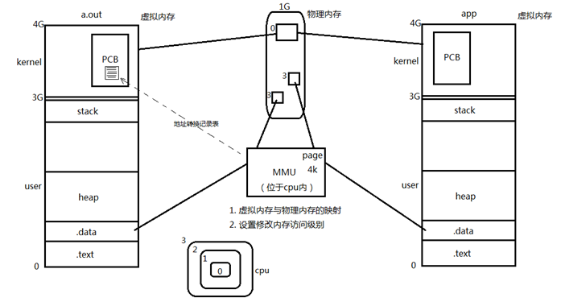
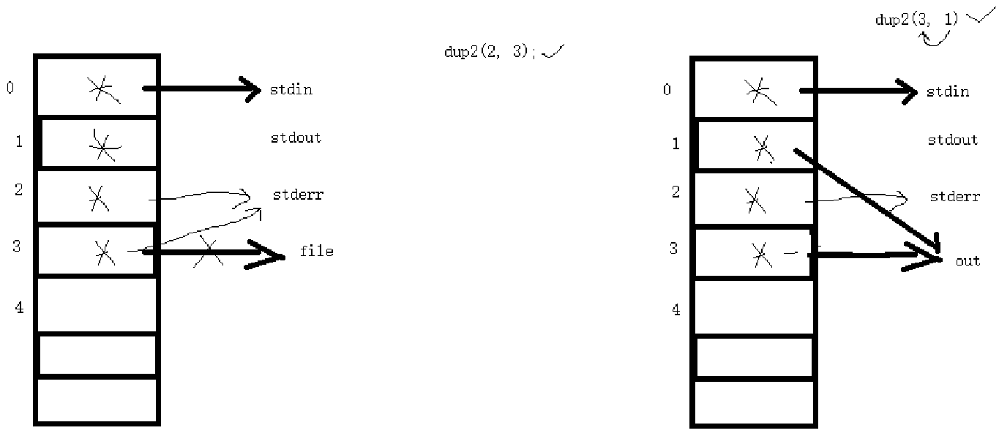

## 进程相关概念

### 多道程序设计模型



并不是同时在运行这么多程序，而是以时钟中断为基础


### cpu



### mmu

#### mmu：内存管理单元



虚拟地址：可用的地址空间有4G

​	0x804a4000	int a = 10;

物理地址：1000

**作用**：

1. 虚拟内存与物理内存的映射，以page 4k为单位来进行映射；不同进程内核只有一块，共用同一块内存空间。
2. 设置修改内存访问级别，用户空间3级，内核空间0级

> PCB是位于内存空间当中，但是两个进程的PCB不一样，但是他们位于同一块物理内存里

### 进程控制块PCB

每个进程在内核中都有一个进程控制块（PCB）来维护进程相关的信息，Linux内核的进程控制块是task_struct结构体。

### 进程控制

#### fork函数

​	返回值有2个： 1个进程——》2个进程——》各自对fork做返回

​		1.==父进程==的fork返回子进程的pid（非负整数）

​		2.==子进程==返回0（表示创建成功）

### exec函数族

exelp	——p	——path 系统可执行程序

execl	l	——list 用户自定义可执行程序

execv	v	——argv[]

execvp 

execve 	e	environment

只有失败返回值，-1

### wait

僵尸进程：

孤儿进程：init	——

```
pid_t wait(int *status); 	成功：清理掉的子进程ID；失败：-1 (没有子进程)
```

wait(status)：返回：成功pid，失败-1

​						status：传出参数

​						1.阻塞等待子进程

​						2.回收子进程资源

​						3.获取子进程结束状态

​							1）WIFEXITED()	真

​									WEXITSTATU()	获取子进程退出状态

​							2）WIFSIGNALED()	真

​									WTERMSIG()	获取导致子进程终止的信号的编号

### waitpid

参1：pid>0 	指定进程id回收

​			pid=-1	回收任意子进程（wait）

​			pid=0	回收本组任意子进程

​			pid<-1	回收该进程组的任意子进程

参2：

​	status

参3：

​	0：(wait) 阻塞回收

​	WNOHANG：非阻塞回收（轮询）

返回值：

​	成功：pid

​	失败：-1

​	返回0值：参3传WNOHANG，并且子进程尚未结束

### dup2



## 进程间通信

IPC：InterProcess Communication 进程间通信

文件

- d 目录
- l 符号链接  ## 以上占用磁盘存储

伪文件

- s 套接字
- b 块设备
- c 字符设备
- p 管道            ## 不占用磁盘存储

### pipe管道:  (简单)

	pipe(fd[2])  fd[0] -- read;  fd[s1] --- write
	
		fork()
	    管道一般读写行为
	
			读:  数据   字节数
	
			    无数据
				
				写端全部关闭  read -- 0  (读到结尾)
				
				仍有写端打开  阻塞等待
	
			写:  读端全闭关	   程序异常终止(SIGPIPE)
	
			     读端仍有打开
	
				管道写满: 阻塞等待
	
				未满:  返回实际写入的字节数.  


```
#include<unistd.h>
int pipe(int filedes[2]);
```

描述：

pipe()会建立管道, 并将文件描述词由参数filedes数组返回。filedes[0]为管道里的读取端, filedes[s1]则为管道的写入端。

返回值：

若成功则返回零, 否则返回-1, 错误原因存于errno中。

### FIFO：命名管道

	fifo: (有名管道)  应用于非血缘关系进程间(不能反复读取)
		用于非血缘关系进程间通信
		命令: mkfifo  


### 共享内存

1、mmap函数：参数：

​						返回值：

2、借助共享内存放磁盘文件

​		借助指针访问磁盘文件

3、父子进程、血缘关系进程	通信

4、匿名映射区

```
共享内存:应用于非血缘关系进程间(能反复读取)
	mmap
	函数的参数使用注意事项.
	用于非血缘关系进程间通信
套接字	稳定
```

#### mmap

```
void *mmap(void *addr, size_t length, int prot, int flags,
                  int fd, off_t offset);
```

描述：

​		创建映射区，使一个磁盘文件与存储空间中的一个缓冲区相映射

参数：    

​         addr:       建立映射区的首地址，由Linux内核指定。使用时，直接传递NULL

​         length： 欲创建映射区的大小

​         prot：      映射区权限PROT_READ、PROT_WRITE、PROT_READ|PROT_WRITE

​         flags：     标志位参数(常用于设定更新物理区域、设置共享、创建匿名映射区)

​                        MAP_SHARED:  会将映射区所做的操作反映到物理设备（磁盘）上。

​                        MAP_PRIVATE: 映射区所做的修改不会反映到物理设备。

​         fd：         用来建立映射区的文件描述符

​         offset：  映射文件的偏移(4k的整数倍)

返回：

- 成功：返回创建的映射区首地址；
- **失败：** **MAP_FAILED宏**

其他：

同malloc函数申请内存空间类似的，mmap建立的映射区在使用结束后也应调用类似free的函数来释放。

#### munmap

```
int munmap(void *start, size_t length);  成功：0； 失败：-1
```

描述：

- munmap()用来取消参数start所指的映射内存起始地址, 参数length则是欲取消的内存大小。当进程结束或利用exec相关函数来执行其他程序时, 映射内存会自动解除, 但关闭对应的文件描述词时不会解除映射。

返回值：

- 如果解除映射成功则返回0, 否则返回－1, 错误原因存于errno中错误代码EINVAL