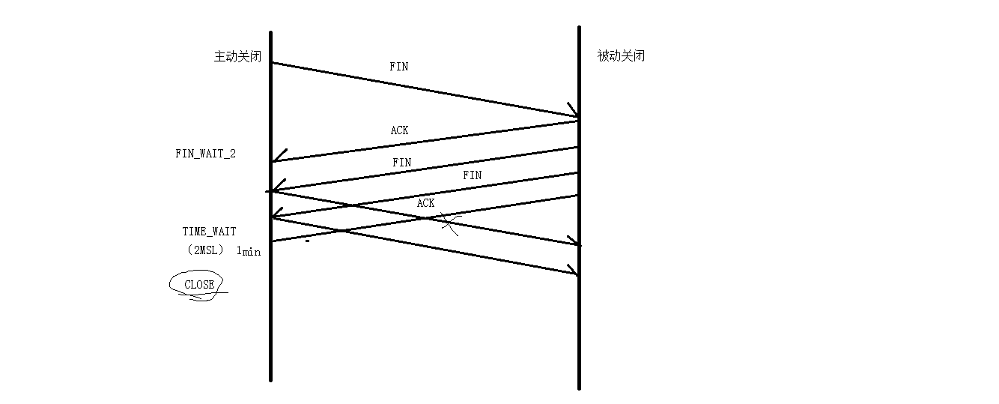
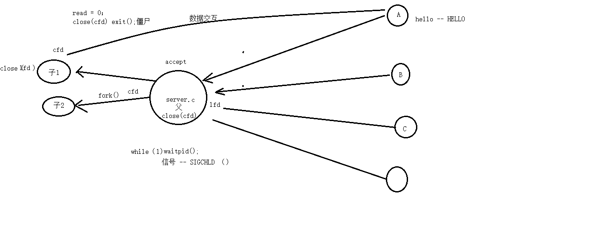
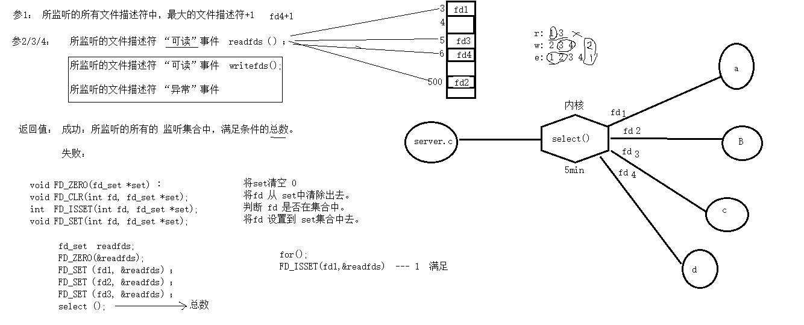
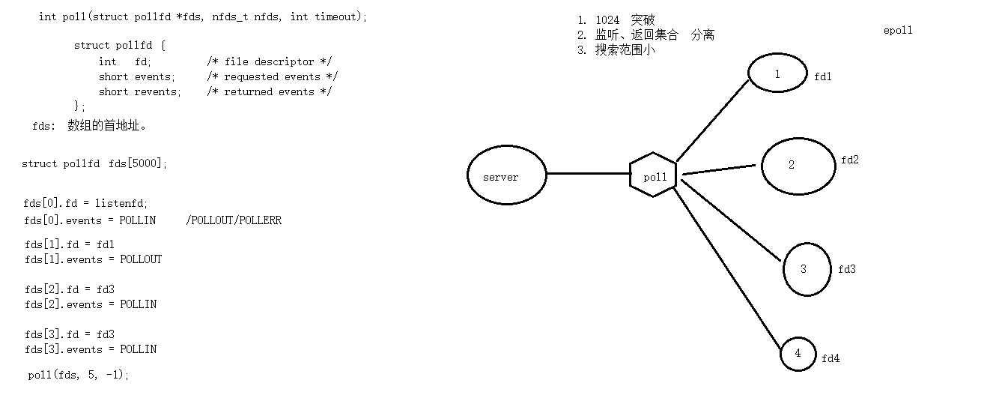
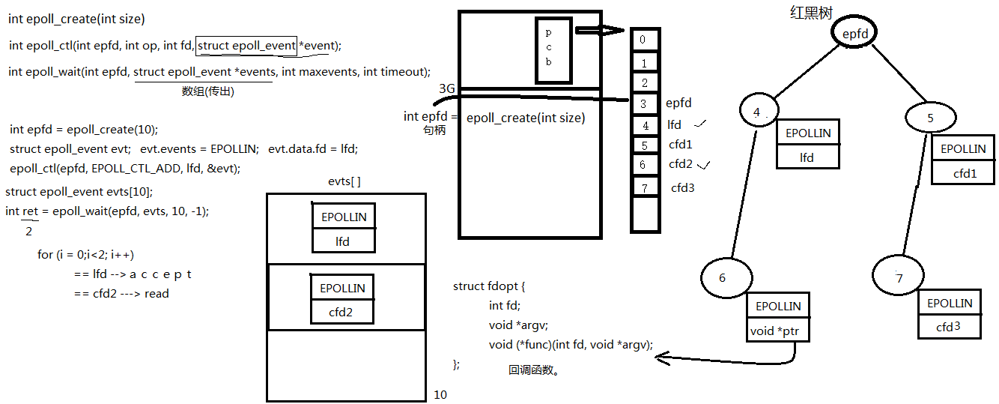
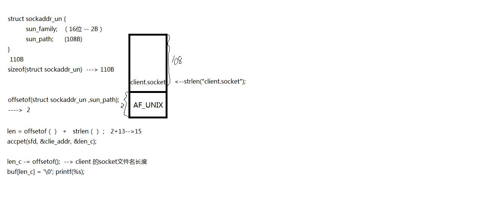

## 协议上限分析


重传1500要比重传15000方便

主动关闭连接，等待2MSL时间，你还是没办法收到ACK，主动关闭连接的那端会直接进closed状态



## 多进程并发服务器



```bash
netstat -apn | grep 888  # 查看端口占用
lsof -i:888  # 也是查看端口占用
```

## select函数



```cpp
// 参1：所监听的所有文件描述符中，最大的文件描述符+1
// 参2/3/4：所监听的文件描述符“可读”事件  readfds()
//		   所监听的文件描述符“可写”事件  writefds()
//         所监听的文件描述符“异常”事件
int select(int nfds, fd_set *readfds, fd_set *writefds,
           fd_set *exceptfds, struct timeval *timeout);

返回值：成功：所监听的所有的监听集合中，满足条件的总数。
	  失败：
    
void FD_ZERO(fd_set *set);	          将set清空0
void FD_CLR(int fd, fd_set *set);     将fd从set中清除出去
int  FD_ISSET(int fd, fd_set *set);	  判断fd是否在集合中
void FD_SET(int fd, fd_set *set);     将fd设置到set集合中去


fd_set readfds;
FD_ZERO(&readfds);
FD_SET(fd1, &readfds);
FD_SET(fd2, &readfds);
FD_SET(fd3, &readfds);
// 然后用select()去监听这个集合
select();   //总数


for();
FD_ISSET(fd1, &readfds);  --1 满足


1.文件描述符上限--1024
    select同时监听的文件描述符1024个
2.   1023---2  只能用for循环才能找到哪2个    
	 自定义数据结构：数组
3.监听集合和满足监听条件的集合是同一个集合
	需要将原有的集合保存
```



## epoll

多路复用IO接口

```cpp
typedef union epoll_data {
    void        *ptr;
    int          fd;
    uint32_t     u32;
    uint64_t     u64;
} epoll_data_t;

struct epoll_event {
    uint32_t     events;      /* Epoll events */
    epoll_data_t data;        /* User data variable */
};
```


```cpp
API:
			
			epoll_create();   --- int epfd = epoll(10);  --- epfd(句柄)


			struct epoll_event events; events.events = EPOLLIN;

						    events.data.fd = lfd;

			epoll_ctl();	--- epoll(epfd, EPOLL_CTL_ADD, lfd, &events);	

				op:	EPOLL_CTL_ADD/MOD/DEL

				events: EPOLLIN/OUT/ERR
				
			struct epoll_event evt[100];

			epoll_wait(epfd, evt, 100, -1);  select   poll 
```


```cpp
struct epoll_evnet 结构体分析：

		events; EPOLLIN/OUT/ERR

		data:	fd u32 u64  void *ptr:   int int * char *  void (*fun)(int arg)  stuct {				
    int fd;
    void *arg;
    void (*fun)(int fd, void *arg)	
    } *ptr;
```


```cpp
epoll ET 
	
		边沿触发。    event = EPOLLIN | EPOLLET

	epoll LT

		水平触发。


	epoll 非阻塞IO

		边沿触发    while(read())   fcntl(O_NONBLOCK);
```


```cpp
epoll 反应堆模型 (libevent 核心思想实现)

		libevent  -- 跨平台   精炼--epoll  回调   

		1. epoll --- 服务器 --- 监听 --- fd ----可读 ---- epoll返回 ---- read --- 小写转大写 --- write ---- epoll继续监听。

		2. epoll 反应堆模型：
													      
 		1) epoll --- 服务器 --- 监听 --- cfd ---- 可读 ---- epoll返回 ---- read -- cfd从树上摘下 --- 设置监听cfd写事件， 操作 ("滑动窗口") 
		--- 小写转大写 -- 等待epoll_wait 返回 --- 回写客户端 -- cfd从树上摘下 ----- 设置监听cfd读事件， 操作 -- epoll继续监听。

		2) evt[i].events = EPOLLIN, evt[I].data.fd == cfd       *ptr     struct {int fd, void (*func)(void *arg), void *arg}
```


```cpp
struct myevent_s {
    int fd;                                                 //要监听的文件描述符
    int events;                                             //对应的监听事件
    void *arg;                                              //泛型参数
    void (*call_back)(int fd, int events, void *arg);       //回调函数
    int status;                                             //是否在监听:1->在红黑树上(监听), 0->不在(不监听)
    char buf[BUFLEN];
    int len;
    long last_active;                                       //记录每次加入红黑树 g_efd 的时间值
};
```

### epoll过程分析




## 线程池

```C
struct threadpool_t {
    pthread_mutex_t lock;               /* 用于锁住本结构体 */    
    pthread_mutex_t thread_counter;     /* 记录忙状态线程个数de琐 -- busy_thr_num */
    pthread_cond_t queue_not_full;      /* 当任务队列满时，添加任务的线程阻塞，等待此条件变量 */
    pthread_cond_t queue_not_empty;     /* 任务队列里不为空时，通知等待任务的线程 */

    pthread_t *threads;                 /* 存放线程池中每个线程的tid。数组 */
    pthread_t adjust_tid;               /* 存管理线程tid */
    threadpool_task_t *task_queue;      /* 任务队列 */

    int min_thr_num;                    /* 线程池最小线程数 */
    int max_thr_num;                    /* 线程池最大线程数 */
    int live_thr_num;                   /* 当前存活线程个数 */
    int busy_thr_num;                   /* 忙状态线程个数 */
    int wait_exit_thr_num;              /* 要销毁的线程个数 */

    int queue_front;                    /* task_queue队头下标 */
    int queue_rear;                     /* task_queue队尾下标 */
    int queue_size;                     /* task_queue队中实际任务数 */
    int queue_max_size;                 /* task_queue队列可容纳任务数上限 */

    int shutdown;                       /* 标志位，线程池使用状态，true或false */
};
```


	TCP:	面向连接的可靠数据包传递	---完全弥补
			优点：稳定： 1. 数据稳定  ---  丢包回传（回执机制）(丢包率97‰)
	
			       	   2. 速率稳定
	
			           3. 流量稳定    “滑动窗口” TCP内部的机制
	
			缺点： 效率低、速度慢
	
			使用场景：大文件、重要文件传输


	UDP：    无连接的不可靠报文传递。----完全不弥补
	
			缺点：不稳定：数据、速率、流量
	
			优点：效率高、速度快
	
		    使用场景：对实时性要求较高，视频会议、视频电话、广播、飞秋
	
	腾讯： TCP --- TCP+UDP --- UDP + 应用层自定义协议弥补UDP的丢包。


listen()函数相当发起三次握手，UDP协议不需要listen()函数

UDP默认就支持多并发

```bash
# 查看结构体在文件里 -r后面跟目录 -n把行号显示出来
grep "struct ip_mreqn {" -r /usr/include -n

```

socket是伪文件，文件大小为0，模拟成一个文件来使用，实际是跟管道差不多的应用，不管写什么东西都不会在文件内部存留

## domain 本地套

```
1. Pipe fifo   实现最简单

2. mmap 	非血缘关系进程间

3. 信号		开销小

4. domain	稳定性最好

#define offsetof(type, member) ((int)&((type *)0)->MEMBER)

socket(AF_UNIX, SOCK_STREAM, 0);

struct sockaddr_un serv_addr;

serv_addr.sun_family = AF_UNIX;

strcpy(serv_addr.sun_path, "mysocket")

int len = offsetof(struct sockaddr_un, sun_path) + strlen(serv_addr.sun_path);

unlink("mysocket");
bind(sfd, (struct sockaddr *)&serv_addr, len);
```


