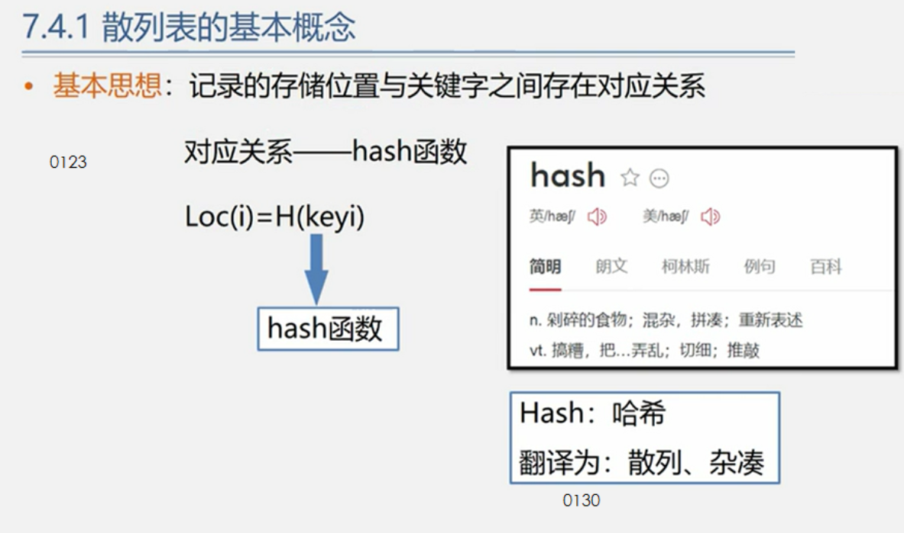
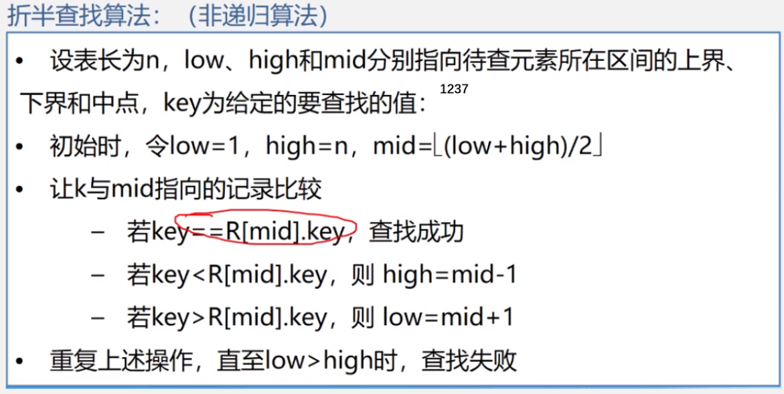
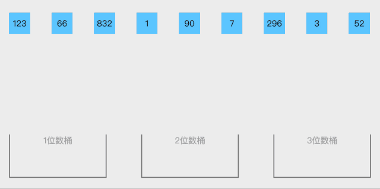
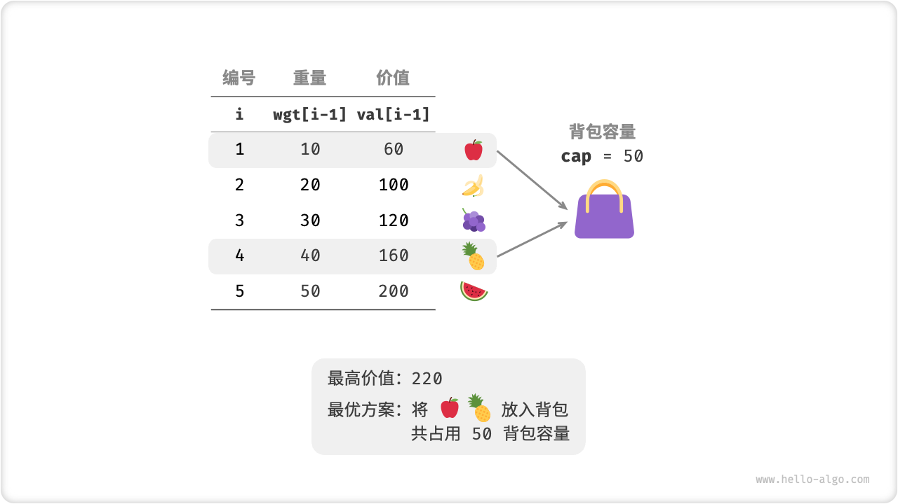
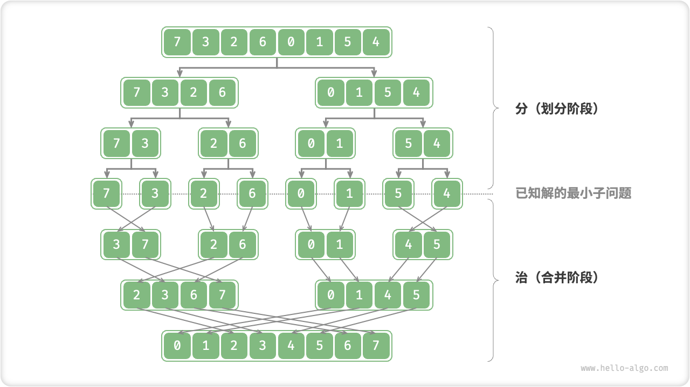

## 基础知识

### 时间复杂度

logn，通常使用以2为底的对数来表示算法的时间复杂度。


### 空间复杂度

空间复杂度为 O(1) 意味着**算法所使用的额外空间是固定的，不随输入规模的增加而增加**。换句话说，**无论输入的大小如何，算法使用的额外空间是恒定的。**

以下是几种常见的情况，其中空间复杂度为 O(1)：

1. 常数变量：如果算法只使用了有限数量的常数变量来存储数据，那么它的空间复杂度将为 O(1)。例如，一个简单的数学运算或条件判断不需要额外的空间。

2. 固定大小的数据结构：如果算法使用的数据结构的大小是固定的，并且与输入的规模无关，则空间复杂度为 O(1)。例如，一个长度为 10 的数组或者一个包含固定数量节点的链表。

3. 原地修改：当算法在原始输入上进行修改，而不是创建新的数据结构来存储结果时，空间复杂度通常为 O(1)。这意味着算法可以直接在输入上进行操作，而不需要额外的空间来存储中间结果。

需要注意的是，即使空间复杂度为 O(1)，算法仍然可能使用一些固定大小的辅助变量或常数级别的内存来执行计算。因此，O(1) 并不意味着算法不使用任何内存，而是指额外空间的使用与输入规模无关且固定。


### 数组

**数组的元素在内存地址中是连续的，不能单独删除数组中的某个元素，只能覆盖。**

创建数组中，不足的个数会用0补充


### 字符串

字符串是若干字符组成的有限序列，也可以理解为是一个字符数组，但是很多语言对字符串做了特殊的规定，接下来我来说一说C/C++中的字符串。

在C语言中，把一个字符串存入一个数组时，也把结束符 '\0'存入数组，并以此作为该字符串是否结束的标志。

例如这段代码：

```cpp
char a[5] = "asd";
for (int i = 0; a[i] != '\0'; i++) {
}
```

在C++中，提供一个string类，string类会提供 size接口，可以用来判断string类字符串是否结束，就不用'\0'来判断是否结束。

例如这段代码:

```cpp
string a = "asd";
for (int i = 0; i < a.size(); i++) {
}
```

那么vector< char > 和 string 又有什么区别呢？

其实在基本操作上没有区别，但是 string提供更多的字符串处理的相关接口，例如string 重载了+，而vector却没有。

所以想处理字符串，我们还是会定义一个string类型。


### 其他

左闭右闭的是<=
左闭右开的是<


#### 容器底层实现

**C++中map、set、multimap，multiset的底层实现都是平衡二叉搜索树**，所以map、set的增删操作时间时间复杂度是logn。

unordered_map、unordered_set，unordered_map、unordered_set底层实现是哈希表。


## 数据结构

### 链表

单链表：
常用操作 
指向头结点 p=L;
指向首元结点p=L->next;i=1; 
指向下一结点p=p->next;

```cpp
// 单链表
struct ListNode {
    int val;  // 节点上存储的元素
    ListNode *next;  // 指向下一个节点的指针
    ListNode(int x) : val(x), next(NULL) {}  // 节点的构造函数
};
```


### 哈希表

记录的存储位置与关键字之间存在对应关系

数组的下标设为哈希表的键值（Key），而数组中的每一个数字设为哈希表的值（Value），这样每一个下标及数组中该下标对应的数字就组成了一个“键值-值”的配对。有了这样的哈希表，就可以在O(1)的时间内实现查找。



一般用unordered_set和unordered_map容器实现，有需要“键值-值”的映射就用map

**unordered_set容器**

- 等价为无序的set_容器
- 容器内的各个元素都互不相等

**unordered_map容器**

- 等价为无序的map容器
- map中所有的元素都是pair
- pair中第一个元素为key（键值），起到索引作用，第二个元素为value（实值）

**有时候也可以简单用个数组**

- 使用数组来做哈希的题目，是因为题目都限制了数值的大小；如果没有限制数值的大小，就无法用数组来做哈希表了

**什么时候使用哈希法**，当我们需要查询一个元素是否出现过，或者一个元素是否在集合里的时候，就要第一时间想到哈希法。


### 栈和队列

匹配问题都是栈的强项，**递归的实现就是：每一次递归调用都会把函数的局部变量、参数值和返回地址等压入调用栈中**，然后递归返回的时候，从栈顶弹出上一次递归的各项参数，所以这就是递归为什么可以返回上一层位置的原因。


### 二叉树

#### 种类

##### 满二叉树

满二叉树：如果一棵二叉树只有度为0的结点和度为2的结点，并且度为0的结点在同一层上，则这棵二叉树为满二叉树。深度为k，有2^k-1个节点。


##### 完全二叉树

在完全二叉树中 层的节点都集中在该层最左边的若干位置。若最底层为第 h 层，则该层包含 1~ 2^(h-1)  个节点。


##### 二叉搜索树（二叉查找树）

**二叉搜索树是一个有序树**

- 若它的左子树不空，则左子树上所有结点的值均小于它的根结点的值；
- 若它的右子树不空，则右子树上所有结点的值均大于它的根结点的值；
- 它的左、右子树也分别为二叉搜索树


##### 平衡二叉树

一个二叉树每个节点的左右两个子树的高度差的绝对值不超过1.

##### 平衡二叉搜索树

平衡二叉搜索树：又被称为AVL（Adelson-Velsky and Landis）树，且具有以下性质：它是一棵空树或它的左右两个子树的高度差的绝对值不超过1，并且左右两个子树都是一棵平衡二叉树。（最后一棵左右两个子树的高度差的绝对值超过了1）


平衡二叉树的平衡性质保证了树的高度较低，使得插入、删除和查找操作的时间复杂度能够保持在O(log n)级别，其中n是树中节点的数量。

为了保持平衡，平衡二叉树在插入或删除节点时可能需要进行旋转操作。旋转操作可以通过调整节点的左右子树来保持平衡性。

平衡二叉树的一个经典实现是AVL树，由于AVL树的平衡性要求比较严格，所以在插入和删除操作时可能需要执行多次旋转操作来调整树的结构。

除了AVL树，还有其他平衡二叉树的变种，如红黑树（Red-Black Tree）和B树（B-Tree）。这些树的设计目标是在保持平衡的同时，尽可能减少旋转操作的次数，以提高插入、删除和查找操作的效率。


#### 存储方式

##### 链式存储

用指针


##### 顺序存储

用数组，**如果父节点的数组下标是 i，那么它的左孩子就是 i \* 2 + 1，右孩子就是 i \* 2 + 2。**


遍历方式

- 深度优先遍历，用递归比较方便；迭代法可以借助栈来实现
  - 前序遍历（递归法，迭代法）
  - 中序遍历（递归法，迭代法）
  - 后序遍历（递归法，迭代法）
- 广度优先遍历，一般使用队列来实现
  - 层次遍历（迭代法）

#### 代码定义

```cpp
struct TreeNode {
    int val;
    TreeNode *left;
    TreeNode *right;  // 左右指针指向左右孩子
    TreeNode(int x) : val(x), left(NULL), right(NULL) {}  // 构造函数
};
```

#### 深度与高度

- 二叉树节点的深度：指从根节点到该节点的最长简单路径边的条数或者节点数（取决于深度从0开始还是从1开始）
- 二叉树节点的高度：指从该节点到叶子节点的最长简单路径边的条数后者节点数（取决于高度从0开始还是从1开始）


### 并查集

并查集（Disjoint Set）是一种用于处理不相交集合的数据结构。它提供了两个主要操作：查找（Find）和合并（Union）。

并查集的目标是将一组元素划分为多个不相交的集合，每个集合称为一个组或一个集合。每个元素都属于一个集合，且每个集合有一个唯一的代表元素。

初始状态下，每个元素都是一个独立的集合，代表元素就是它自己。通过查找操作，可以确定一个元素所属的集合，即找到该元素的代表元素。合并操作可以将两个集合合并为一个集合，即将两个集合的代表元素连接起来。

并查集的主要应用是解决等价关系和连通性问题。例如，在图的算法中，可以使用并查集来判断两个节点是否属于同一个连通分量，或者用于判断图中是否存在环路。

并查集的实现可以使用数组或树结构。使用数组实现时，每个元素存储其父节点的索引，根节点的父节点指向自身。使用树结构实现时，每个元素作为一个节点，树的根节点作为集合的代表元素。

在并查集的实现中，优化的技术包括路径压缩和按秩合并。路径压缩是在查找操作中将节点的父节点直接指向根节点，以减少后续查找操作的时间复杂度。按秩合并是在合并操作中，将秩较小的树合并到秩较大的树上，以保持树的平衡性，减少树的高度，提高操作效率。

总之，通过并查集的数据结构和操作，可以高效地处理不相交集合的合并和查询问题。


### 堆、优先队列

「堆 Heap」是一种满足特定条件的完全二叉树，可分为两种类型：

- 「大顶堆 Max Heap」，任意节点的值 $\geq$ 其子节点的值。
- 「小顶堆 Min Heap」，任意节点的值 $\leq$ 其子节点的值。


堆作为完全二叉树的一个特例，具有以下特性：

- 最底层节点靠左填充，其他层的节点都被填满。
- 我们将二叉树的根节点称为「堆顶」，将底层最靠右的节点称为「堆底」。
- 对于大顶堆（小顶堆），堆顶元素（即根节点）的值分别是最大（最小）的。

**堆通常用作实现优先队列，大顶堆相当于元素按从大到小顺序出队的优先队列**。从使用角度来看，我们可以将「优先队列」和「堆」看作等价的数据结构。

#### 1、堆常用操作

```cpp
/* 初始化堆 */
// 初始化小顶堆
priority_queue<int, vector<int>, greater<int>> minHeap;
// 初始化大顶堆
priority_queue<int, vector<int>, less<int>> maxHeap;

/* 元素入堆 */
maxHeap.push(1);
maxHeap.push(3);
maxHeap.push(2);
maxHeap.push(5);
maxHeap.push(4);

/* 获取堆顶元素 */
int peek = maxHeap.top(); // 5

/* 堆顶元素出堆 */
// 出堆元素会形成一个从大到小的序列
maxHeap.pop(); // 5
maxHeap.pop(); // 4
maxHeap.pop(); // 3
maxHeap.pop(); // 2
maxHeap.pop(); // 1

/* 获取堆大小 */
int size = maxHeap.size();

/* 判断堆是否为空 */
bool isEmpty = maxHeap.empty();

/* 输入列表并建堆 */
vector<int> input{1, 3, 2, 5, 4};
priority_queue<int, vector<int>, greater<int>> minHeap(input.begin(), input.end());

```


#### 2、堆的实现

全二叉树非常适合用数组来表示。由于堆正是一种完全二叉树，**我们将采用数组来存储堆**。

当使用数组表示二叉树时，元素代表节点值，索引代表节点在二叉树中的位置。**节点指针通过索引映射公式来实现**。

具体而言，给定索引 $i$ ，其左子节点索引为 $2i + 1$ ，右子节点索引为 $2i + 2$ ，父节点索引为 $(i - 1) / 2$（向下取整）。当索引越界时，表示空节点或节点不存在。


可以将索引映射公式封装成函数，方便后续使用。

```cpp
/* 获取左子节点索引 */
int left(int i) {
    return 2 * i + 1;
}

/* 获取右子节点索引 */
int right(int i) {
    return 2 * i + 2;
}

/* 获取父节点索引 */
int parent(int i) {
    return (i - 1) / 2; // 向下取整
}

```

**访问堆顶元素**

堆顶元素即为二叉树的根节点，也就是列表的首个元素。

```cpp
/* 访问堆顶元素 */
int peek() {
    return maxHeap[0];
}

```

##### 元素入堆

给定元素 `val` ，我们首先将其添加到堆底。添加之后，由于 val 可能大于堆中其他元素，堆的成立条件可能已被破坏。因此，**需要修复从插入节点到根节点的路径上的各个节点**，这个操作被称为「堆化 Heapify」。

考虑从入堆节点开始，**从底至顶执行堆化**。具体来说，我们比较插入节点与其父节点的值，如果插入节点更大，则将它们交换。然后继续执行此操作，从底至顶修复堆中的各个节点，直至越过根节点或遇到无需交换的节点时结束。

设节点总数为 $n$ ，则树的高度为 $O(\log n)$ 。由此可知，堆化操作的循环轮数最多为 $O(\log n)$ ，**元素入堆操作的时间复杂度为 $O(\log n)$** 。

```cpp
/* 元素入堆 */
void push(int val) {
    // 添加节点
    maxHeap.push_back(val);
    // 从底至顶堆化
    siftUp(size() - 1);
}

/* 从节点 i 开始，从底至顶堆化 */
void siftUp(int i) {
    while (true) {
        // 获取节点 i 的父节点
        int p = parent(i);
        // 当“越过根节点”或“节点无需修复”时，结束堆化
        if (p < 0 || maxHeap[i] <= maxHeap[p])
            break;
        // 交换两节点
        swap(maxHeap[i], maxHeap[p]);
        // 循环向上堆化
        i = p;
    }
}

```


##### 堆顶元素出堆

堆顶元素是二叉树的根节点，即列表首元素。如果我们直接从列表中删除首元素，那么二叉树中所有节点的索引都会发生变化，这将使得后续使用堆化修复变得困难。为了尽量减少元素索引的变动，我们采取以下操作步骤：

1. 交换堆顶元素与堆底元素（即交换根节点与最右叶节点）。
2. 交换完成后，将堆底从列表中删除（注意，由于已经交换，实际上删除的是原来的堆顶元素）。
3. 从根节点开始，**从顶至底执行堆化**。

顾名思义，**从顶至底堆化的操作方向与从底至顶堆化相反**，我们将根节点的值与其两个子节点的值进行比较，将最大的子节点与根节点交换；然后循环执行此操作，直到越过叶节点或遇到无需交换的节点时结束。

与元素入堆操作相似，堆顶元素出堆操作的时间复杂度也为 $O(\log n)$ 。

```cpp
/* 元素出堆 */
void pop() {
    // 判空处理
    if (empty()) {
        throw out_of_range("堆为空");
    }
    // 交换根节点与最右叶节点（即交换首元素与尾元素）
    swap(maxHeap[0], maxHeap[size() - 1]);
    // 删除节点
    maxHeap.pop_back();
    // 从顶至底堆化
    siftDown(0);
}

/* 从节点 i 开始，从顶至底堆化 */
void siftDown(int i) {
    while (true) {
        // 判断节点 i, l, r 中值最大的节点，记为 ma	
        int l = left(i), r = right(i), ma = i;
        // 若节点 i 最大或索引 l, r 越界，则无需继续堆化，跳出
        if (l < size() && maxHeap[l] > maxHeap[ma])
            ma = l;
        if (r < size() && maxHeap[r] > maxHeap[ma])
            ma = r;
        // 若节点 i 最大或索引 l, r 越界，则无需继续堆化，跳出
        if (ma == i)
            break;
        swap(maxHeap[i], maxHeap[ma]);
        // 循环向下堆化
        i = ma;
    }
}

```


#### 3、堆常见应用

- **优先队列**：堆通常作为实现优先队列的首选数据结构，其入队和出队操作的时间复杂度均为 $O(\log n)$ ，而建队操作为 $O(n)$ ，这些操作都非常高效。
- **堆排序**：给定一组数据，我们可以用它们建立一个堆，然后不断地执行元素出堆操作，从而得到有序数据。然而，我们通常会使用一种更优雅的方式实现堆排序，详见后续的堆排序章节。
- **获取最大的 $k$ 个元素**：这是一个经典的算法问题，同时也是一种典型应用，例如选择热度前 10 的新闻作为微博热搜，选取销量前 10 的商品等。


#### 4、建堆操作

##### 借助入堆方法实现

最直接的方法是借助“元素入堆操作”实现，首先创建一个空堆，然后将列表元素依次添加到堆中。

设元素数量为 $n$ ，则最后一个元素入堆的时间复杂度为 $O(\log n)$ 。在依次添加元素时，堆的平均长度为 $\frac{n}{2}$ ，因此该方法的总体时间复杂度为 $O(n \log n)$ 。


##### 基于堆化操作实现

有趣的是，存在一种更高效的建堆方法，其时间复杂度仅为 $O(n)$ 。我们先将列表所有元素原封不动添加到堆中，**然后迭代地对各个节点执行“从顶至底堆化”**。当然，**我们不需要对叶节点执行堆化操作**，因为它们没有子节点。

```cpp
/* 构造方法，根据输入列表建堆 */
MaxHeap(vector<int> nums) {
    // 将列表元素原封不动添加进堆
    maxHeap = nums;
    // 堆化除叶节点以外的其他所有节点
    for (int i = parent(size() - 1); i >= 0; i--) {
        siftDown(i);
    }
}

```

为什么时间复杂度为$O(n)$

[8.2.   建堆操作 - Hello 算法 (hello-algo.com)](https://www.hello-algo.com/chapter_heap/build_heap/#823)


#### 5、TOP-K问题

> 给定一个长度为 $n$ 无序数组 `nums` ，请返回数组中前 $k$ 大的元素。

##### 方法1：排序

我们可以对数组 `nums` 进行排序，并返回最右边的 $k$ 个元素，时间复杂度为 $O(n \log n)$ 。

显然，该方法“超额”完成任务了，因为我们只需要找出最大的 $k$ 个元素即可，而不需要排序其他元素。

##### 方法2：堆

可以基于堆更加高效地解决 Top-K 问题，流程如下：

1. 初始化一个小顶堆，其堆顶元素最小。
2. 先将数组的前 $k$ 个元素依次入堆。
3. 从第 $k + 1$ 个元素开始，若当前元素大于堆顶元素，则将堆顶元素出堆，并将当前元素入堆。
4. 遍历完成后，堆中保存的就是最大的 $k$ 个元素。

```cpp
/* 基于堆查找数组中最大的 k 个元素 */
priority_queue<int, vector<int>, greater<int>> topKHeap(vector<int> &nums, int k) {
    priority_queue<int, vector<int>, greater<int>> heap;
    // 将数组的前 k 个元素入堆
    for (int i = 0; i < k; i++) {
        heap.push(nums[i]);
    }
    // 从第 k+1 个元素开始，保持堆的长度为 k
    for (int i = k; i < nums.size(); i++) {
        // 若当前元素大于堆顶元素，则将堆顶元素出堆、当前元素入堆
        if (nums[i] > heap.top()) {
            heap.pop();
            heap.push(nums[i]);
        }
    }
    return heap;
}

```

总共执行了 $n$ 轮入堆和出堆，堆的最大长度为 $k$ ，因此时间复杂度为 $O(n \log k)$ 。该方法的效率很高，当 $k$ 较小时，时间复杂度趋向 $O(n)$ ；当 $k$ 较大时，时间复杂度不会超过 $O(n \log n)$ 。

另外，该方法适用于动态数据流的使用场景。在不断加入数据时，我们可以持续维护堆内的元素，从而实现最大 $k$ 个元素的动态更新。


## 算法

### 最易懂的贪心算法

贪心算法或贪心思想采用贪心的策略，保证每次操作都是局部最优的，从而使最后得到的结果是全局最优的


### 双指针

- 双指针主要用于遍历数组，两个指针指向不同的元素，从而协同完成任务。也可以延伸到多个数组的多个指针。
- 若两个指针指向同一数组，遍历方向相同且不会相交，则也称为滑动窗口（两个指针包围的区域即为当前的窗口），经常用于区间搜索。
- 若两个指针指向同一数组，但是遍历方向相反，则可以用来进行搜索，待搜索的数组往往是排好序的。


### 二分查找



**前提是数组为有序数组**，同时题目还强调**数组中无重复元素**，因为一旦有重复元素，使用二分查找法返回的元素下标可能不是唯一的，这些都是使用二分法的前提条件，当大家看到题目描述满足如上条件的时候，可要想一想是不是可以用二分法了。

#### 二分法第一种写法

第一种写法，我们定义 target 是在一个在==左闭右闭==的区间里，**也就是[left, right] （这个很重要非常重要）**。

区间的定义这就决定了二分法的代码应该如何写，**因为定义target在[left, right]区间，所以有如下两点：**

- while ==(left <= right)== 要使用 <= ，因为left == right是有意义的，所以使用 <=
- if (nums[middle] > target) right 要赋值为 middle - 1，因为当前这个nums[middle]一定不是target，那么接下来要查找的左区间结束下标位置就是 middle - 1

例如在数组：1,2,3,4,7,9,10中查找元素2，如图所示：


#### 二分法第二种写法

如果说定义 target 是在一个在==左闭右开==的区间里，也就是[left, right) ，那么二分法的边界处理方式则截然不同。

有如下两点：

- while ==(left < right)==，这里使用 < ,因为left == right在区间[left, right)是没有意义的
- if (nums[middle] > target) right 更新为 middle，因为当前nums[middle]不等于target，去左区间继续寻找，而寻找区间是左闭右开区间，所以right更新为middle，即：下一个查询区间不会去比较nums[middle]

在数组：1,2,3,4,7,9,10中查找元素2，如图所示：（**注意和方法一的区别**）


### 排序算法

#### 十大排序一图总览


**⼗⼤排序中的稳定排序** 

- 冒泡排序（bubble sort） — O(n2)
- 插⼊排序 （insertion sort）— O(n2)
- 归并排序 （merge sort）— O(n log n)

**⼗⼤排序中的⾮稳定排序** 
⾯试考察中⼀般问快排，选择，希尔，堆这⼏种⾮稳定排序

- 选择排序 （selection sort）— O(n2)
- 希尔排序 （shell sort）— O(n log n)
- 堆排序 （heapsort）— O(n log n)
- 快速排序 （quicksort）— O(n log n)

#### 1、冒泡排序

冒泡排序就是把小的元素往前调或者把大的元素往后调，比较是相邻的两个元素比较，交换也发生在这两个元素之间。

所以，如果两个元素相等，我想你是不会再无聊地把他们俩交换一下的；如果两个相等的元素没有相邻，那么即使通过前面的两两交换把两个相邻起来，这时候也不会交换，所以相同元素的前后顺序并没有改变，所以冒泡排序是一种稳定排序算法。

 

1. 比较相邻的元素。如果第一个比第二个大，就交换他们两个。
2. 对每一对相邻元素作同样的工作，从开始第一对到结尾的最后一对。这步做完后，最后的元素会是最大的数。
3. 针对所有的元素重复以上的步骤，除了最后一个。
4. 持续每次对越来越少的元素重复上面的步骤，直到没有任何一对数字需要比较。

**时间复杂度 o(n^2) ，空间 o 1， 原地算法，稳定**

```cpp
// 每次都把大的往前移
void bubbleSort(vector<int>& nums) {
	int len = nums.size();
	for (int i = 0; i < len; ++i) {
		for (int j = 0; j < len - 1 - i; ++j) {
			if (nums[j] > nums[j + 1]) 
                swap(nums[j], nums[j + 1]);
		}
	}
}
```


**冒泡优化版本**

假如从开始的第一对到结尾的最后一对，相邻的元素之间都没有发生交换的操作，这意味着右边的元素总是大于等于左边的元素，此时的数组已经是有序的了，我们无需再对剩余的元素重复比较下去了。

```cpp
void bubbleSort2(vector<int>& nums) {

	int len = nums.size();
	bool flag = false;
	for (int i = 0; i < len; ++i) {
		flag = false;
		for (int j = 0; j < len - 1 - i; ++j) {
			if (nums[j] > nums[j + 1]) { 
				flag = true;
				swap(nums[j], nums[j + 1]); 
			}
		}
		if (!flag)//说明没有交换，则表明[0,len-i-1]已经是有序的了
			break;
	}
}
```


**冒泡优化版本2.0**

上述两个冒泡排序（包括优化版本），均存在一定问题：

1、两种冒泡排序（包括优化版本）都是循环了n次，虽然不影响结果的正确性，但对于n个元素的冒泡排序趟数， n - 1躺更符合规范理解一些；

现给出冒泡排序优化版本2.0

```cpp
#include <iostream>
#include <vector>

//using namespace std;

using std::cout;
using std::endl;
using std::vector;
using std::swap;

void print(vector<int>& nums) {
    for (auto i : nums) {
        cout << i << " ";
    }
    cout << endl;
}

void bubbleSort(vector<int>& nums) {
    int n = nums.size();
    bool flag = false;
    for (int i = 0; i < n - 1; ++i) {//i = 0 起，循环了n - 1趟，更符合规范理解
    //for (int i = 0; i < n; ++i) {//i = 0 起，循环了n 趟，不影响结果
        flag = false;
        for (int j = 0; j < n - 1 - i; ++j) {
            if (nums[j] > nums[j + 1]) {
                //某一趟排序中，只要发生一次元素交换，flag就从false变为了true
                //也即表示这一趟排序还不能确定所剩待排序列是否已经有序，应继续下一趟循环
                swap(nums[j], nums[j + 1]);
                flag = true;
            }
        }
        //但若某一趟中一次元素交换都没有，即依然为flag = false
        //那么表明所剩待排序列已经有序
        //不必再进行趟数比较，外层循环应该结束，即此时if (!flag) break; 跳出循环
        /* if (flag) { break; } */
        if (!flag) { break; }
    }
}

int main() {
    vector<int> nums = { 8,9,1,4,2,3,6,7,5,5 };
    bubbleSort(nums);
    print(nums);

    return 0;
}
```

#### 2、选择排序

 选择排序是给每个位置选择当前元素最小的，比如给第一个位置选择最小的，在剩余元素里面给>二个元素选择第二小的，依次类推，直到第n-1个元素，第n个 元素不用选择了，因为只剩下它一个最大的元素了。

比较拗口，举个例子，序列5 8 5 2 9， 我们知道第一遍选择第1个元素5会和2交换，那么原序列中2个5的相对前后顺序就被破坏了，所以选择排序**不是一个稳定的排序**算法。 


1. 在未排序序列中找到最小（大）元素，存放到排序序列的起始位置
2. 从剩余未排序元素中继续寻找最小（大）元素，然后放到已排序序列的末尾
3. 以此类推，直到所有元素均排序完毕
4. 时间负复杂度：O(n^2)，空间O（1），非稳定排序，原地排序


```cpp
void selectSort(vector<int>& nums) {
	int len = nums.size();
	int minIndex = 0;
	for (int i = 0; i < len; ++i) {
		minIndex = i;
		for (int j = i + 1; j < len; ++j) {
			if (nums[j] < nums[minIndex]) minIndex = j;
		}
		swap(nums[i], nums[minIndex]);
	}
}
```

#### 3、插入排序

插入排序是在一个已经有序的小序列的基础上，一次插入一个元素。

当然，刚开始这个有序的小序列只有1个元素，就是第一个元素。比较是从有序序列的末尾开 始，也就是想要插入的元素和已经有序的最大者开始比起，如果比它大则直接插入在其后面，否则一直往前找直到找到它该插入的位置。

如果碰见一个和插入元素相等的，那么插入元素把想插入的元素放在相等元素的后面。

所以，相等元素的前后顺序没有改变，从原无序序列出去的顺序就是排好序后的顺序，所以**插入排序是稳定**的。 


1. 从第一个元素开始，该元素可以认为已经被排序

2. 取出下一个元素，在已经排序的元素序列中从后向前扫描

3. 如果该元素（已排序）大于新元素，将该元素移到下一位置

4. 重复步骤3，直到找到已排序的元素小于或者等于新元素的位置

5. 将新元素插入到该位置后

6. 重复步骤2~5

   **时间复杂度 on^2 空间 o1，稳定排序，原地排序**


```cpp
void print(vector<int>& a, int n, int i) {
	cout << "step"<< i << ": ";
	for (int j = 0; j < n; j++) {
		cout << a[j] << " ";
	}
	cout << endl;
}
void insertionSort(vector<int>& a, int n) {//{ 9,1,5,6,2,3 }
	for (int i = 1; i < n; ++i) {
		if (a[i] < a[i - 1]) {   //若第i个元素大于i-1元素，直接插入。小于的话，移动有序表后插入
			int j = i - 1;
			int x = a[i];     //复制为哨兵，即存储待排序元素
			//a[i] = a[i - 1];           //先后移一个元素，可以不要这一句，跟循环里面的功能重复了
			while (j >= 0 && x < a[j]) {   //查找在有序表的插入位置,还必须要保证j是>=0的 因为a[j]要合法
				a[j + 1] = a[j];
				j--;     //元素后移
			}
			a[j + 1] = x;     //插入到正确位置
		}

		print(a, n, i);      //打印每趟排序的结果
	}
}
```

#### 4、快速排序  不太好记住

**算法思想**

1、选取第一个数为基准

2、将比基准小的数交换到前面，比基准大的数交换到后面

3、对左右区间重复第二步，直到各区间只有一个数


我们从数组中选择一个元素，我们把这个元素称之为中轴元素吧，然后把数组中所有小于中轴元素的元素放在其左边，所有大于或等于中轴元素的元素放在其右边，显然，此时中轴元素所处的位置的是有序的。也就是说，我们无需再移动中轴元素的位置。

从中轴元素那里开始把大的数组切割成两个小的数组(两个数组都不包含中轴元素)，接着我们通过递归的方式，让中轴元素左边的数组和右边的数组也重复同样的操作，直到数组的大小为1，此时每个元素都处于有序的位置。


```cpp
// 左闭右闭
void quickSort(vector<int>& a, int low, int high) {
	if (low >= high)		// 结束标志
		return;
	int first = low;		// 低位下标
	int last = high;		// 高位下标
	int key = a[first];		// 设第一个为基准

	while (first < last)
	{
		// 从后往前走，将比第一个小的移到前面
		while (first < last && a[last] > key)
			last--;
		if (first < last)
			a[first++] = a[last];

		//从前往后走， 将比第一个大的移到后面
		while (first < last && a[first] <= key)
			first++;
		if (first < last)
			a[last--] = a[first];
	}

	a[first] = key;
	// 前半递归
	quickSort(a, low, first - 1);
	// 后半递归
	quickSort(a, first + 1, high);
	
}


quickSort(A, 0,A.size()-1);
	for (auto a : A) {
		cout << a << endl;
	}
```

#### 5、希尔排序

希尔排序可以说是插入排序的一种变种。无论是插入排序还是冒泡排序，如果数组的最大值刚好是在第一位，要将它挪到正确的位置就需要 n - 1 次移动。也就是说，原数组的一个元素如果距离它正确的位置很远的话，则需要与相邻元素交换很多次才能到达正确的位置，这样是相对比较花时间了。

希尔排序就是为了加快速度简单地改进了插入排序，交换不相邻的元素以对数组的局部进行排序。

希尔排序的思想是采用插入排序的方法，先让数组中任意间隔为 h 的元素有序，刚开始 h 的大小可以是 h = n / 2,接着让 h = n / 4，让 h 一直缩小，当 h = 1 时，也就是此时数组中任意间隔为1的元素有序，此时的数组就是有序的了。

```cpp
void shellSortCore(vector<int>& nums, int gap, int i) {
	int inserted = nums[i];
	int j;
    //  插入的时候按组进行插入
	for (j = i - gap; j >= 0 && inserted < nums[j]; j -= gap) {
		nums[j + gap] = nums[j];
	}
	nums[j + gap] = inserted;
}

void shellSort(vector<int>& nums) {
	int len = nums.size();
    //进行分组，最开始的时候，gap为数组长度一半
	for (int gap = len / 2; gap > 0; gap /= 2) {
        //对各个分组进行插入分组
		for (int i = gap; i < len; ++i) {
            //将nums[i]插入到所在分组正确的位置上
			shellSortCore(nums,gap,i);
		}
	}

	for (auto a : nums) {
		cout << a << "";
	}

}
```


#### 6、归并排序

将一个大的无序数组有序，我们可以把大的数组分成两个，然后对这两个数组分别进行排序，之后在把这两个数组合并成一个有序的数组。由于两个小的数组都是有序的，所以在合并的时候是很快的。

通过递归的方式将大的数组一直分割，直到数组的大小为 1，此时只有一个元素，那么该数组就是有序的了，之后再把两个数组大小为1的合并成一个大小为2的，再把两个大小为2的合并成4的 … 直到全部小的数组合并起来。


归并排序是建立在归并操作上的一种有效的排序算法。该算法是采用分治法（Divide and Conquer）的一个非常典型的应用。将已有序的子序列合并，得到完全有序的序列；即先使每个子序列有序，再使子序列段间有序。若将两个有序表合并成一个有序表，称为2-路归并。


**算法思想**

1、把长度为n的输入序列分成两个长度为n/2的子序列；

2、对这两个子序列分别采用归并排序；

3、 将两个排序好的子序列合并成一个最终的排序序列。

##### vector 类型的递归 ，就记这一种

```C++
// 左闭右闭
void mergeSortCore(vector<int>& data, vector<int>& dataTemp, int low, int high) {

	if (low >= high) return;
	int len = high - low, mid = low + len / 2;
	int start1 = low, end1 = mid, start2 = mid + 1, end2 = high;
	mergeSortCore(data, dataTemp, start1, end1);
	mergeSortCore(data, dataTemp, start2, end2);
	int index = low;
	while (start1 <= end1 && start2 <= end2) {
		dataTemp[index++] = data[start1] < data[start2] ? data[start1++] : data[start2++];
	}

	while (start1 <= end1) {
		dataTemp[index++] = data[start1++];
	}


	while (start2 <= end2) {
		dataTemp[index++] = data[start2++];
	}

	for (index = low; index <= high; ++index) {
		data[index] = dataTemp[index];
	}
}


void mergeSort(vector<int>& data) {
	int len = data.size();
	vector<int> dataTemp(len, 0);
	mergeSortCore(data, dataTemp, 0, len - 1);
}
```

**节约时间的一种递归归并排序，很好，也记这一种：**

```cpp
void mergeSortCore(vector<int>& nums, vector<int>& copy, int begin, int end) {
	if (begin >= end) return;
	int mid = begin + (end - begin) / 2;
	int low1 = begin, high1 = mid, low2 = mid + 1, high2 = end;
	mergeSortCore(copy, nums, low1, high1);//这里减少了copy向nums的赋值部分，千万注意不要把copy 和 nums赋值反了
	mergeSortCore(copy, nums, low2, high2);

	int copyIndex = low1;
	while (low1 <= high1 && low2 <= high2) {
		copy[copyIndex++] = nums[low1] < nums[low2] ? nums[low1++] : nums[low2++];
	}
	while (low1 <= high1) {
		copy[copyIndex++] = nums[low1++];
	}
	while (low2 <= high2) {
		copy[copyIndex++] = nums[low2++];
	}

	cout << begin << " " << end << endl;
	for (auto a : copy) {
		cout << a << " ";
	}
	cout << endl;

}

void mergeSort(vector<int> nums) {

	for (auto a : nums) {
		cout << a << " ";
	}
	cout << endl;
	
	
	vector<int> copyNums(nums);//这里要借助一个一模一样的数组的
	mergeSortCore(nums, copyNums, 0, nums.size() - 1);
	nums.assign(copyNums.begin(), copyNums.end());//到最后copy数组是排序好的，记得要赋值一下
		
	for (auto a : nums) {
		cout << a << " ";
	}
}
```


#### 7、堆排序

堆，大根堆：

1）完全二叉树

2）父节点大于子节点

堆排序：每三个节点找到最大的那一个放在根

```cpp
void heapify(vector<int>& nums, int n, int i)//对有一定顺序的堆，
//当前第i个结点取根左右的最大值（这个操作称heapfiy）
{
	int l = i * 2 + 1, r = i * 2 + 2;
	int max = i;
	if (l<n && nums[l]>nums[max])
		max = l;
	if (r<n && nums[r]>nums[max])
		max = r;
	if (max != i)
	{
        // 把最大值交换到根
		swap(nums[max], nums[i]);
		heapify(nums, n, max);
	}
}
void heapify_build(vector<int>& nums, int n)//建立大根堆，从树的倒数第二层第一个结点开始，
//对每个结点进行heapify操作，然后向上走
{
	int temp = (n - 2) / 2;
	for (int i = temp; i >= 0; i--)
		heapify(nums, n, i);

	for (int i = 0; i < nums.size(); i++)
		cout << nums[i] << " ";
	cout << endl;
}
void heapify_sort(vector<int>& nums, int n)//建立大根堆之后，每次交换最后一个结点和根节点（最大值），
//对交换后的根节点继续进行heapify（此时堆的最后一位是最大值，因此不用管他，n变为n-1）
{
	heapify_build(nums, n);
	for (int i = 0; i < n; i++)
	{
		swap(nums.front(), nums[n - i - 1]);
		heapify(nums, n - i - 1, 0);
	}
}
```


「堆排序 Heap Sort」是一种基于堆数据结构实现的高效排序算法。我们可以利用已经学过的“建堆操作”和“元素出堆操作”实现堆排序：

1. 输入数组并建立小顶堆，此时最小元素位于堆顶。
2. 不断执行出堆操作，依次记录出堆元素，即可得到从小到大排序的序列。

以上方法虽然可行，但需要借助一个额外数组来保存弹出的元素，比较浪费空间。在实际中，我们通常使用一种更加优雅的实现方式。


##### 算法流程

设数组的长度为 $n$ ，堆排序的流程如下：

1. 输入数组并建立大顶堆。完成后，最大元素位于堆顶。
2. 将堆顶元素（第一个元素）与堆底元素（最后一个元素）交换。完成交换后，堆的长度减 $1$ ，已排序元素数量加 $1$ 。
3. 从堆顶元素开始，从顶到底执行堆化操作（Sift Down）。完成堆化后，堆的性质得到修复。
4. 循环执行第 `2.` 和 `3.` 步。循环 $n - 1$ 轮后，即可完成数组排序。

实际上，元素出堆操作中也包含第 `2.` 和 `3.` 步，只是多了一个弹出元素的步骤。

在代码实现中，我们使用了与堆章节相同的从顶至底堆化（Sift Down）的函数。值得注意的是，由于堆的长度会随着提取最大元素而减小，因此我们需要给 Sift Down 函数添加一个长度参数 n，用于指定堆的当前有效长度。

```cpp
/* 堆的长度为 n ，从节点 i 开始，从顶至底堆化 */
void siftDown(vector<int> &nums, int n, int i) {
    while (true) {
        // 判断节点 i, l, r 中值最大的节点，记为 ma
        int l = 2 * i + 1;
        int r = 2 * i + 2;
        int ma = i;
        if (l < n && nums[l] > nums[ma])
            ma = l;
        if (r < n && nums[r] > nums[ma])
            ma = r;
        // 若节点 i 最大或索引 l, r 越界，则无需继续堆化，跳出
        if (ma == i) {
            break;
        }
        // 交换两节点
        swap(nums[i], nums[ma]);
        // 循环向下堆化
        i = ma;
    }
}

/* 堆排序 */
void heapSort(vector<int> &nums) {
    // 建堆操作：堆化除叶节点以外的其他所有节点
    for (int i = nums.size() / 2 - 1; i >= 0; --i) {
        siftDown(nums, nums.size(), i);
    }
    // 从堆中提取最大元素，循环 n-1 轮
    for (int i = nums.size() - 1; i > 0; --i) {
        // 交换根节点与最右叶节点（即交换首元素与尾元素）
        swap(nums[0], nums[i]);
        // 以根节点为起点，从顶至底进行堆化
        siftDown(nums, i, 0);
    }
}

```

##### 算法特性

- **时间复杂度 $O(n \log n)$ 、非自适应排序** ：建堆操作使用 $O(n)$ 时间。从堆中提取最大元素的时间复杂度为 $O(\log n)$ ，共循环 $n - 1$ 轮。
- **空间复杂度 $O(1)$ 、原地排序** ：几个指针变量使用 $O(1)$ 空间。元素交换和堆化操作都是在原数组上进行的。
- **非稳定排序**：在交换堆顶元素和堆底元素时，相等元素的相对位置可能发生变化。


#### 8、计数排序

计数排序统计小于等于该元素值的元素的个数i，于是该元素就放在目标数组的索引i位（i≥0）。

- **计数排序基于一个假设，待排序数列的所有数均为整数，且出现在（0，k）的区间之内**。
- 如果 k（待排数组的最大值） 过大则会引起较大的空间复杂度，一般是用来排序 0 到 100 之间的数字的最好的算法，但是它不适合按字母顺序排序人名。
- 计数排序不是比较排序，排序的速度快于任何比较排序算法。

**算法思想**：

1. 找出待排序的数组中最大和最小的元素；
2. 统计数组中每个值为 i 的元素出现的次数，存入数组 C 的第 i 项；
3. 对所有的计数累加（从 C 中的第一个元素开始，每一项和前一项相加）；
4. 向填充目标数组：将每个元素 i 放在新数组的第 C[i] 项，每放一个元素就将 C[i] 减去 1；


```cpp
#include <iostream>
#include <vector>
#include <algorithm>

using namespace std;

// 计数排序
void CountSort(vector<int>& vecRaw, vector<int>& vecObj)
{
	// 确保待排序容器非空
	if (vecRaw.size() == 0)
		return;

	// 使用 vecRaw 的最大值 + 1 作为计数容器 countVec 的大小
	int vecCountLength = (*max_element(begin(vecRaw), end(vecRaw))) + 1;
	vector<int> vecCount(vecCountLength, 0);

	// 统计每个键值出现的次数
	for (int i = 0; i < vecRaw.size(); i++)
		vecCount[vecRaw[i]]++;
	
	// 后面的键值出现的位置为前面所有键值出现的次数之和
	for (int i = 1; i < vecCountLength; i++)
		vecCount[i] += vecCount[i - 1];

	// 将键值放到目标位置
	for (int i = vecRaw.size(); i > 0; i--)	// 此处逆序是为了保持相同键值的稳定性
		vecObj[--vecCount[vecRaw[i - 1]]] = vecRaw[i - 1];
}

int main()
{
	vector<int> vecRaw = { 0,5,7,9,6,3,4,5,2,8,6,9,2,1 };
	vector<int> vecObj(vecRaw.size(), 0);

	CountSort(vecRaw, vecObj);

	for (int i = 0; i < vecObj.size(); ++i)
		cout << vecObj[i] << "  ";
	cout << endl;

	return 0;
}
```


#### 9、桶排序

将值为i的元素放入i号桶，最后依次把桶里的元素倒出来。

**算法思想**：

1. 设置一个定量的数组当作空桶子。
2. 寻访序列，并且把项目一个一个放到对应的桶子去。
3. 对每个不是空的桶子进行排序。
4. 从不是空的桶子里把项目再放回原来的序列中。



#### 10、基数排序

一种多关键字的排序算法，可用桶排序实现。

**算法思想**：

1. 取得数组中的最大数，并取得位数；
2. arr为原始数组，从最低位开始取每个位组成radix数组；
3. 对radix进行计数排序（利用计数排序适用于小范围数的特点）


```cpp
int maxbit(int data[], int n) //辅助函数，求数据的最大位数
{
    int maxData = data[0];		///< 最大数
    /// 先求出最大数，再求其位数，这样有原先依次每个数判断其位数，稍微优化点。
    for (int i = 1; i < n; ++i)
    {
        if (maxData < data[i])
            maxData = data[i];
    }
    int d = 1;
    int p = 10;
    while (maxData >= p)
    {
        //p *= 10; // Maybe overflow
        maxData /= 10;
        ++d;
    }
    return d;
/*    int d = 1; //保存最大的位数
    int p = 10; 
    for(int i = 0; i < n; ++i)
    {
        while(data[i] >= p)
        {
            p *= 10;
            ++d;
        }
    }
    return d;*/
}
void radixsort(int data[], int n) //基数排序
{
    int d = maxbit(data, n);
    int *tmp = new int[n];
    int *count = new int[s10]; //计数器
    int i, j, k;
    int radix = 1;
    for(i = 1; i <= d; i++) //进行d次排序
    {
        for(j = 0; j < 10; j++)
            count[j] = 0; //每次分配前清空计数器
        for(j = 0; j < n; j++)
        {
            k = (data[j] / radix) % 10; //统计每个桶中的记录数
            count[k]++;
        }
        for(j = 1; j < 10; j++)
            count[j] = count[j - 1] + count[j]; //将tmp中的位置依次分配给每个桶
        for(j = n - 1; j >= 0; j--) //将所有桶中记录依次收集到tmp中
        {
            k = (data[j] / radix) % 10;
            tmp[count[k] - 1] = data[j];
            count[k]--;
        }
        for(j = 0; j < n; j++) //将临时数组的内容复制到data中
            data[j] = tmp[j];
        radix = radix * 10;
    }
    delete []tmp;
    delete []count;
}
```


### 递归

#### 明确递归三要素

1. **确定递归函数的参数和返回值：** 确定哪些参数是递归的过程中需要处理的，那么就在递归函数里加上这个参数， 并且还要明确每次递归的返回值是什么进而确定递归函数的返回类型。
2. **确定终止条件：** 写完了递归算法, 运行的时候，经常会遇到栈溢出的错误，就是没写终止条件或者终止条件写的不对，操作系统也是用一个栈的结构来保存每一层递归的信息，如果递归没有终止，操作系统的内存栈必然就会溢出。
3. **确定单层递归的逻辑：** 确定每一层递归需要处理的信息。在这里也就会重复调用自己来实现递归的过程。


再来看返回值，递归函数什么时候需要返回值？什么时候不需要返回值？这里总结如下三点：

- 如果需要搜索整棵二叉树且不用处理递归返回值，递归函数就不要返回值。（这种情况就是本文下半部分介绍的113.路径总和ii）
- 如果需要搜索整棵二叉树且需要处理递归返回值，递归函数就需要返回值。 
- 如果要搜索其中一条符合条件的路径，那么递归一定需要返回值，因为遇到符合条件的路径了就要及时返回。（本题的情况）

#### 前序遍历

```cpp
class Solution {
public:
    // 1、确定递归函数的参数和返回值：因为要打印出前序遍历节点的数值，所以参数里需要传入vector来放节点的数值，除了这一点就不需要再处理什么数据了也不需要有返回值，所以递归函数返回类型就是void
    void traversal(TreeNode* cur, vector<int>& vec) {
        // 2、确定终止条件：在递归的过程中，如何算是递归结束了呢，当然是当前遍历的节点是空了，那么本层递归就要结束了，所以如果当前遍历的这个节点是空，就直接return
        if (cur == NULL) return;
        // 3、确定单层递归的逻辑：前序遍历是中左右的循序，所以在单层递归的逻辑，是要先取中节点的数值，代码如下
        vec.push_back(cur->val);    // 中
        traversal(cur->left, vec);  // 左
        traversal(cur->right, vec); // 右
    }
    vector<int> preorderTraversal(TreeNode* root) {
        vector<int> result;
        traversal(root, result);
        return result;
    }
};
```

#### 中序遍历

```cpp
void traversal(TreeNode* cur, vector<int>& vec) {
    if (cur == NULL) return;
    traversal(cur->left, vec);  // 左
    vec.push_back(cur->val);    // 中
    traversal(cur->right, vec); // 右
}
```

#### 后序遍历

```cpp
void traversal(TreeNode* cur, vector<int>& vec) {
    if (cur == NULL) return;
    traversal(cur->left, vec);  // 左
    traversal(cur->right, vec); // 右
    vec.push_back(cur->val);    // 中
}
```


### 迭代法

#### 前序遍历

```cpp
// 代码中空节点不入栈
class Solution {
public:
    vector<int> preorderTraversal(TreeNode* root) {
        stack<TreeNode*> st;
        vector<int> result;
        if (root == NULL) return result;
        st.push(root);
        while (!st.empty()) {
            TreeNode* node = st.top();                       // 中
            st.pop();
            result.push_back(node->val);
            if (node->right) st.push(node->right);           // 右（空节点不入栈）
            if (node->left) st.push(node->left);             // 左（空节点不入栈）
        }
        return result;
    }
};
```

#### 中序遍历

迭代过程中，有两个操作：

1. **处理：将元素放进result数组中**
2. **访问：遍历节点**

```cpp
class Solution {
public:
    vector<int> inorderTraversal(TreeNode* root) {
        vector<int> result;
        stack<TreeNode*> st;
        TreeNode* cur = root;
        while (cur != NULL || !st.empty()) {
            if (cur != NULL) { // 指针来访问节点，访问到最底层
                st.push(cur); // 将访问的节点放进栈
                cur = cur->left;                // 左
            } else {
                cur = st.top(); // 从栈里弹出的数据，就是要处理的数据（放进result数组里的数据）
                st.pop();
                result.push_back(cur->val);     // 中
                cur = cur->right;               // 右
            }
        }
        return result;
    }
};
```

#### 后序遍历

先序遍历是中左右，后续遍历是左右中，那么我们只需要调整一下先序遍历的代码顺序，就变成中右左的遍历顺序，然后在反转result数组，输出的结果顺序就是左右中了，如下图：


```cpp
class Solution {
public:
    vector<int> postorderTraversal(TreeNode* root) {
        stack<TreeNode*> st;
        vector<int> result;
        if (root == NULL) return result;
        st.push(root);
        while (!st.empty()) {
            TreeNode* node = st.top();
            st.pop();
            result.push_back(node->val);
            if (node->left) st.push(node->left); // 相对于前序遍历，这更改一下入栈顺序 （空节点不入栈）
            if (node->right) st.push(node->right); // 空节点不入栈
        }
        reverse(result.begin(), result.end()); // 将结果反转之后就是左右中的顺序了
        return result;
    }
};
```


### 回溯

#### 回溯算法

「回溯算法 Backtracking Algorithm」是一种通过穷举来解决问题的方法，它的核心思想是从一个初始状态出发，暴力搜索所有可能的解决方案，当遇到正确的解则将其记录，直到找到解或者尝试了所有可能的选择都无法找到解为止。

回溯算法通常采用「深度优先搜索」来遍历解空间。

##### 1.   尝试与回退

**之所以称之为回溯算法，是因为该算法在搜索解空间时会采用“尝试”与“回退”的策略**。当算法在搜索过程中遇到某个状态无法继续前进或无法得到满足条件的解时，它会撤销上一步的选择，退回到之前的状态，并尝试其他可能的选择。

对于例题一，访问每个节点都代表一次“尝试”，而越过叶结点或返回父节点的 `return` 则表示“回退”。

值得说明的是，**回退并不仅仅包括函数返回**。

> 例题二
>
> 在二叉树中搜索所有值为 7 的节点，**请返回根节点到这些节点的路径**。

```CPP
/* 前序遍历：例题二 */
void preOrder(TreeNode *root) {
    if (root == nullptr) {
        return;
    }
    // 尝试
    path.push_back(root);
    if (root->val == 7) {
        // 记录解
        res.push_back(path);
    }
    preOrder(root->left);
    preOrder(root->right);
    // 回退
    path.pop_back();
}

```

##### 2.   剪枝

复杂的回溯问题通常包含一个或多个约束条件，**约束条件通常可用于“剪枝”**。

剪枝是一个非常形象的名词。在搜索过程中，**我们“剪掉”了不满足约束条件的搜索分支**，避免许多无意义的尝试，从而实现搜索效率的提高。

> 例题三
>
> 在二叉树中搜索所有值为 7 的节点，请返回根节点到这些节点的路径，**并要求路径中不包含值为 3 的节点**。

```cpp
/* 前序遍历：例题三 */
void preOrder(TreeNode *root) {
    // 剪枝
    if (root == nullptr || root->val == 3) {
        return;
    }
    // 尝试
    path.push_back(root);
    if (root->val == 7) {
        // 记录解
        res.push_back(path);
        path.pop_back();
        return;
    }
    preOrder(root->left);
    preOrder(root->right);
    // 回退
    path.pop_back();
}

```

##### 3.   框架代码

将回溯的“尝试、回退、剪枝”的主体框架提炼出来，提升代码的通用性。

在以下框架代码中，`state` 表示问题的当前状态，`choices` 表示当前状态下可以做出的选择。

```cpp
/* 回溯算法框架 */
void backtrack(State *state, vector<Choice *> &choices, vector<State *> &res) {
    // 判断是否为解
    if (isSolution(state)) {
        // 记录解
        recordSolution(state, res);
        // 停止继续搜索
        return;
    }
    // 遍历所有选择
    for (Choice choice : choices) {
        // 剪枝：判断选择是否合法
        if (isValid(state, choice)) {
            // 尝试：做出选择，更新状态
            makeChoice(state, choice);
            backtrack(state, choices, res);
            // 回退：撤销选择，恢复到之前的状态
            undoChoice(state, choice);
        }
    }
}
```

##### 5.   优势与局限性

回溯算法本质上是一种深度优先搜索算法，它尝试所有可能的解决方案直到找到满足条件的解。这种方法的优势在于它能够找到所有可能的解决方案，而且在合理的剪枝操作下，具有很高的效率。

然而，在处理大规模或者复杂问题时，**回溯算法的运行效率可能难以接受**。

- **时间**：回溯算法通常需要遍历状态空间的所有可能，时间复杂度可以达到指数阶或阶乘阶。
- **空间**：在递归调用中需要保存当前的状态（例如路径、用于剪枝的辅助变量等），当深度很大时，空间需求可能会变得很大。

即便如此，**回溯算法仍然是某些搜索问题和约束满足问题的最佳解决方案**。对于这些问题，由于无法预测哪些选择可生成有效的解，因此我们必须对所有可能的选择进行遍历。在这种情况下，**关键是如何进行效率优化**，常见方法有：

- **剪枝**：避免搜索那些肯定不会产生解的路径，从而节省时间和空间。
- **启发式搜索**：在搜索过程中引入一些策略或者估计值，从而优先搜索最有可能产生有效解的路径。

##### 6.   回溯典型例题

回溯算法可用于解决许多搜索问题、约束满足问题和组合优化问题。

**搜索问题**：这类问题的目标是找到满足特定条件的解决方案。

- 全排列问题：给定一个集合，求出其所有可能的排列组合。
- 子集和问题：给定一个集合和一个目标和，找到集合中所有和为目标和的子集。
- 汉诺塔问题：给定三个柱子和一系列大小不同的圆盘，要求将所有圆盘从一个柱子移动到另一个柱子，每次只能移动一个圆盘，且不能将大圆盘放在小圆盘上。

**约束满足问题**：这类问题的目标是找到满足所有约束条件的解。

- n皇后：在 n×n的棋盘上放置 n个皇后，使得它们互不攻击。
- 数独：在 9×9 的网格中填入数字 1 ~ 9 ，使得每行、每列和每个 3×3 子网格中的数字不重复。
- 图着色问题：给定一个无向图，用最少的颜色给图的每个顶点着色，使得相邻顶点颜色不同。

**组合优化问题**：这类问题的目标是在一个组合空间中找到满足某些条件的最优解。

- 0-1 背包问题：给定一组物品和一个背包，每个物品有一定的价值和重量，要求在背包容量限制内，选择物品使得总价值最大。
- 旅行商问题：在一个图中，从一个点出发，访问所有其他点恰好一次后返回起点，求最短路径。
- 最大团问题：给定一个无向图，找到最大的完全子图，即子图中的任意两个顶点之间都有边相连。

请注意，对于许多组合优化问题，回溯都不是最优解决方案，例如：

- 0-1 背包问题通常使用动态规划解决，以达到更高的时间效率。
- 旅行商是一个著名的 NP-Hard 问题，常用解法有遗传算法和蚁群算法等。
- 最大团问题是图论中的一个经典问题，可用贪心等启发式算法来解决。


#### 全排列问题

全排列问题是回溯算法的一个典型应用。它的定义是在给定一个集合（如一个数组或字符串）的情况下，找出这个集合中元素的所有可能的排列。

下表列举了几个示例数据，包括输入数组和对应的所有排列。


| 输入数组     | 所有排列                                                     |
| :----------- | :----------------------------------------------------------- |
| $[s1]$       | $[s1]$                                                       |
| $[s1, 2]$    | $[s1, 2], [2, 1]$                                            |
| $[s1, 2, 3]$ | $[s1, 2, 3], [s1, 3, 2], [2, 1, 3], [2, 3, 1], [3, 1, 2], [3, 2, 1]$ |

##### 1.   无相等元素的情况

```cpp
/* 回溯算法：全排列 I */
void backtrack(vector<int> &state, const vector<int> &choices, vector<bool> &selected, vector<vector<int>> &res) {
    // 当状态长度等于元素数量时，记录解
    if (state.size() == choices.size()) {
        res.push_back(state);
        return;
    }
    // 遍历所有选择
    for (int i = 0; i < choices.size(); i++) {
        int choice = choices[i];
        // 剪枝：不允许重复选择元素 且 不允许重复选择相等元素
        if (!selected[i]) {
            // 尝试：做出选择，更新状态
            selected[i] = true;
            state.push_back(choice);
            // 进行下一轮选择
            backtrack(state, choices, selected, res);
            // 回退：撤销选择，恢复到之前的状态
            selected[i] = false;
            state.pop_back();
        }
    }
}

/* 全排列 I */
vector<vector<int>> permutationsI(vector<int> nums) {
    vector<int> state;
    vector<bool> selected(nums.size(), false);
    vector<vector<int>> res;
    backtrack(state, nums, selected, res);
    return res;
}

```


回溯是递归的副产品，只要递归就会有回溯

**效率：**不高效，本质是穷举，穷举所有可能，然后选出我们想要的答案

#### 可解决问题

- 组合问题：N个数里面按一定规则找出k个数的集合
- 切割问题：一个字符串按一定规则有几种切割方式
- 子集问题：一个N个数的集合里有多少符合条件的子集
- 排列问题：N个数按一定规则全排列，有几种排列方式
- 棋盘问题：N皇后，解数独等等

**组合是不强调元素顺序的，排列是强调元素顺序**。例如：{1, 2} 和 {2, 1} 在组合上，就是一个集合，因为不强调顺序，而要是排列的话，{1, 2} 和 {2, 1} 就是两个集合了。

如果是一个集合来求组合的话，就需要startIndex，例如：[77.组合 (opens new window)](https://programmercarl.com/0077.组合.html)，[216.组合总和III (opens new window)](https://programmercarl.com/0216.组合总和III.html)。

如果是多个集合取组合，各个集合之间相互不影响，那么就不用startIndex，例如：[s17.电话号码的字母组](https://programmercarl.com/0017.电话号码的字母组合.html)

#### 理解回溯法

**回溯法解决的问题都可以抽象为树形结构**。

回溯法解决的都是在集合中递归查找子集，**集合的大小就构成了树的宽度，递归的深度，都构成的树的深度**。递归就要有终止条件，所以必然是一棵高度有限的树（N叉树）。

#### 模板

##### 回溯函数模板返回值以及参数

返回值一般为void

```cpp
void backtracking(参数)
```

##### 回溯函数终止条件

什么时候达到了终止条件，树中就可以看出，一般来说搜到叶子节点了，也就找到了满足条件的一条答案，把这个答案存放起来，并结束本层递归。

```cpp
if (终止条件) {
    存放结果;
    return;
}
```

##### 回溯搜索的遍历过程

回溯法一般是在集合中递归搜索，集合的大小构成了树的宽度，递归的深度构成的树的深度。


```cpp
for (选择：本层集合中元素（树中节点孩子的数量就是集合的大小）) {
    处理节点;
    backtracking(路径，选择列表); // 递归
    回溯，撤销处理结果
}
```

- for循环就是遍历集合区间，可以理解一个节点有多少个孩子，这个for循环就执行多少次。
- backtracking这里自己调用自己，实现递归。
- 可以从图中看出**for循环可以理解是横向遍历，backtracking（递归）就是纵向遍历**，这样就把这棵树全遍历完了，一般来说，搜索叶子节点就是找的其中一个结果了。

#### 回溯算法模板框架

```cpp
void backtracking(参数) {
    if (终止条件) {
        存放结果;
        return;
    }

    for (选择：本层集合中元素（树中节点孩子的数量就是集合的大小）) {
        处理节点;
        backtracking(路径，选择列表); // 递归
        回溯，撤销处理结果   // 处理过程和回溯过程是一一对应的
    }
}
```


清楚子集问题和组合问题、分割问题的的区别，**子集是收集树形结构中树的所有节点的结果**。

**而组合问题、分割问题是收集树形结构中叶子节点的结果**。


### 搜索

#### 深度优先搜索

前序遍历、中序遍历和后序遍历是三种利用深度优先搜索遍历二叉树的方式。
只是对结点访问的顺序有一点不同，其它完全相同。

#### 回溯法

##### 回溯算法与深度优先遍历

采用试错的思想，它尝试分步的去解决一个问题。在分步解决问题的过程中，当它通过尝试发现现有的分步答案不能得到有效的正确的解答的时候，它将取消上一步甚至是上几步的计算，再通过其它的可能的分步解答再次尝试寻找问题的答案。回溯法通常用最简单的递归方法来实现，在反复重复上述的步骤后可能出现两种情况：

- 找到一个可能存在的正确的答案；
- 在尝试了所有可能的分步方法后宣告该问题没有答案。

**深度优先搜索** 算法（英语：Depth-First-Search，DFS）是一种用于遍历或搜索树或图的算法。这个算法会 **尽可能深** 的搜索树的分支。当结点 v 的所在边都己被探寻过，搜索将 **回溯** 到发现结点 v 的那条边的起始结点。这一过程一直进行到已发现从源结点可达的所有结点为止。如果还存在未被发现的结点，则选择其中一个作为源结点并重复以上过程，整个进程反复进行直到所有结点都被访问为止。

##### 与动态规划的区别

##### 共同点

用于求解多阶段决策问题。多阶段决策问题即：

- 求解一个问题分为很多步骤（阶段）；
- 每一个步骤（阶段）可以有多种选择。

##### 不同点

- 动态规划只需要求我们评估最优解是多少，最优解对应的具体解是什么并不要求。因此很适合应用于评估一个方案的效果；
- 回溯算法可以搜索得到所有的方案（当然包括最优解），但是本质上它是一种遍历算法，时间复杂度很高。


### 动态规划

​		「动态规划 Dynamic Programming」是一种通过将复杂问题分解为更简单的子问题的方式来求解问题的方法。它将**一个问题分解为一系列更小的子问题，并通过存储子问题的解来避免重复计算**，从而大幅提升时间效率。**各个子问题之间不是相互独立的，原问题的解可以由子问题的解构成**。

#### 记忆化搜索和动态规划

​		**记忆化搜索是一种“从顶至底”的方法**：我们从原问题（根节点）开始，递归地将较大子问题分解为较小子问题，直至解已知的最小子问题（叶节点）；最终通过回溯将子问题的解逐层收集，得到原问题的解。

​		**我们也可以直接“从底至顶”进行求解**，得到标准的动态规划解法：从最小子问题开始，迭代地求解较大子问题，直至得到原问题的解。

​		**如果题目需求的是最终状态，那么使用动态搜索比较方便；如果题目需要输出所有的路径，那么使用带有状态记录的优先搜索会比较方便**。


#### 分治、动态规划、回溯中的子问题

- 分治算法将原问题划分为几个独立的子问题，然后递归解决子问题，最后合并子问题的解得到原问题的解。
- 动态规划也是将原问题分解为多个子问题，但与分治算法的主要区别是，**动态规划中的子问题往往不是相互独立的**，原问题的解依赖于子问题的解，而子问题的解又依赖于更小的子问题的解。
- 回溯算法在尝试和回退中穷举所有可能的解，并通过剪枝避免不必要的搜索分支。原问题的解由一系列决策步骤构成，我们可以将每个决策步骤之前的子序列看作为一个子问题。


#### dp

​		**由于动态规划不包含回溯过程，因此无需使用递归，而可以直接基于递推实现**。我们初始化一个数组 `dp` 来存储子问题的解，从最小子问题开始，逐步求解较大子问题。在以下代码中，数组 `dp` 起到了记忆化搜索中数组 `mem` 相同的记录作用。

- 将数组 `dp` 称为「\(dp\) 表」，\(dp[i]\) 表示状态 \(i\) 对应子问题的解；
- 将最小子问题对应的状态（即第 \(1\) , \(2\) 阶楼梯）称为「初始状态」；
- 将递推公式 \(dp[i] = dp[i-1] + dp[i-2]\) 称为「状态转移方程」；

#### 问题判断

总的来说，如果一个问题包含重叠子问题、最优子结构，并满足无后效性，那么它通常就适合用动态规划求解，但我们很难从问题描述上直接提取出这些特性。因此我们通常会放宽条件，**先观察问题是否适合使用回溯（穷举）解决**。

**适合用回溯解决的问题通常满足“决策树模型”**，这种问题可以使用树形结构来描述，其中每一个节点代表一个决策，每一条路径代表一个决策序列。

换句话说，如果问题包含明确的决策概念，并且解是通过一系列决策产生的，那么它就满足决策树模型，通常可以使用回溯来解决。

在此基础上，还有一些判断问题是动态规划问题的“加分项”，包括：

- 问题包含最大（小）或最多（少）等最优化描述；
- 问题的状态能够使用一个列表、多维矩阵或树来表示，并且一个状态与其周围的状态存在某种递推关系；

而相应的“减分项”包括：

- 问题的目标是找出所有可能的解决方案，而不是找出最优解。
- 问题描述中有明显的排列组合的特征，需要返回具体的多个方案。

如果一个问题满足决策树模型，并具有较为明显的“加分项“，我们就可以假设它是一个动态规划问题，并尝试求解它。

#### 求解步骤

描述决策，定义状态，建立 \(dp\) 表，推导状态转移方程，确定边界条件等

1. 确定dp数组（dp table）以及下标的含义，dp数组如何初始化
2. 确定递推公式
3. 确定边界条件、遍历顺序
4. 举例推导dp数组

**第一步：思考每轮的决策，定义状态，从而得到 \(dp\) 表**

**第二步：找出最优子结构，进而推导出状态转移方程**

**第三步：确定边界条件和状态转移顺序**


### 动态规划-0-1背包

> 给定 n 个物品，第 i 个物品的重量为 wgt[i-1]、价值为 val[i-1] ，和一个容量为 cap 的背包。**每个物品只能选择一次**，问在不超过背包容量下能放入物品的最大价值。

请注意，物品编号 i 从 1 开始计数，数组索引从 0 开始计数，因此物品 i 对应重量 wgt[i-1] 和价值 val[i-1] 。



#### 动态规划

dp[i, c]：前i个物品在剩余容量为c的背包中的最大价值

```cpp
/* 0-1 背包：动态规划 */
int knapsackDP(vector<int> &wgt, vector<int> &val, int cap) {
    int n = wgt.size();
    // 初始化 dp 表
    vector<vector<int>> dp(n + 1, vector<int>(cap + 1, 0));
    // 状态转移
    for (int i = 1; i <= n; i++) {
        for (int c = 1; c <= cap; c++) {
            if (wgt[i - 1] > c) {
                // 若超过背包容量，则不选物品 i
                dp[i][c] = dp[i - 1][c];
            } else {
                // 不选和选物品 i 这两种方案的较大值
                dp[i][c] = max(dp[i - 1][c], dp[i - 1][c - wgt[i - 1]] + val[i - 1]);
            }
        }
    }
    return dp[n][cap];
}
```

#### 状态压缩

```cpp
/* 0-1 背包：状态压缩后的动态规划 */
int knapsackDPComp(vector<int> &wgt, vector<int> &val, int cap) {
    int n = wgt.size();
    // 初始化 dp 表
    vector<int> dp(cap + 1, 0);
    // 状态转移
    for (int i = 1; i <= n; i++) {
        // 倒序遍历
        for (int c = cap; c >= 1; c--) {
            if (wgt[i - 1] <= c) {
                // 不选和选物品 i 这两种方案的较大值
                dp[c] = max(dp[c], dp[c - wgt[i - 1]] + val[i - 1]);
            }
        }
    }
    return dp[cap];
}
```


### 动态规划-完全背包

#### 完全背包

> 给定 $n$ 个物品，第 $i$ 个物品的重量为 $wgt[i-1]$ 、价值为 $val[i-1]$ ，和一个容量为 $cap$ 的背包。**每个物品可以重复选取**，问在不超过背包容量下能放入物品的最大价值。


完全背包和 0-1 背包问题非常相似，**区别仅在于不限制物品的选择次数**。

- 在 0-1 背包中，每个物品只有一个，因此将物品 $i$ 放入背包后，只能从前 $i-1$ 个物品中选择。
- 在完全背包中，每个物品有无数个，因此将物品 $i$ 放入背包后，**仍可以从前 $i$ 个物品中选择**。

这就导致了状态转移的变化，对于状态 $[i, c]$ 有：

- **不放入物品 $i$** ：与 0-1 背包相同，转移至 $[i-1, c]$ 。
- **放入物品 $i$** ：与 0-1 背包不同，转移至 $[i, c-wgt[i-1]]$ 。

从而状态转移方程变为：

$$
dp[i, c] = \max(dp[i-1, c], dp[i, c - wgt[i-1]] + val[i-1])
$$

##### 代码实现

```cpp
/* 完全背包：动态规划 */
int unboundedKnapsackDP(vector<int> &wgt, vector<int> &val, int cap) {
    int n = wgt.size();
    // 初始化 dp 表
    vector<vector<int>> dp(n + 1, vector<int>(cap + 1, 0));
    // 状态转移
    for (int i = 1; i <= n; i++) {
        for (int c = 1; c <= cap; c++) {
            if (wgt[i - 1] > c) {
                // 若超过背包容量，则不选物品 i
                dp[i][c] = dp[i - 1][c];
            } else {
                // 不选和选物品 i 这两种方案的较大值
                dp[i][c] = max(dp[i - 1][c], dp[i][c - wgt[i - 1]] + val[i - 1]);
            }
        }
    }
    return dp[n][cap];
}

```

##### 状态压缩

```cpp
/* 完全背包：动态规划 */
int unboundedKnapsackDP(vector<int> &wgt, vector<int> &val, int cap) {
    int n = wgt.size();
    // 初始化 dp 表
    vector<vector<int>> dp(n + 1, vector<int>(cap + 1, 0));
    // 状态转移
    for (int i = 1; i <= n; i++) {
        for (int c = 1; c <= cap; c++) {
            if (wgt[i - 1] > c) {
                // 若超过背包容量，则不选物品 i
                dp[i][c] = dp[i - 1][c];
            } else {
                // 不选和选物品 i 这两种方案的较大值
                dp[i][c] = max(dp[i - 1][c], dp[i][c - wgt[i - 1]] + val[i - 1]);
            }
        }
    }
    return dp[n][cap];
}

```

#### 零钱兑换问题

背包问题是一大类动态规划问题的代表，其拥有很多的变种，例如零钱兑换问题。

> 给定 $n$ 种硬币，第 $i$ 个硬币的面值为 $coins[i - 1]$ ，目标金额为 $amt$ ，**每种硬币可以重复选取**，问能够凑出目标金额的最少硬币个数。如果无法凑出目标金额则返回 $-1$ 。


**零钱兑换可以看作是完全背包的一种特殊情况**，两者具有以下联系与不同点：

- 两道题可以相互转换，“物品”对应于“硬币”、“物品重量”对应于“硬币面值”、“背包容量”对应于“目标金额”。
- 优化目标相反，背包问题是要最大化物品价值，零钱兑换问题是要最小化硬币数量。
- 背包问题是求“不超过”背包容量下的解，零钱兑换是求“恰好”凑到目标金额的解。

**第一步：思考每轮的决策，定义状态，从而得到 $dp$ 表**

状态 $[i, a]$ 对应的子问题为：**前 $i$ 个硬币能够凑出金额 $a$ 的最少硬币个数**，记为 $dp[i, a]$ 。

二维 $dp$ 表的尺寸为 $(n+1) \times (amt+1)$ 。

**第二步：找出最优子结构，进而推导出状态转移方程**

与完全背包的状态转移方程基本相同，不同点在于：

- 本题要求最小值，因此需将运算符 $\max()$ 更改为 $\min()$ 。
- 优化主体是硬币数量而非商品价值，因此在选中硬币时执行 $+1$ 即可。

$$
dp[i, a] = \min(dp[i-1, a], dp[i, a - coins[i-1]] + 1)
$$

**第三步：确定边界条件和状态转移顺序**

当目标金额为 $0$ 时，凑出它的最少硬币个数为 $0$ ，即首列所有 $dp[i, 0]$ 都等于 $0$ 。

当无硬币时，**无法凑出任意 $> 0$ 的目标金额**，即是无效解。为使状态转移方程中的 $\min()$ 函数能够识别并过滤无效解，我们考虑使用 $+ \infty$ 来表示它们，即令首行所有 $dp[0, a]$ 都等于 $+ \infty$ 。

##### 代码实现

大多数编程语言并未提供 $+ \infty$ 变量，只能使用整型 `int` 的最大值来代替。而这又会导致大数越界：状态转移方程中的 $+ 1$ 操作可能发生溢出。

为此，我们采用数字 $amt + 1$ 来表示无效解，因为凑出 $amt$ 的硬币个数最多为 $amt$ 个。

最后返回前，判断 $dp[n, amt]$ 是否等于 $amt + 1$ ，若是则返回 $-1$ ，代表无法凑出目标金额。

```cpp
/* 零钱兑换：动态规划 */
int coinChangeDP(vector<int> &coins, int amt) {
    int n = coins.size();
    int MAX = amt + 1;
    // 初始化 dp 表
    vector<vector<int>> dp(n + 1, vector<int>(amt + 1, 0));
    // 状态转移：首行首列
    for (int a = 1; a <= amt; a++) {
        dp[0][a] = MAX;
    }
    // 状态转移：其余行列
    for (int i = 1; i <= n; i++) {
        for (int a = 1; a <= amt; a++) {
            if (coins[i - 1] > a) {
                // 若超过背包容量，则不选硬币 i
                dp[i][a] = dp[i - 1][a];
            } else {
                // 不选和选硬币 i 这两种方案的较小值
                dp[i][a] = min(dp[i - 1][a], dp[i][a - coins[i - 1]] + 1);
            }
        }
    }
    return dp[n][amt] != MAX ? dp[n][amt] : -1;
}

```

##### 动态规划

```cpp
/* 零钱兑换：状态压缩后的动态规划 */
int coinChangeDPComp(vector<int> &coins, int amt) {
    int n = coins.size();
    int MAX = amt + 1;
    // 初始化 dp 表
    vector<int> dp(amt + 1, MAX);
    dp[0] = 0;
    // 状态转移
    for (int i = 1; i <= n; i++) {
        for (int a = 1; a <= amt; a++) {
            if (coins[i - 1] > a) {
                // 若超过背包容量，则不选硬币 i
                dp[a] = dp[a];
            } else {
                // 不选和选硬币 i 这两种方案的较小值
                dp[a] = min(dp[a], dp[a - coins[i - 1]] + 1);
            }
        }
    }
    return dp[amt] != MAX ? dp[amt] : -1;
}

```

#### 零钱兑换问题 II

给定 $n$ 种硬币，第 $i$ 个硬币的面值为 $coins[i - 1]$ ，目标金额为 $amt$ ，每种硬币可以重复选取，**问在凑出目标金额的硬币组合数量**。


相比于上一题，本题目标是组合数量，因此子问题变为：**前 $i$ 个硬币能够凑出金额 $a$ 的组合数量**。而 $dp$ 表仍然是尺寸为 $(n+1) \times (amt + 1)$ 的二维矩阵。

当前状态的组合数量等于不选当前硬币与选当前硬币这两种决策的组合数量之和。状态转移方程为：

$$
dp[i, a] = dp[i-1, a] + dp[i, a - coins[i-1]]
$$

当目标金额为 $0$ 时，无需选择任何硬币即可凑出目标金额，因此应将首列所有 $dp[i, 0]$ 都初始化为 $1$ 。当无硬币时，无法凑出任何 $>0$ 的目标金额，因此首行所有 $dp[0, a]$ 都等于 $0$ 。

##### 代码实现

```cpp
/* 零钱兑换 II：动态规划 */
int coinChangeIIDP(vector<int> &coins, int amt) {
    int n = coins.size();
    // 初始化 dp 表
    vector<vector<int>> dp(n + 1, vector<int>(amt + 1, 0));
    // 初始化首列
    for (int i = 0; i <= n; i++) {
        dp[i][0] = 1;
    }
    // 状态转移
    for (int i = 1; i <= n; i++) {
        for (int a = 1; a <= amt; a++) {
            if (coins[i - 1] > a) {
                // 若超过背包容量，则不选硬币 i
                dp[i][a] = dp[i - 1][a];
            } else {
                // 不选和选硬币 i 这两种方案之和
                dp[i][a] = dp[i - 1][a] + dp[i][a - coins[i - 1]];
            }
        }
    }
    return dp[n][amt];
}

```

##### 状态压缩

```cpp
/* 零钱兑换 II：状态压缩后的动态规划 */
int coinChangeIIDPComp(vector<int> &coins, int amt) {
    int n = coins.size();
    // 初始化 dp 表
    vector<int> dp(amt + 1, 0);
    dp[0] = 1;
    // 状态转移
    for (int i = 1; i <= n; i++) {
        for (int a = 1; a <= amt; a++) {
            if (coins[i - 1] > a) {
                // 若超过背包容量，则不选硬币 i
                dp[a] = dp[a];
            } else {
                // 不选和选硬币 i 这两种方案之和
                dp[a] = dp[a] + dp[a - coins[i - 1]];
            }
        }
    }
    return dp[amt];
}

```


### 分治法

「分治 Divide and Conquer」，全称分而治之，是一种非常重要且常见的算法策略。分治通常基于递归实现，包括“分”和“治”两步：

1. **分（划分阶段）**：递归地将原问题分解为两个或多个子问题，直至到达最小子问题时终止。
2. **治（合并阶段）**：从已知解的最小子问题开始，从底至顶地将子问题的解进行合并，从而构建出原问题的解。

已介绍过的「归并排序」是分治策略的典型应用之一，它的分治策略为：

1. **分**：递归地将原数组（原问题）划分为两个子数组（子问题），直到子数组只剩一个元素（最小子问题）。
2. **治**：从底至顶地将有序的子数组（子问题的解）进行合并，从而得到有序的原数组（原问题的解）。



#### 1.如何判断分治问题

一个问题是否适合使用分治解决，通常可以参考以下几个判断依据：

1. **问题可以被分解**：原问题可以被分解成规模更小、类似的子问题，以及能够以相同方式递归地进行划分。
2. **子问题是独立的**：子问题之间是没有重叠的，互相没有依赖，可以被独立解决。
3. **子问题的解可以被合并**：原问题的解通过合并子问题的解得来。

显然归并排序，满足以上三条判断依据：

1. 递归地将数组（原问题）划分为两个子数组（子问题）。
2. 每个子数组都可以独立地进行排序（子问题可以独立进行求解）。
3. 两个有序子数组（子问题的解）可以被合并为一个有序数组（原问题的解）。


### KMP


应用在字符串匹配上

**主要思想：当出现字符串不匹配时，可以知道一部分之前已经匹配的文本内容，可以利用这些信息避免从头再去做匹配了。**

#### 前缀表

next数组就是一个前缀表（prefix table）。


**前缀表是用来回退的，它记录了模式串与主串(文本串)不匹配的时候，模式串应该从哪里开始重新匹配。**
前缀表的任务是当前位置匹配失败，找到之前已经匹配上的位置，再重新匹配，此也意味着在某个字符失配时，前缀表会告诉你下一步匹配中，模式串应该跳到哪个位置。

**前缀表：记录下标i之前（包括i）的字符串中，有多大长度的相同前缀后缀。**

#### 最长公共前后缀

文章中字符串的

- 前缀是指不包含最后一个字符的所有以第一个字符开头的连续子串。
- 后缀是指不包含第一个字符的所有以最后一个字符结尾的连续子串。

**正确理解什么是前缀什么是后缀很重要**!

**因为前缀表要求的就是相同前后缀的长度。**

而最长公共前后缀里面的“公共”，更像是说前缀和后缀公共的长度。这其实并不是前缀表所需要的。

所以字符串a的最长相等前后缀为0。 字符串aa的最长相等前后缀为1。 字符串aaa的最长相等前后缀为2。

#### 为什么一定要用前缀表


**下标5之前这部分的字符串（也就是字符串aabaa）的最长相等的前缀 和 后缀字符串是 子字符串aa ，因为找到了最长相等的前缀和后缀，==匹配失败的位置是后缀子串的后面，那么我们找到与其相同的前缀的后面重新匹配就可以了==。**

#### 如何计算前缀表

长度为前5个字符的子串`aabaa`，最长相同前后缀的长度为2。 长度为前6个字符的子串`aabaaf`，最长相同前后缀的长度为0。

把求得的最长相同前后缀的长度就是对应前缀表的元素，如图：


可以看出模式串与前缀表对应位置的数字表示的就是：**下标i之前（包括i）的字符串中，有多大长度的相同前缀后缀。**


找到的不匹配的位置， 那么此时我们要看它的前一个字符的前缀表的数值是多少。

为什么要前一个字符的前缀表的数值呢，因为要找前面字符串的最长相同的前缀和后缀。

前一个字符的前缀表的数值是2， 所以把下标移动到下标2的位置继续比配。 可以再反复看一下上面的动画。

最后就在文本串中找到了和模式串匹配的子串了。

#### 前缀表与next数组

next数组就可以是前缀表，但是很多实现都是把前缀表统一减一（右移一位，初始位置为-1）之后作为next数组。

其实**这并不涉及到KMP的原理，而是具体实现，next数组既可以就是前缀表，也可以是前缀表统一减一（右移一位，初始位置为-1）。**

根据next数组来 匹配文本串s，和模式串t了。注意next数组是新前缀表（旧前缀表统一减一了）。


#### 时间复杂度分析

其中n为文本串长度，m为模式串长度，因为在匹配的过程中，根据前缀表不断调整匹配的位置，可以看出匹配的过程是O(n)，之前还要单独生成next数组，时间复杂度是O(m)。所以整个KMP算法的时间复杂度是O(n+m)的。

暴力的解法显而易见是O(n × m)，所以**KMP在字符串匹配中极大地提高了搜索的效率。**

#### 构造next数组

```cpp
1 初始化
2 处理前后缀不相同的情况
3 处理前后缀相同的情况

// 函数参数为指向next数组的指针，和一个字符串
// 构造next数组其实就是计算模式串s，前缀表的过程
void getNext(int* next, const string& s)
{
    // 定义两个指针i和j，j指向前缀末尾位置，i指向后缀末尾位置。
	// 然后还要对next数组进行初始化赋值，如下：
    // 前后先都为-1
    int j = -1;
   	next[0] = j;
    
    // 因为j初始化为-1，那么i就从1开始，进行s[i] 与 s[j+1]的比较。
    // 所以遍历模式串s的循环下标i 要从 1开始，代码如下：
    for (int i = 1; i < s.size(); i++) {
        // 如果 s[i] 与 s[j+1]不相同，也就是遇到 前后缀末尾不相同的情况，就要向前回退。
        // next[j]就是记录着j（包括j）之前的子串的相同前后缀的长度。
		// 那么 s[i] 与 s[j+1] 不相同，就要找 j+1前一个元素在next数组里的值（就是next[j]）。
        while (j >= 0 && s[i] != s[j + 1]) { // 前后缀不相同了
    		j  = next[j]; // 向前回退
		}
        
        // 如果 s[i] 与 s[j + 1] 相同，那么就同时向后移动i 和j 说明找到了相同的前后缀，同时还要将j（前缀的长度）赋给next[i], 因为next[i]要记录相同前后缀的长度。
        if (s[i] == s[j + 1]) { // 找到相同的前后缀
    		j++;
		}
		next[i] = j;
    }   
}
```


##### 使用next数组来做匹配

```cpp
// j 指向模式串起始位置，i指向文本串起始位置。
int j = -1; // 因为next数组里记录的起始位置为-1
for (int i = 0; i < s.size(); i++) { // 注意i就从0开始
    // 如果 s[i] 与 t[j + 1] 不相同，j就要从next数组里寻找下一个匹配的位置。
    while(j >= 0 && s[i] != t[j + 1]) { // 不匹配
        j = next[j]; // j 寻找之前匹配的位置
    }
    
    // 如果 s[i] 与 t[j + 1] 相同，那么i 和 j 同时向后移动， 代码如下：
    if (s[i] == t[j + 1]) { // 匹配，j和i同时向后移动
        j++; // i的增加在for循环里
    }
    
    // 本题要在文本串字符串中找出模式串出现的第一个位置 (从0开始)，所以返回当前在文本串匹配模式串的位置i 减去 模式串的长度，就是文本串字符串中出现模式串的第一个位置。
    if (j == (t.size() - 1) ) { // 文本串s里出现了模式串t
        return (i - t.size() + 1);
    }
}
//如何判断在文本串s里出现了模式串t呢，如果j指向了模式串t的末尾，那么就说明模式串t完全匹配文本串s里的某个子串了。
```


