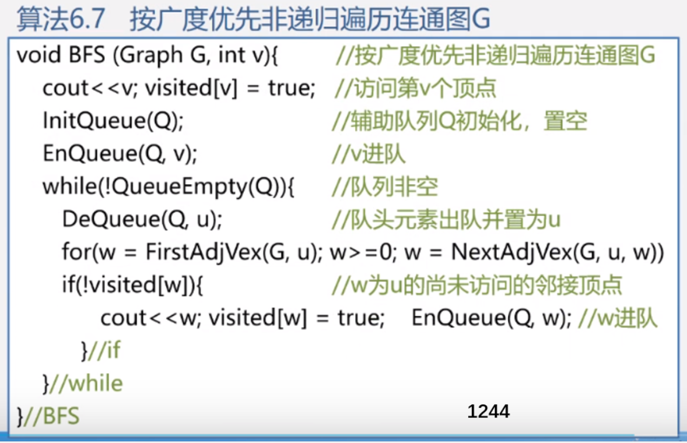

### 图

#### **邻接矩阵表示法**

*图的定义*

~~~cpp
struct AMGraph
{
    //图的顶点向量
    char Vexs[MAXSIZE];
    //图的邻接矩阵
    int Arcs[MAXSIZE][MAXSIZE];
    //图的总顶点数和总边数
    int vexnum, arcnum;
};
~~~

*创建无向网*

~~~cpp
void CreatUDN(AMGraph &G)
{
    //第一步：输入无向图的顶点数目
    cout << "input num" << endl;
    cin >> G.arcnum >> G.arcnum; //输入总顶点数和总边数
    //第二步：输入结点的名称，保存在一维数组中
    cout << "input vexs" << endl;
    for (int i = 0; i < G.vexnum; ++i)
    {
        cin >> G.vexs[i];
    }
    //第三步：将邻接矩阵的元素值置为无穷大
    for (int i = 0; i < G.arcnum; ++i)
    {
        for (int j = 0; j < G.arcnum; ++j)
        {
            G.arcs[i][j] = INT32_MAX;
        }
    }
    //第四步：输入顶点相互关系以及权重
    for (int k = 0; k < G.arcnum;++k)
    {
        int i, j, weight;
        char a, b;
        cin >> a >> b >> weight;
        //由输入的顶点a和b查找到对应的下标i,j
        i = LocateVex(G,a)
        j = LocateVex(G,b)
        G.arcs[i][j] = G.arcs[j][i] = weight;
    }
}
~~~

*邻接矩阵的LocateVex函数*

~~~cpp
int LocateVex(AMGraph &G, const char &e)
{
    for (int i = 0; i < G.vexnum;++i)
    {
        if(G.vexs[i]==e)
            return i;
    }
    return -1;
}
~~~

*深度优先遍历算法DFS*

~~~cpp
//深度优先遍历算法
//定义一个visited数组作标志
int visited[MAXSIZE] = {};
void DFS_AM(AMGraph &G, int v)
{
    //输出图顶点的包含的内容
    //cout << v;
    cout << G.vexs[v];
    //标志数组visit对应的元素被访问了，要记为1
    visited[v] = 1;
    //从邻接矩阵的某一行的第1个元素开始-遍历到该行第n个元素
    for (int w = 0; w < G.vexnum; ++w)
    {
        //如果找到一个相连的顶点，并且该顶点还没有被访问过，进入递归函数
        if((G.arcs[v][w]!=0) && visited[w]==0)
        {
            DFS_AM(G, w);
        }
    }
    //算法时间复杂度O(n^2)
}
~~~

*广度优先遍历算法BFS*

~~~cpp
void BFS_AM(AMGraph &G)
{
    for (int v = 0; v < G.vexnum; ++v)
    {
        for (int w = 0; w < G.vexnum; ++w)
        {
            if ((G.arcs[v][w] != 0) && visited[w] == 0)
            {
                cout << G.vexs[w];
                visited[w] = 1;
            }
        }
    }
    //算法时间复杂度O(n^2)
}
~~~

***

#### **邻接表表示法**

*定义*

~~~cpp
//边表的定义
struct ArcNode
{
    int adjvex;       //保存顶点的下标
    int weight;       //保存边的权重
    ArcNode *nextarc; //指向下一个边结点
};
//顶点表的定义
struct VNode
{
    //数据域，存放顶点
    VecTexType data;
    //指针域，用于保存邻接表的
    ArcNode *firstarc;
};
//图的定义
struct ALGraph
{
    //定义一个数组，保存图的顶点
    VNode vexs[MAXSIZE];
    //定义两个变量，保存当前图的顶点个数以及边的条数
    int vexnum, arcnum;
};
~~~

*邻接表的LocateVex函数*

~~~cpp
int LocateVex(ALGraph &G, const char &v)
{
    for (int i = 0; i < G.vexnum; ++i)
    {
        if (G.vexs[i].data == v)
            return i;
    }
    return -1;
}
~~~

*创建无向图算法*

~~~cpp
void CreatUDG(ALGraph &G)
{
    //第一步：输入图的顶点个数以及边的条数
    cout << "info" << endl;
    cin >> G.vexnum >> G.arcnum;
    //第二步：给顶点向量赋值
    for (int i = 0; i < G.vexnum; ++i)
    {
        cin >> G.vexs[i].data;
        G.vexs[i].firstarc = nullptr;
    }
    //给每个顶点所含的边赋值
    for (int j = 0; j < G.arcnum; ++j)
    {
        cout << "input info about arc" << endl;
        char a, b;
        //int w;
        cin >> a >> b;
        int i = LocateVex(G, a);
        int j = LocateVex(G, b);
        //申请动态内存
        ArcNode *p = new ArcNode;
        p->adjvex = j;
        //p->weight = w;
        p->nextarc = G.vexs[i].firstarc;
        G.vexs[i].firstarc = p;

        ArcNode *q = new ArcNode;
        q->adjvex = i;
        //q->weight = w;
        q->nextarc = G.vexs[j].firstarc;
        G.vexs[j].firstarc = q;
    }
}
~~~

*深度优先遍历算法DFS*

~~~cpp
int visited[MAXSIZE] = {};
void DFS_AL(ALGraph &G, int v)
{
    //访问v代表的顶点
    cout << G.vexs[v].data << endl;
    //访问之后，顶点标记为1
    visited[v] = 1;
    //访问该顶点之后的边结点
    ArcNode *p = G.vexs[v].firstarc;
    while (p != nullptr)
    {
        int i = p->adjvex;
        if (visited[i] == 0)
        {
            DFS_AL(G, i);
        }
        p = p->nextarc;
    }
}
~~~

*广度优先遍历算法BFS*

