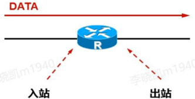
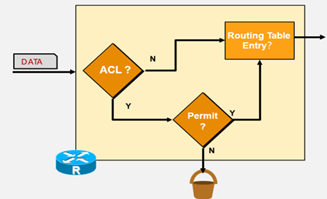
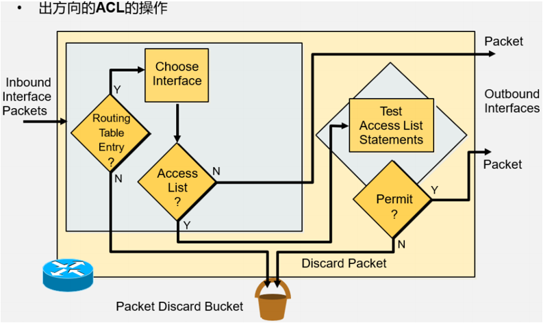
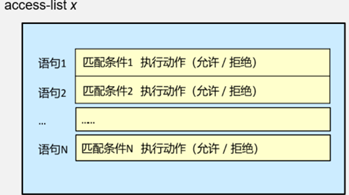
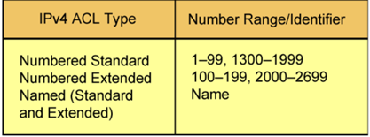
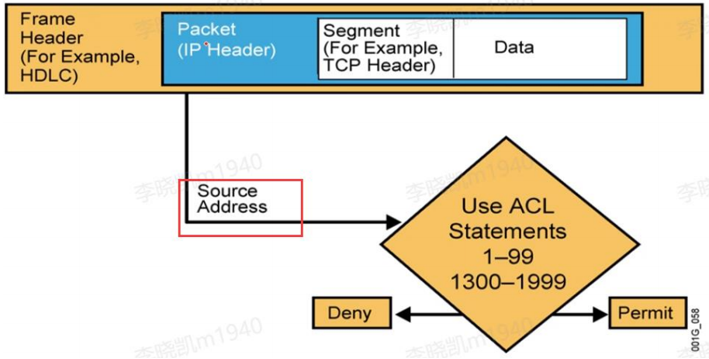
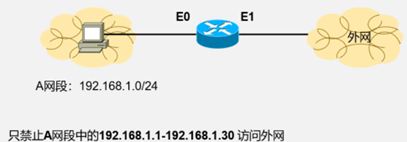
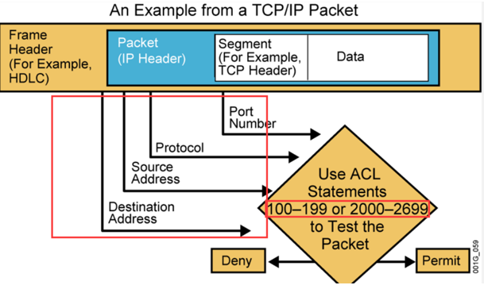
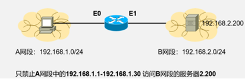
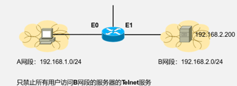

# ACL（ACESS CONTROL LIST 接入控制列表）

## 1、为什么用 ACL（ACESS CONTROL LIST 接入控制列表）

两个方向： 

向外 

限制内网某些主机不能上外网 

向内 

财务部门的信息一般比较机密，所以其他部门不能访问。 

ACL 的两大主要功能：流量控制 ，匹配感兴趣流量

## 2、ACL 类型：标准访问控制列表，扩展访问控制列表

### 2.1 标准访问控制列表

- 只能根据源地址做过滤（限制 穿越路由器的流量）
- 针对整个协议采取相关动作（允许或禁止），不能限制特定的流量

### 2.2 扩展访问列表

- 能根据源、目的地地址，端口号等等进行过滤。

根据源地址禁止流量穿越路由器。

根据目的地址，主机的流量可以穿越路由器，去往目的地址的流量则被丢弃

- 能允许或拒绝特定的协议。

禁止 ICMP 包，导致主机 ping 不通但是主机却能连接服务器

### 2.3命名的访问控制列表

 标准访问列表和扩展访问列表的另外一种表达形式。

## 3、ACL的操作

**入站和出站**

- ACL 策略是应用在接口的。
- 配置入站 ACL 策略后，如果流量时从左向右，若匹配到策略则丢弃。而流量从右向左进入路由在入站的 ACL 的则没作用。
- 配置出站 ACL 策略后则相反。

### 3.1 入方向的 ACL 的操作

先匹配 ACL 策略再路由或丢弃

### 3.2 出方向的 ACL 操作

先路由，若出接口配置 ACL 则进行 ACL 策略匹配

### 3.3 ACL格式

- ACL 由很多语句组成（二元语句：条件、动作）
- 流量由上往下匹配各条件
- 数据包如果被一个条件匹配后不会再继续往下匹配了
- 如果到最后都没匹配到。默认丢弃。

### 3.4 ACL 的标识

常用：

标准 访问控制列表：1-99

扩展 100-199

## 4、配置

ACL 的查看

Router# show access-lists {access-list number|name}

### 4.1 标准访问控制列表配置

**Router（config）#access-list access-list-number {permit|deny} source [wildcard mask]**

编号选择：1-99 或者 1300-1999

通配符，缺省值 0.0.0.0

**“no access-list access-list-number”将会删除整个 ACL列表**

**Ip access-group access-list number {in|out}**

在接口应用

应用时关联入或出站方向

默认出站

**“no ip access-group access-list-number”**可移除接口上应用的访问列表

 

例子 1：

Route(config)#access-list 1 deny 192.168.1.1 0.0.0.0

Route(config)#access-list 1 permit any

Route(config)#interface e0

Route(config-if)#ip access-group 1 in

例子 2：

Route(config)#access-list 1 deny 192.168.1.0 0.0.0.31 （写策略）

Route(config)#access-list 1 permit any

Route(config)#interface e0（进接口）

Route(config-if)#ip access-group 1 in（在接口入方向应用策略）

**总结：**

- 写策略（必须写一条允许全部通过的策略，因为策略默认拒绝所有）
- 在接口中应用

应用时关联入或出站方向

### 4.2 扩展访问控制列表配置

**Router（config）**#access-list access-list-number {permit|deny} protocol source

**source-wildcard [operate port] destination destination-wildcard [operate port]** 

**[establish] [log]** 

**Router(config-if)#ip access-group access-list-number{in|out}** 

在接口中应用 

应用时关联入或出站方向 

 

例子 1：

Router(config)#access-list 100 deny ip 192.168.1.0 0.0.0.31 192.168.200 0.0.0.0Router(config)#access-list 100 permit any 

Router(config)#interface e0 

Router(config-if)#access-group 100 in 

例子 2： 

Router(config)#access-list 100 deny tcp 192.168.1.0 0.0.0.255 192.168.2.0 0.0.0.255 eq 23 

Router(config)#access-list 100 permit any 

Router(config)#interface e0 

Router(config-if)#access-group 100 in

### 4.3 命名访问控制列表配置

**标准访问控制列表和扩展访问控制列表的缺点：**

1 无法编辑，删改，添加 （条件）

2 删除时删除整个列表

3 使用数字编号不直观

 

**命名访问控制列表可以使用字符串命名访问控制列表，并且能删除，添加条件**

**配置：**

① **Router（config）# ip access-list {standard|extended} name**

② **Router(config {std- | ext-}nacl)#**

**[sequence-number] {permit | deny} {ip access list test conditions} {permit | deny} {ip access list test conditions}**

序列号默认从 10 开始，并每次增加 10。

③ **ip access-group access-list-number { in | out }**

access-list-number 使用 name.

## 5、总结

-  通过数字标识 ACL 时（1-99 标识标准访问控制列表，100-199 标识扩展访问控制列表）

-  另一种标识 ACL 的方式是使用命名访问控制列表。

-  在 ACL 中默认拒绝所有，应该配置一条允许所有的策略

-  在配置的时候先写策略后，在接口应用时要出入站

-  在某个接口的某个特定方向（in，out），针对某种协议，只能应用一个 ACL。

-  ACL 不能对本地始发的流量过滤。只能对穿越路由器的的流量做过滤

-  尽可能的把 IP 标准 ACL 放置在离目标地址近的地方;尽可能的把 IP 扩展 ACL 放置在离源地址近的地方

-  每个接口,每个方向,每种协议,你只能设置 1 个 ACL

-  你不可能从 ACL 从除去 1 行,除去 1 行意味你将除去整个 ACL,命名访问列表(named access lists)例外

-  组织好你的 ACL 的顺序,比如测试性的最好放在 ACL 的最顶部