# IPV6

## 1、 IPv6的基本概念

### 1.1 IPv6地址

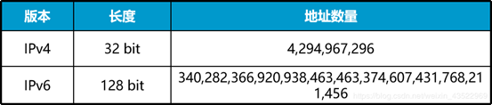

### 1.2 IPv6基本报头

IPv6的基本报头在IPv4报头的基础上，增加了流标签域，去除了一些冗余字段，使报文头的处理更为简单、高效。

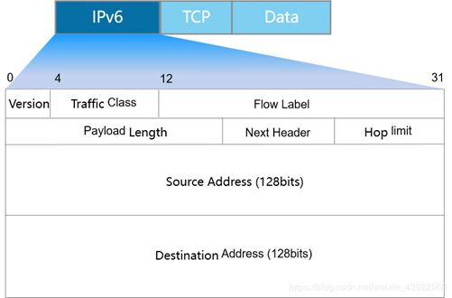

**IPv6报文由IPv6基本报头、IPv6扩展报头以及上层协议数据单元三部分组成。**

 

**基本报头中的各字段解释如下：**

1、Version：版本号，长度为4bit。对于IPv6，该值为6。

2、Traffic Class：流类别，长度为8bit，它等同于IPv4报头中的TOS字段，表示IPv6数据报文的类或优先级，主要应用于QoS。

3、Flow Label：流标签，长度为20bit，它用于区分实时流量。流可以理解为特定应用或进程的来自某一源地址发往一个或多个目的地址的连续单播、组播或任播报文。IPv6中的流标签字段、源地址字段和目的地址字段一起为特定数据流指定了网络中的转发路径。这样，报文在IP网络中传输时会保持原有的顺序，提高了处理效率。随着三网合一的发展趋势，IP网络不仅要求能够传输传统的数据报文，还需要能够传输语音、视频等报文。这种情况下，流标签字段的作用就显得更加重要。

4、Payload Length：有效载荷长度，长度为16bit，它是指紧跟IPv6报头的数据报文的其它部分。

5、Next Header：下一个报头，长度为8bit。该字段定义了紧跟在IPv6报头后面的第一个扩展报头（如果存在）的类型。

6、跳数限制（Hop Limit），长度为8bit，该字段类似于IPv4报头中的Time to Live字段，它定义了IP数据报文所能经过的最大跳数。每经过一个路由器，该数值减去1；当该字段的值为0时，数据报文将被丢弃。

7、Source Address：源地址，长度为128bit，表示发送方的地址。

8、Destination Address：目的地址，长度为128bit，表示接收方的地址。

与IPv4相比，IPv6报头去除了IHL、Identifier、Flags、Fragment Offset、Header Checksum、

9、Options、Padding域，只增了流标签域，因此IPv6报文头的处理较IPv4大大简化，提高了处理效率。另外，IPv6为了更好支持各种选项处理，提出了扩展头的概念。

### 1.3 IPv6扩展报头

IPv6扩展报头是跟在IPv6基本报头后面的可选报头，可以有一个或多个。

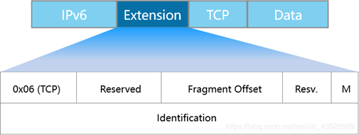

 **IPv6增加了扩展报头，使得IPv6报头更加简化**。一个IPv6报文可以包含0个、1个或多个扩展报头，仅当需要路由器或目的节点做某些特殊处理时，才由发送方添加一个或多个扩展头。IPv6支持多个扩展报头，各扩展报头中都含有一个下一个报头字段，用于指明下一个扩展报头的类型。这些报头必须按照以下顺序出现：

1、IPv6基本报头

2、逐跳选项扩展报头

3、目的选项扩展报头

4、路由扩展报头

5、分片扩展报头

6、认证扩展报头

7、封装安全有效载荷扩展报头

8、目的选项扩展报头（指那些将被分组报文的最终目的地处理的选项）

9、上层协议数据报文

​       除了目的选项扩展报头外，每个扩展报头在一个报文中最多只能出现一次。目的选项扩展报头在一个报文中最多也只能出现两次，一次是在路由扩展报头之前，另一次是在上层协议扩展报头之前。

## 2、 IPv6地址格式和地址类型

### 2.1 IPv6地址格式

IPv6地址长度为128比特，每16比特划分为一段，每段由4个十六进制数表示，并用冒号隔开。

IPv6地址包括网络前缀和接口标识两部分。

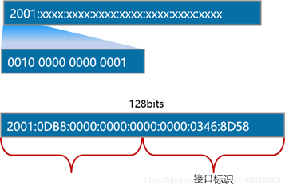

### 2.2 IPv6地址压缩格式

每一组中的前导“0”都可以省略。

地址中包含的连续全为0的组，可以用双冒号“::”来代替。

注意：如果一个IPV6地址中只能出现一个‘::’，否则会出现歧义

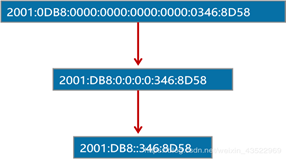

### 2.3 IPv6地址分类

IPv6地址分为单播地址、任播地址、组播地址三种类型。

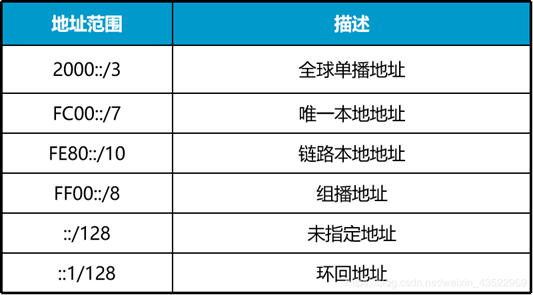

**单播地址的格式是2000::/3，代表公共IP网络上任意可及的地址。**IANA负责将该段地址范围内的地址分配给多个区域互联网注册管理机构（RIR）。RIR负责全球5个区域的地址分配。以下几个地址范围已经分配：2400::/12 (APNIC)、2600::/12 (ARIN)、2800::/12 (LACNIC)、2A00::/12 (RIPE NCC)和2C00::/12 (AfriNIC)，它们使用单一地址前缀标识特定区域中的所有地址。2000::/3地址范围中还为文档示例预留了地址空间，例如2001:0DB8::/32。

**链路本地地址只能在连接到同一本地链路的节点之间使用**。可以在自动地址分配、邻居发现和链路上没有路由器的情况下使用链路本地地址。以链路本地地址为源地址或目的地址的IPv6报文不会被路由器转发到其他链路。链路本地地址的前缀是FE80::/10。

**组播地址的前缀是FF00::/8**。组播地址范围内的大部分地址都是为特定组播组保留的。跟IPv4一样，IPv6组播地址还支持路由协议。IPv6中没有广播地址。组播地址替代广播地址可以确保报文只发送给特定的组播组而不是IPv6网络中的任意终端。

**IPv6还包括一些特殊地址，比如未指定地址::/128。**如果没有给一个接口分配IP地址，该接口的地址则为::/128。需要注意的是，不能将未指定地址跟默认IP地址::/0相混淆。默认IP地址::/0跟IPv4中的默认地址0.0.0.0/0类似。环回地址127.0.0.1在IPv6中被定义为保留地址::1/128。 

### 2.4 IPv6单播地址

全球单播地址带有固定前缀，类似于IPv4中的公网地址

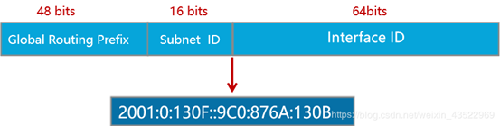

链路本地单播地址前缀为FE80::/10。

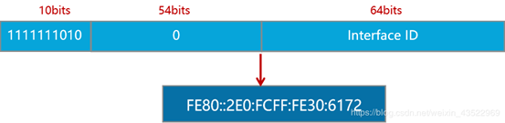

**单播地址主要包含全球单播地址和链路本地地址。**全球单播地址（例如2000::/3）带有固定的地址前缀，即前三位为固定值001。其地址结构是一个三层结构，依次为**全球路由前缀、子网标识和接口标识。**全球路由前缀由RIR和互联网服务供应商（ISP）组成，RIR为ISP分配IP地址前缀。子网标识定义了网络的管理子网。

### 2.5 IPv6组播地址

所有IPv6组播地址都以FF开始。

IPv6为需要使用组播发送数据的协议预留了一些组播组。

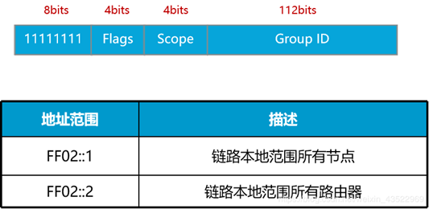

1. IPv6的组播与IPv4相同，用来标识一组接口，一般这些接口属于不同的节点。一个节点可能属于0到多个组播组。

2. 目的地址为组播地址的报文会被该组播地址标识的所有接口接收。

3. 一个IPv6组播地址是由前缀、标志（Flag）字段、范围（Scope）字段以及组播组ID（Group ID）4个部分组成：

1）前缀：IPv6组播地址的前缀是FF00::/8（1111 1111）。

2）标志字段（Flag）：长度4bit，目前只使用了最后一个比特（前三位必须置0），当该位值为0时，表示当前的组播地址是由IANA所分配的一个永久分配地址；当该值为1时，表示当前的组播地址是一个临时组播地址（非永久分配地址）。

3）范围字段（Scope）：长度4bit，用来限制组播数据流在网络中发送的范围。

4）组播组ID（Group ID）：长度112bit，用以标识组播组。目前，RFC2373并没有将所有的112位都定义成组标识，而是建议仅使用该112位的最低32位作为组播组ID，将剩余的80位都置0，这样，每个组播组ID都可以映射到一个唯一的以太网组播MAC地址（RFC2464）。  

### 2.6 IPv6任播地址

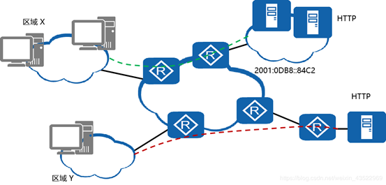

- **任播地址标识一组网络接口（通常属于不同的节点）。`目标地址`是任播地址的数据包将发送给其中路由意义上最近的一个网络接口**。任播过程涉及一个任播报文发起方和一个或多个响应方。任播报文的发起方通常为请求某一服务（DNS查找）的主机或请求返还特定数据（例如，HTTP网页信息）的主机。**任播地址与单播地址在格式上无任何差异，唯一的区别是一台设备可以给多台具有相同地址的设备发送报文。**
- 企业网络中运用任播地址有很多优势。其中一个优势是业务冗余。比如，用户可以通过多台使用相同地址的服务器获取同一个服务（例如，HTTP）。这些服务器都是任播报文的响应方。如果不是采用任播地址通信，当其中一台服务器发生故障时，用户需要获取另一台服务器的地址才能重新建立通信。如果采用的是任播地址，当一台服务器发生故障时，任播报文的发起方能够自动与使用相同地址的另一台服务器通信，从而实现业务冗余。
- 使用多服务器接入还能够提高工作效率。例如，用户（即任播地址的发起方）浏览公司网页时，与相同的单播地址建立一条连接，连接的对端是具有相同任播地址的多个服务器。用户可以从不同的镜像服务器分别下载html文件和图片。用户利用多个服务器的带宽同时下载网页文件，其效率远远高于使用单播地址进行下载。(分布式)

## 3、 IPv6无状态地址配置的过程

### 3.1 IPv6无状态地址自动配置

网络节点向相连的路由器发送RS，请求地址前缀信息。

路由器通过发送路由器通告RA，回复地址前缀信息。

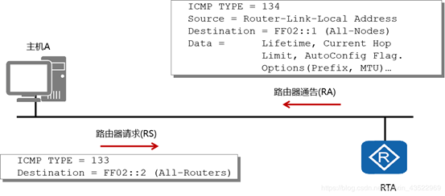

IPv6支持无状态地址自动配置，无需使用诸如DHCP之类的辅助协议，主机即可获取IPv6前缀并自动生成接口ID。路由器发现功能是IPv6地址自动配置功能的基础，主要通过以下两种报文实现：

**RA报文：**每台路由器为了让二层网络上的主机和其它路由器知道自己的存在，定期以组播方式（FF02::1 所有主机）发送携带网络配置参数的RA报文。RA报文的Type字段值为134。

**RS报文：**主机接入网络后可以主动发送RS报文。RA报文是由路由器定期发送的，但是如果主机希望能够尽快收到RA报文，它可以立刻主动发送RS报文给路由器。网络上的路由器收到该RS报文后会立即向相应的主机单播回应RA报文，告知主机该网段的默认路由器和相关配置参数。RS报文的Type字段值为133。

### 3.2 EUI-64规范

将FFFE插入MAC地址的前24位与后24位之间，并将第7位的值取反（比如0改为1）即可生成接口ID。

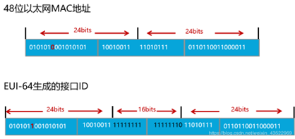

为了通过IPv6网络进行通信，各接口必须获取有效的IPv6地址，以下三种方式可以用来配置IPv6地址的接口ID：

1）网络管理员手动配置；

2）通过系统软件生成；

3）采用扩展唯一标识符（EUI-64）格式生成。

就实用性而言，EUI-64格式是IPv6生成接口ID的最常用方式。

- IEEE EUI-64标准采用接口的MAC地址生成IPv6接口ID。MAC地址只有48位，而接口ID却要求64位。MAC地址的前24位代表厂商ID，后24位代表制造商分配的唯一扩展标识。
- MAC地址的第七高位是一个U/L位，值为0时表示MAC地址全局唯一，值为1时表示MAC地址本地唯一。
- 在MAC地址向EUI-64格式的转换过程中，在MAC地址的前24位和后24位之间插入了16比特的FFFE，并将U/L位的值从0变成了1，这样就生成了一个64比特的接口ID，且接口ID的值全局唯一。接口ID和接口前缀一起组成接口地址。

### 3.3 IPv6无状态地址DAD检查

当为接口配置IPv6地址时，DAD用来在本地链路范围内检测将要使用的IPv6地址是否唯一。

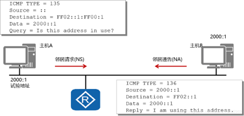

**设备在给接口分配IPv6单播地址之前会进行重复地址检测（DAD），确认是否有其它的节点使用了该地址。尤其是在地址自动配置的时候，进行DAD检测是很必要的。**一个IPv6单播地址在分配给一个接口之后且通过重复地址检测之前称为试验地址，此时该接口不能使用这个试验地址进行单播通信，但是仍然会加入两个组播组：ALL-nodes组播组和Solicited-node组播组。Solicited-node组播组由单播或任播地址的后24位加上地址前缀FF02:0:0:0:0:1:FF00::/104组成。

例如，本示例中配置的试验地址为2000::1，该地址被加入Solicited-node组播组FF02::1:FF00:1。

**IPv6重复地址检测技术和IPv4中的免费ARP类似：**用于地址分配或主机连接网络时检测重复的IPv4主机地址。

节点向一个自己将使用的试验地址所在的Solicited-node组播组发送一个以该试验地址为请求的目标地址的邻居请求**（NS）报文，如果收到某个其它站点回应的邻居通告（NA）报文，就证明该地址已被网络上使用，节点将不能使用该试验地址进行通信。这种情况下，网络管理员需要手动为该节点分配另外一个地址。**(回复NA报文是告诉发送NS报文的主机，该节点已经被使用)

## 4、IPv6过渡技术

### 4.1 双协议栈技术

同时启用v4与v6协议栈

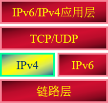

**双栈技术**

1）同时支持IPv6和IPv4协议

2）应用程序根据DNS解析地址类型选择使用IPv6或IPv4协议

**优点**

互通性好，实现简单，允许应用逐渐从IPv4过渡到IPv6　

**缺点**

只适用双栈节点本身

对每个IPv4节点都要升级，成本较大，没有解决IPv4地址紧缺问题

### 4.2 隧道技术

v6报文封装在v4中（主流技术）

#### 4.2.1 GRE隧道技术

IPv6报文被包含在GRE报文中作为GRE的载荷

**优点**

通用性好

技术成熟，易于理解

**缺点**

维护复杂

**GRE隧道流程**

1）发送方与接收方都是双栈设备

2）隧道已预先建立好

3）发送方封装报文，接收方解封装

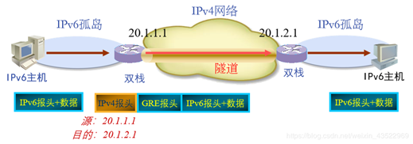

#### 4.2.2 IPv6 in IPv4隧道技术

IPv6报文被包含在IPv4报文中作为IPv4的载荷(没有GRE的封装)

同GRE隧道有类似的优缺点

**6to4隧道流程**

1）同自动隧道技术类似6to4中继

2）通往纯IPv6网络的网关

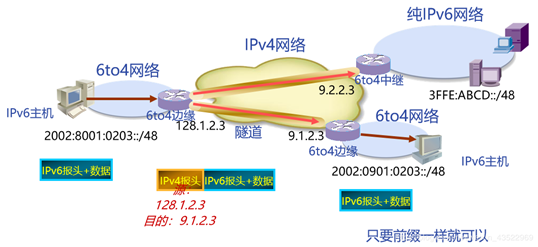

#### 4.2.3 ISATAP隧道技术

- 连接IPv4网点内部的IPv6主机和路由器
- 将IPv4网点作为一个NBMA链路，在IPv4报文中封装IPv6报文

**优点**

​        IPv4网点内部的IPv6主机可自动获得IPv6前缀

**缺点**

​        IPv6地址为固定格式 

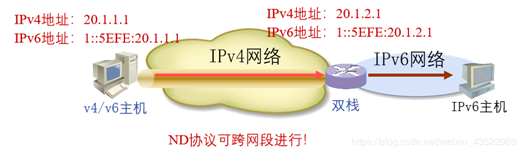

### 4.3 网络地址转换

NAT－PT

**NAT-PT原理**

1）通过中间的NAT-PT协议转换服务器，实现纯IPv6节点和纯IPv4节点间的互通

2）NAT-PT服务器分配动态IPv4地址来标识IPv6主机（与DNS配合）

3）NAT-PT服务器向相邻IPv6网络宣告96位地址前缀信息，用于标识IPv4主机

4）NAT-PT服务器负责IPv4-to-IPv6，或IPv6-to-IPv4的报文转换

**优点**

只需设置NAT-PT服务器

**缺点**

资源消耗较大，服务器负载重

**NAT-PT种类**

1）静态NAT-PT

- NAT-PT服务器提供一对一的IPv6地址和IPv4地址的映射。
- 配置复杂，使用大量的IPv4地址。

2）动态NAT-PT

- NAT-PT服务器提供多对一的IPv6地址和IPv4地址的映射。
- 采用上层协议复用的方法。

3）NAT-PT DNS ALG

- 动态NAT-PT与DNS ALG联合使用，转换DNS请求。
- 可利用原有的DNS服务器。

#### 4.3.1 静态NAT-PT转换过程

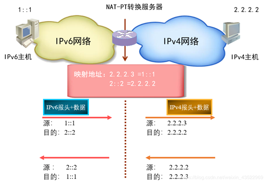

#### 4.3.2 动态NAT-PT转换过程

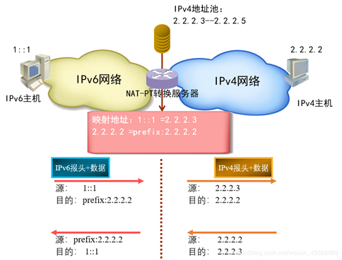

#### 4.3.3 NAT-PT DNS ALG转换过程

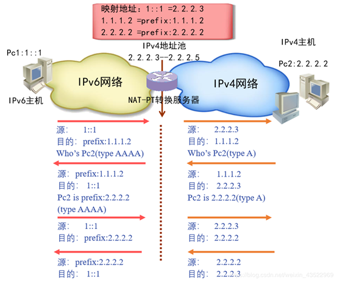

## 5、 常见问题

IPv6主机无状态地址自动配置的过程是什么?

**答：**IPv6主机首先通过路由器发现功能来获取地址前缀信息，之后通过向接口已有的48比特MAC地址中插入16比特的FFEE生成接口ID，在生成了IPv6地址后会通过重复地址检测来确认地址是否唯一。（DAD检查）

