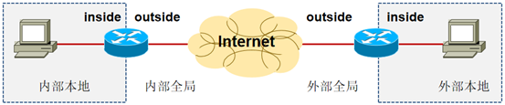
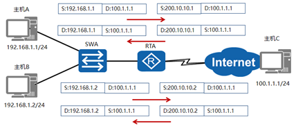
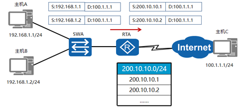
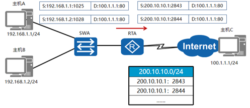
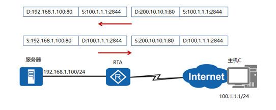
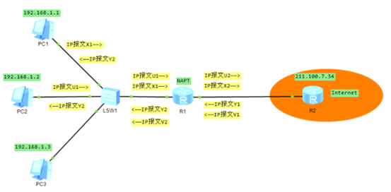

# NAT 网络地址转换技术

网络地址转换技术也称为NAT（Network Address Translation）技术，他的基本作用就是实现私网IP与公网IP地址之间的转换。

**公网：**就是公有的IP地址的网络，公网中是绝对不能使用私有IP地址的。

**私网：**就是使用私有IP地址的网络。在私网中，各个网络接口的 IP地址必须是私有IP地址，但是在有些情况下，私网出现的IP报文，其目的IP地址或源IP地址可以是公有IP地址。

**NAT优缺点：**

| 优点                                   | 缺点                                  |
| -------------------------------------- | ------------------------------------- |
| 节省IP地址空间                         | 增加转发延迟                          |
| 解决IP地址重叠问题                     | 丧失端到端的寻址能力                  |
| 增加网络的连入Internet的弹性           | 某些应用不支持NAT                     |
| 当网络变更的时候减少更改ip重编址的麻烦 | 需要一定的内存空间支持动态存储NAT表项 |
| 对外隐藏内部地址，增加网络安全性       | 需要耗费一定CPU资源进行NAT操作        |

**NAT术语：**

| 术语     | 解释                       |
| -------- | -------------------------- |
| 内部本地 | 转换之前内部源地址的名字   |
| 外部本地 | 转换之前目标主机的名字     |
| 内部全局 | 转换之后内部主机的名字     |
| 外部全局 | 转换之后外部目标主机的名字 |

## 1、静态NAT

- 静态NAT实现了私有地址和公有地址的一对一映射。

- 一个公网IP只会分配给唯一且固定的内网主机。

在本示例中，源地址为192.168.1.1的报文需要发往公网地址100.1.1.1。在网关RTA上配置了一个私网地址192.168.1.1到公网地址200.10.10.1的映射。当网关收到主机A发送的数据包后，会先将报文中的源地址192.168.1.1转换为200.10.10.1，然后转发报文到目的设备。目的设备回复的报文目的地址是200.10.10.1。当网关收到回复报文后，也会执行静态地址转换，将200.10.10.1转换成192.168.1.1，然后转发报文到主机A。和主机A在同一个网络中其他主机，如主机B，访问公网的过程也需要网关RTA做静态NAT转换。

## 2、动态NAT

- 动态NAT基于地址池来实现私有地址和公有地址的转换。
- 动态NAT地址池中的地址用尽以后，只能等待被占用的公用IP被释放后，其他主机才能使用它来访问公网。

本示例中，当内部主机A和主机B需要与公网中的目的主机通信时，网关RTA会从配置的公网地址池中选择一个未使用的公网地址与之做映射。每台主机都会分配到地址池中的一个唯一地址。当不需要此连接时，对应的地址映射将会被删除，公网地址也会被恢复到地址池中待用。当网关收到回复报文后，会根据之前的映射再次进行转换之后转发给对应主机。

## 3、NAPT(端口复用)

- 网络地址端口转换NAPT允许多个内部地址映射到同一个公有地址的不同端口。
- 理想状况下，一个单一的IP地址可以使用的端口数为4000个

本例中，RTA收到一个私网主机发送的报文，源IP地址是192.168.1.1，源端口号是1025，目的IP地址是100.1.1.1，目的端口是80。RTA会从配置的公网地址池中选择一个空闲的公网IP地址和端口号，并建立相应的NAPT表项。这些NAPT表项指定了报文的私网IP地址和端口号与公网IP地址和端口号的映射关系。之后，RTA将报文的源IP地址和端口号转换成公网地址200.10.10.1和端口号2843，并转发报文到公网。当网关RTA收到回复报文后，会根据之前的映射表再次进行转换之后转发给主机A。主机B同理。

## 4、NAT服务器

- 通过配置NAT服务器,可以使外网用户访问内网服务器
- NAT在使内网用户访问公网的同时，也屏蔽了公网用户访问私网主机的需求。当一个私网需要向公网用户提供Web和SFTP服务时，私网中的服务器必须随时可供公网用户访问。
- NAT服务器可以实现这个需求，但是需要配置服务器私网IP地址和端口号转换为公网IP地址和端口号并发布出去。路由器在收到一个公网主机的请求报文后，根据报文的目的IP地址和端口号查询地址转换表项。路由器根据匹配的地址转换表项，将报文的目的IP地址和端口号转换成私网IP地址和端口号，并转发报文到私网中的服务器。

本例中，主机C需要访问私网服务器，发送报文的目的IP地址是200.10.10.1，目的端口号是80。RTA收到此报文后会查找地址转换表项，并将目的IP地址转换成192.168.1.1，目的端口号保持不变。服务器收到报文后会进行响应，RTA收到私网服务器发来的响应报文后，根据报文的源IP地址192.168.1.1和端口号80查询地址转换表项。然后，路由器根据匹配的地址转换表项，将报文的源IP地址和端口号转换成公网IP地址200.10.10.1和端口号80，并转发报文到目的公网主机。

## 5、 NAT过程实验操作解释

| 公有地址资源池 |
| -------------- |
| 200.24.5.1     |
| 200.24.5.2     |
| 200.24.5.3     |
| 200.24.5.4     |
| 200.24.5.5     |
| 200.24.5.6     |

**动态地址及端口号映射：**

| 私有地址：端口号 | 公有地址：端口号 |
| ---------------- | ---------------- |
| 192.168.1.1:1031 | 200.24.5.1:5531  |
| 192.168.1.2:1540 | 200.24.5.1:5532  |

| 报文X1                   | 报文X2                   |
| ------------------------ | ------------------------ |
| 源IP地址：192.168.1.1    | 源IP地址：200.24.5.1     |
| 源端口号：1031           | 源端口号：5531           |
| 目的IP地址：211.100.7.34 | 目的IP地址：211.100.7.34 |
| 目的端口号：Z1           | 目的端口号：Z1           |

| 报文Y1                 | 报文Y2                  |
| ---------------------- | ----------------------- |
| 源IP地址：211.100.7.34 | 源IP地址：211.100.7.34  |
| 源端口号：Z2           | 源端口号：5531          |
| 目的IP地址：200.24.5.1 | 目的IP地址：192.168.1.1 |
| 目的端口号：5531       | 目的端口号：1031        |

| 报文U1                   | 报文U2                   |
| ------------------------ | ------------------------ |
| 源IP地址：192.168.1.2    | 源IP地址：200.24.5.1     |
| 源端口号：1540           | 源端口号：5532           |
| 目的IP地址：211.100.7.34 | 目的IP地址：211.100.7.34 |
| 目的端口号：Z3           | 目的端口号：Z3           |

| 报文V1                 | 报文V2                  |
| ---------------------- | ----------------------- |
| 源IP地址：211.100.7.34 | 源IP地址：211.100.7.34  |
| 源端口号：Z4           | 源端口号：Z4            |
| 目的IP地址：200.24.5.1 | 目的IP地址：192.168.1.2 |
| 目的端口号：5532       | 目的端口号：1540        |

**过程：**

1、PC1 向Internet发起访问请求，发送报文为X。**源IP地址：192.168.1.1，源端口号：1031，目的IP地址211.100.7.34，目的端口号Z1。**

2、当X1达到R1的时候，NAPT会在公有地址资源池选中了IP地址200.24.5.1，并根据某种规则确定出一个端口5531，然后在动态地址及端口映射表中创建**192.168.1.1:1031与200.24.5.1:5531映射表项；**

3、根据这个表项NAPT将**源IP地址：192.168.1.1，源端口号：1031**，替换成200.24.5.1:5531，从而得到一个新的IP报文X2，并发送到Internet；

4、服务器向PC1 返回一个IP报文Y1，**源IP地址：211.100.7.34，源端口号：Z2，目的IP地址：200.24.5.1，目的端口号：5531**；

5、Y1进入R2后，NAPT会在动态地址映射表中找到200.24.5.1:5531对应的表项192.168.1.1:1031，进行替换得到一个新的报文Y2，R1将Y2发到私网。

PC2访问服务器与服务器访问PC2同理。

