# 交换基础

## 1、二层交换基础

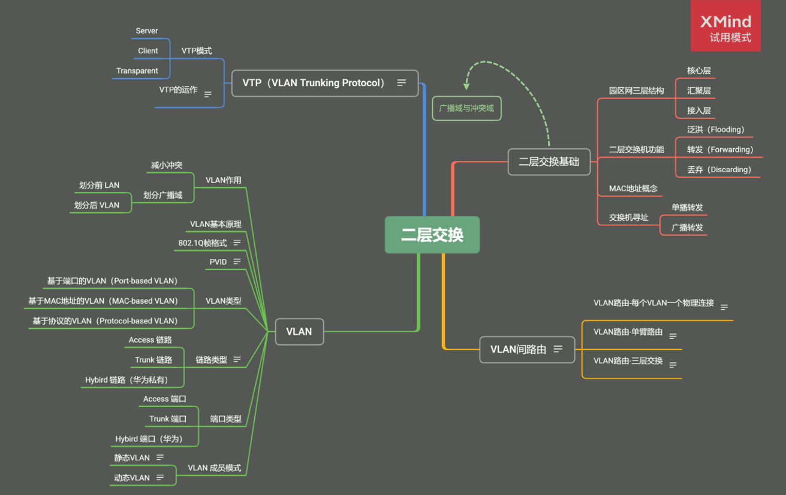

**二层交换特点**

二层交换（二层通信）：交换帧，源和目的MAC地址不会变，但是涉及到路由器（或者具有三层转发功能的交换机）源MAC地址会改变。

**广播域：接收同样广播消息的节点的集合；**

**冲突域：连接在同一条线上所有工作站的集合；**

 

**区别：**

1、广播域可以划分网段，冲突域一般在同一个网段；

2、广播域基于二层，冲突域基于一层；

3、一个局域网就是一个广播域；

4、集线器（hub）所有端口位于同一个广播域，冲突域；

5、二层交换机（switch）所有端口在一个广播域，每一个端口是一个冲突域；

 

### 1.1 园区网结构

出口层（OR）：广域网接入 出口策略 带宽控制

核心层（CO）：高速转发 服务器接入 路由选择

汇聚层（GS）：流量汇聚 链路冗余 设备冗余 路由选择

接入层（AS）：用户接入 接入安全 访问控制

 

### 1.2 MAC地址

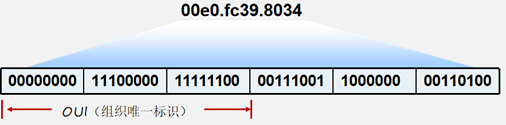

MAC地址有48位，通常被表示为点分十六进制数。

MAC地址全球唯一，由 IEEE对这些地址进行管理和分配。

每个地址由两部分组成，分别是供应商代码和序列号。其中前24位二进制代表 该供应商代码。剩下的24位由厂商自己分配。

### 1.3 交换机工作原理

#### 1.3.1 二层交换机的主要功能：

Address learning

Forward/filter decision

Loop avoidance

#### 1.3.2 二层交换机的行为

1、泛洪：把一个帧从除了进入端口外的所有端口转发出去；

2、转发：从某一端口转发到另一端口；

3、丢弃：不进行转发，直接丢弃；

#### 1.3.3 交换机的寻址：

 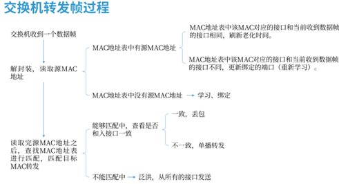

 

### 1.4 ARP概述

1. ARP协议(Address Resolution Protocol)即地址解析协议，用于实现从 IP 地址到 MAC 地址的映射，即询问目标IP对应的MAC地址。
2. 在网络通信中，主机和主机通信的数据包需要依据OSI模型从上到下进行数据封装，当数据封装完整后，再向外发出。所以在局域网的通信中，不仅需要源目IP地址的封装，也需要源目MAC的封装。
3. 一般情况下，上层应用程序更多关心IP地址而不关心MAC地址，所以需要通过ARP协议来获知目的主机的MAC地址，完成数据封装。

 

**ARP实现过程：**

ARP应答

　　同一个局域网中，两台主机需要进行通信时，根据OSI数据封装顺序，发送方会自顶向下（从应用层到物理层）封装数据，然后发送出去，这是发送方发送ARP请求给接收方，接收方把主机的MAC地址回复给发送方，这就是ARP请求和回复的过程，通过这个交互工程，发送发便具备了接收方的MAC地址信息。

 

**ARP表：**

ARP高效运行的关键

1、每个主机上都有一个ARP高速缓存，即ARP表 

2、ARP表中记录了最近的映射记录

 

**ARP代理：**

　　如果ARP请求是从一个网络的主机发往另一个网络上的主机，那么连接这两个网络的路由器就可以回答该请求，这个过程称作委托ARP或ARP代理（ARP Proxy）

 

**免费ARP（无故ARP）：**

　　为什么要免费ARP？

　　当一个主机和你配置了一样的IP地址时，怎么办？　

　　我改了自己的IP地址，别人怎么知道我改了IP地址？

　　　　其实很简单： 

　　　　一机器进入了我的网络领域或更改自己的IP地址 

　　　　按规矩，他要向网络中广播一个ARP报文 

　　　　告诉我们这些土著他的新IP地址和MAC地址 

　　　　我们就对自己ARP表进行更新

## 2、VLAN概述

### 2.1为什么需要VLAN

答：整台交换机的所有端口均属于同一个广播域，将交换机的端口划分进特定的VLAN（不同广播域），这样形成逻辑的广播域，不同之间的VLAN互相隔离

### 2.2 VLAN的成员模式

静态 VLAN －交换机上的端口以手动方式分配给VLAN； 

动态 VLAN －使用VMPS可以根据连接到交换机端口的设备的源 MAC 地址，动态地将端口分配给 VLAN；

 

1）一个VLAN中所有设备都是在同一广播域内，不同的VLAN为不同的广播域 VLAN之间互相隔离，广播不能跨越VLAN传播，因此不同VLAN之间的设备一般 无法互访，不同VLAN间需通过三层设备实现相互通信

2）一个VLAN一般为一个逻辑子网，由被配置为此VLAN成员的设备组成 

3）VLAN中成员多基于交换机的端口分配，划分VLAN就是对交换机的接口划分

4）VLAN工作于OSI参考模型的第二层 

5）VLAN是二层交换机的一个非常根本的工作机制

### 2.3 VLAN中接口类型（链路类型）：

**Access接口：**

- 进该接口打上VLAN标记，VLAN ID和端口的PVID相同；出接口剥离VLAN标记。
- 一般见于交换机和主机之间
- 在一条Access链路上运动的帧只能是Untagged 帧。

**Trunk接口：**

- 当一条链路，需要承载多VLAN信息的时候，需使用trunk来实现 
- Trunk两端的交换机需采用相同的干道协议
- 一般见于交换机之间或交换机与路由器之间

 

**Trunk端口收发数据帧的规则如下：**

1、当接收到对端设备发送的不带Tag的数据帧时，会添加该端口的PVID，如果PVID在允许通过的VLAN ID列表中，则接收该报文，否则丢弃该报文。

2、当接收到对端设备发送的带Tag的数据帧时，检查VLAN ID是否在允许通过的VLAN ID列表中。如果VLAN ID在接口允许通过的VLAN ID列表中，则接收该报文。否则丢弃该报文。

3、端口发送数据帧时，当VLAN ID与端口的PVID相同，且是该端口允许通过的VLAN ID时，去掉Tag，发送该报文。当VLAN ID与端口的PVID不同，且是该端口允许通过的VLAN ID时，保持原有Tag，发送该报文。(PVID 与 VLAN ID相同去掉Tag，不同保持原有Tag)

**例：**

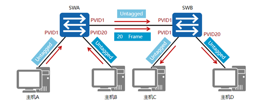

在本示例中，SWA和SWB连接主机的端口为Access端口，PVID如图所示。SWA和SWB互连的端口为Trunk端口，PVID都为1，此Trunk链路允许所有VLAN的流量通过。当SWA转发VLAN1的数据帧时会剥离VLAN标签，然后发送到Trunk链路上。而在转发VLAN20的数据帧时，不剥离VLAN标签直接转发到Trunk链路上。

### 2.4 802.1Q帧格式

1）ISL思科专有，用的少

2）802.1Q

- 公有标准，用的多
- IEEE 802.1D定义了不支持VLAN特性交换机的标准规范，IEEE 802.1Q定义了关于支持VLAN特性的交换机标准；
- 通过tag区分不同VLAN；

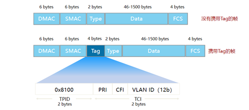

| 标签 | 含义                                                         |
| ---- | ------------------------------------------------------------ |
| TPID | Tag   Protocol ID,表示这个帧是否有tag，0x8100表示带有Tag（固定值） |
| PRI  | Priority，帧优先级，越大越优先                               |
| CFI  | Canoncial Format Indicator                                   |
| VID  | VLAN   Identification，表示该帧所属VLAN                      |

 

### 2.5 PVID

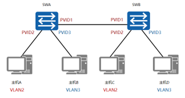

  **PVID即Port VLAN ID**，代表端口的缺省VLAN****。**交换机从对端设备收到的帧有可能是Untagged的数据帧，但所有以太网帧在交换机中都是以Tagged的形式来被处理和转发的，因此交换机必须给端口收到的Untagged数据帧添加上Tag。为了实现此目的，必须为交换机配置端口的缺省VLAN。当该端口收到Untagged数据帧时，交换机将给它加上该缺省VLAN的VLAN Tag。

### 2.6 单臂路由

作用：实现不同VLAN间的通信

在交换机和路由器之间仅使用一条物理链路连接。在交换机上，把连接到路由器的端口配置成**Trunk类型的端口**，并允许相关VLAN的帧通过。在路由器上需要创建**子接口**，逻辑上把连接路由器的物理链路分成了多条。一个子接口代表了一条归属于某个VLAN的逻辑链路。(**创建子接口**）

 

**详细过程：**

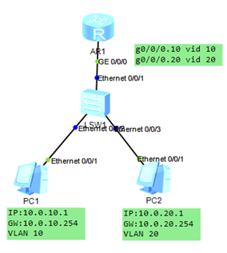

**vlan间通信**

**PC1 ping PC2**

1、PC1向PC2发送ICMP request

2、SW1的E0/0/2接口收到ICMP request之后，打上VLAN 10，并且从E0/0/1转发出去

3、R1的g0/0/0.10收到ICMP request之后，剥离VLAN 10，并且在路由表查找目的IP：10.0.20.0/24 对应的出接口。将ICMP request打上vlan 20，从g0/0/0.20发出

4、SW1的E0/0/1收到ICMP request之后，剥离VLAN 20，并转发至E0/0/3

5、PC2收到ICMP request之后，向R1发送ICMP Reply。

6、SW1的E0/0/3接口收到ICMP Reply之后，打上VLAN 20，并且从E0/0/1转发出去

7、R1的g0/0/0.20收到ICMP Reply之后，剥离VLAN 20，并且在路由表查找目的IP：10.0.10.0/24 对应的出接口。将ICMP Reply打上vlan 10，从g0/0/0.10发出

8、SW1的E0/0/1收到ICMP Reply之后，剥离VLAN 10，并转发至E0/0/2

9、PC1收到ICMP Reply

完成通信

 

**配置子接口时，需要注意以下几点：**

- 必须为每个子接口分配一个IP地址。该IP地址与子接口所属VLAN位于同一网段；

- 需要在子接口上配置802.1Q封装，来剥掉和添加VLAN Tag，从而实现VLAN间互通；
- 在子接口上使能子接口的ARP广播功能；
- 子接口G0/0/1.1 与 G0/0/1.2 的MAC地址是一样的都是G0/0/1的MAC地址；

**缺点：** 

如果VLAN数量众多，VLAN间的通信流量很大时，单臂路由提供的带宽就无法支撑这些流量。

## 3、生成树协议 STP（spanning-tree protocol）

### 3.1 STP的功能

逻辑上堵塞某个接口来防止二层环路

能够在二层交换网络中实现冗余备份

### 3.2 STP选举机制

**目的：**

找到阻塞的端口

 

**STP交换机的角色：**

根交换机

非根交换机

 

**STP****的选票：**

STP的选举是通过比较BPDU（Bridge Protocol Date Unit 桥协议数据单元）的字段

BPDU主要比较以下字段：

​     Root ID 根ID：根ID=根优先级+MAC地址 （根优先级默认是32768，若根优先级一样则比较MAC地址）

​     Cost of path 路径开销：路径开销是在端口发送BPDU的时候加带宽10M开销100，带宽100M开销19，带宽1G开销4，带宽10G开销2

​     Bridge ID 桥ID：桥ID=桥优先级+MAC地址（桥优先级默认是32768，若桥优先级一样则比较MAC地址）

​     Port ID 端口ID：端口ID=端口优先级（默认是128）+端口号     例如：f0/1的端口ID是128.1

 

**STP的端口角色**

根端口：非根交换机上去往根交换机最好的端口（每一个非根交换机上有一个）

指定端口：根交换机去往非根交换机最好的接口（每一个段有一个）

阻塞端口：既不是根端口也不是指定端口（在非根交换机上，整个环路只有一个）

### 3.3 STP选举过程

1.选举根交换机 

2.选举根端口

3.选举指定端口

4.选举阻塞端口

 

**1.选举根交换机  （先比较Root ID的优先级，若优先级一样再比较MAC地址）**

在选举出根交换机之前，所有的交换机都会认为自己是根交换机，每个都会发送BPDU，

通过比较BPDU的Root ID字段，从图中可知Sw0的priority最小最优先，所有Sw0为根交换机

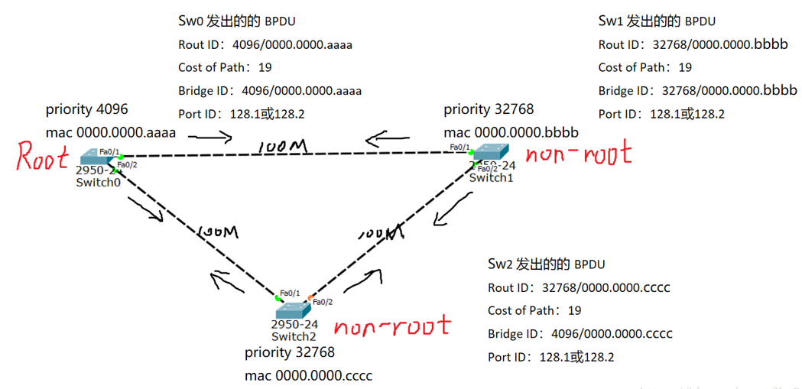

根交换机选好后，只有根交换机会定期的发送BPDU（每2S一次），非根交换机只能转发BPDU

**2.选举根端口 （主要看路径开销，若开销则看端口ID）**

非根交换机的所有端口接收到根发送的BPDU后，通过BPDU里面的字段进行比较

看图，以Sw1为例，从f0/1和f0/2收到的BPDU可以看出，

​      Roud ID都是4096/0000.0000.aaaa，所以无法比较，

​      从f0/1收到的BPDU开销为19，从f0/2收到的BPDU开销为38，所以f0/1为根端口

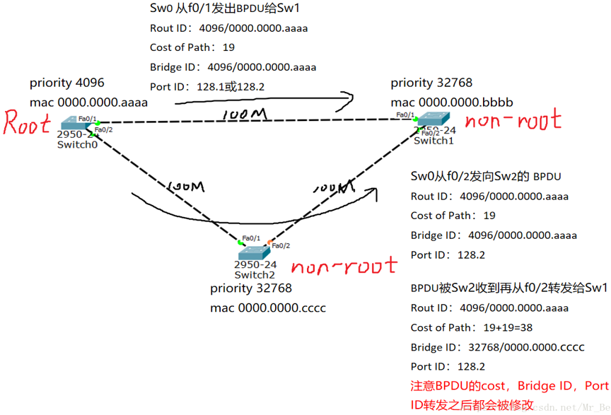

**3.选举指定端口（每一个段需要选举一个指定端口）**

首先，根交换机上所有的端口都是指定端口

通过所有交换机的端口转发或者发送的BPDU进行比较

看图，如何选举出Sw1和Sw2之间的指定端口？

​      通过比较他们各自转发的BPDU

​      Root ID肯定都是一样的，无法判断

​     开销碰巧也一样（一般情况比较开销就可以选举出指定端口），也无法比较

​     最后看Bridge ID，从Sw1转发的BPDU的Bridge ID是32768/0000.0000.bbbb

​                    从Sw2转发的BPDU的Bridge ID是32768/0000.0000.cccc

​     不难看出Sw1的Bridge ID的mac地址更小更优先，所以Sw1的f0/2接口为指定端口

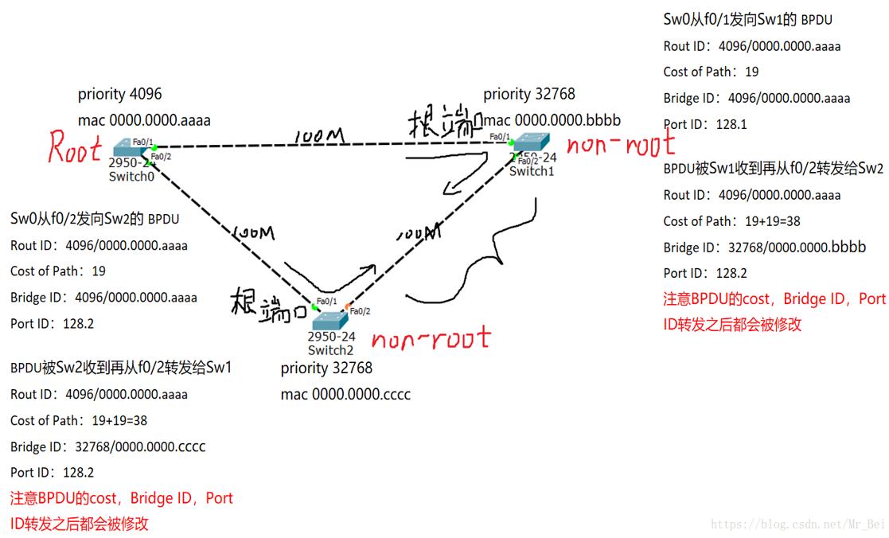

4.选举出阻塞端口

最后，除了根端口，和指定端口，剩下的接口就是阻塞端口啦。从图中可以看出阻塞端口是Sw2的f0/2接口

 

思维导图：

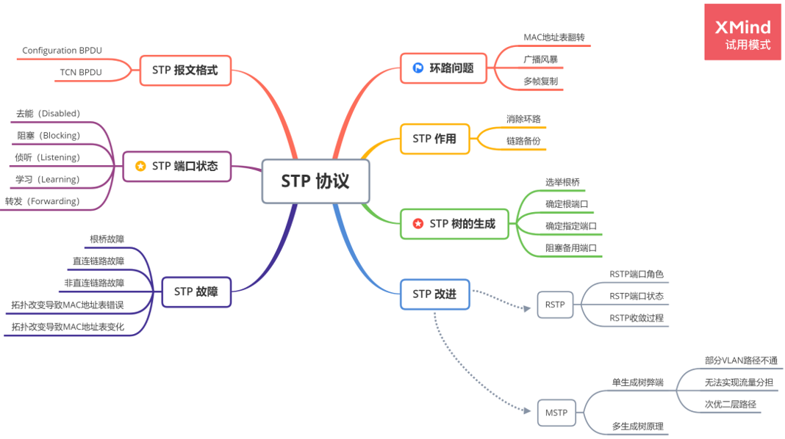

### 3.1 环路问题

#### 3.1.1 广播风暴

**产生原因：**根据交换机的转发原则，如果交换机从一个端口上接收到的是一个广播帧，或者是一个目的MAC地址未知的单播帧，则会将这个帧向除源端口之外的所有其他端口转发。如果交换网络中有环路，则这个帧会被无限转发，此时便会形成广播风暴，网络中也会充斥着重复的数据帧。

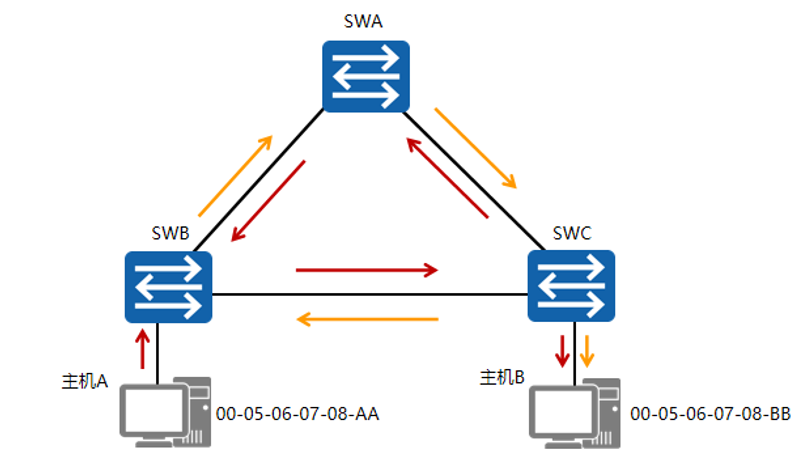

本例中，主机A向外发送了一个单播帧，假设此单播帧的目的MAC地址在网络中所有交换机的MAC地址表中都暂时不存在。SWB接收到此帧后，将其转发到SWA和SWC，SWA和SWC也会将此帧转发到除了接收此帧的其他所有端口，结果此帧又会被再次转发给SWB，这种循环会一直持续，于是便产生了广播风暴。交换机性能会因此急速下降，并会导致业务中断。

#### 3.1.2 MAC地址表翻转

**产生原因：**交换机是根据所接收到的数据帧的源地址和接收端口生成MAC地址表项的。

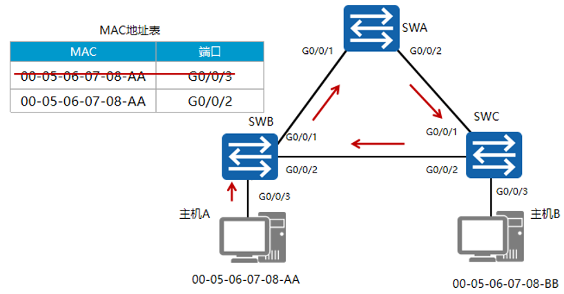

- 主机A向外发送一个单播帧，假设此单播帧的目的MAC地址在网络中所有交换机的MAC地址表中都暂时不存在。SWB收到此数据帧之后，在MAC地址表中生成一个MAC地址表项，00-05-06-07-08-AA，对应端口为G0/0/3，并将其从G0/0/1和G0/0/2端口转发。此例仅以SWB从G0/0/1端口转发此帧为例进行说明。
- SWA接收到此帧后，由于MAC地址表中没有对应此帧目的MAC地址的表项，所以SWA会将此帧从G0/0/2转发出去。
- SWC接收到此帧后，由于MAC地址表中也没有对应此帧目的MAC地址的表项，所以SWC会将此帧从G0/0/2端口发送回SWB，也会发给主机B。
- SWB从G0/0/2接口接收到此数据帧之后，会在MAC地址表中删除原有的相关表项，生成一个新的表项，，00-05-06-07-08-AA，对应端口为G0/0/2。此过程会不断重复，从而导致MAC地址表震荡。

#### 3.1.3 多帧复制

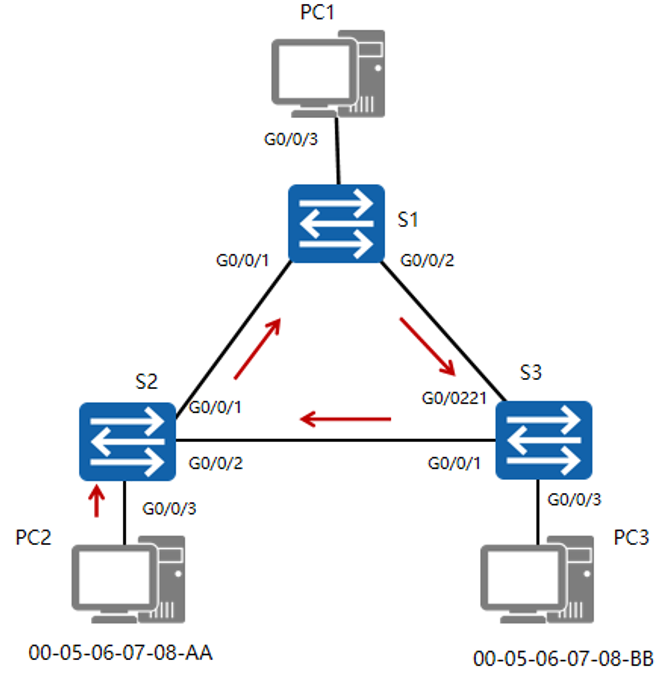

PC2向PC1发送一个单播帧Y，假设S2的MAC地址表中不存在关于PC1的MAC地址表项，所以S2会对Y帧进行泛洪。假设S1的MAC地址表项中存在“PC1的MAC地址<——>port 3” ，S3的MAC地址表项中存在“PC1的MAC地址<——>port 1” ，显然，S1，S3都会对Y帧进行点对点转发操作。最后的结果是PC1 会收到两份Y帧的拷贝。

 

### 3.2 STP 作用

**STP通过阻塞端口来消除环路，并能够实现链路备份的目的。**

#### 3.2.1 作用

**消除环路：**通过阻断冗余链路来消除网络中可能存在的环路。

**链路备份：**当活动路径发生故障时，激活备份链路，及时恢复网络连通性。

#### 3.2.2 基本术语

##### 3.2.2.1 桥（Bridge）

桥和交换机这两个术语是互用的。

##### 3.2.2.2 桥MAC地址

一个桥有多个转发端口，一个端口有一个MAC地址。通常把编号最小的那个端口MAC地址作为桥的MAC地址。

##### 3.2.2.3 桥 ID（BID）

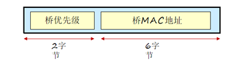

- 一个桥的桥ID由两部分组成，2字节的桥优先级和6字节的桥MAC地址。
- 桥优先级可以人为指定，缺省值为0x8000（相当于32768）。

##### 3.2.2.4 端口 ID（PID）

端口ID有两种定义方式，不同厂家采用的 PID 定义方式不同，同样端口优先级也是可以人为指定的,缺省情况下，端口优先级是128。

1）PID 由两字节组成，第一个字节表示端口优先级，后一个字节是端口编号；

2）PID 由16 bits组成，前4 bit表示端口优先级，后12bit表示端口编号；

###  3.3 STP 树的生成

**STP通过构造一棵树来消除交换网络中的环路。**

- 每个STP网络中，都会存在一个根桥，其他交换机为非根桥。根桥或者根交换机位于整个逻辑树的根部，是STP网络的逻辑中心，非根桥是根桥的下游设备。当现有根桥产生故障时，非根桥之间会交互信息并重新选举根桥，交互的这种信息被称为BPDU。BPDU中包含交换机在参加生成树计算时的各种参数信息;
- STP中定义了三种端口角色：**指定端口，根端口和预备端口。**
- **指定端口**是交换机向所连网段转发配置BPDU的端口，每个网段有且只能有一个指定端口。一般情况下，根桥的每个端口总是指定端口。
- **根端口**是非根交换机去往根桥路径最优的端口。在一个运行STP协议的交换机上最多只有一个根端口，但根桥上没有根端口。
- 如果一个端口既不是指定端口也不是根端口，则此端口为预备端口。预备端口将被阻塞。

**STP树生成过程：**

1、选举一个根桥。

2、每个非根交换机选举一个根端口。

3、每个网段选举一个指定端口。

4、阻塞非根、非指定端口。

#### 3.3.1 选举根桥

**选取原则：**桥优先级是可以配置的，取值范围是0～65535，默认值为32768。优先级最高的设备（数值越小越优先）会被选举为根桥。如果优先级相同，则会比较MAC地址，MAC地址越小则越优先。(先比优先级——>MAC地址)

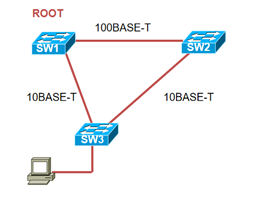

交换机启动后就自动开始进行生成树收敛计算。

- 默认情况下，所有交换机启动时都认为自己是根桥，自己的所有端口都为指定端口，这样BPDU报文就可以通过所有端口转发。
- 对端交换机收到BPDU报文后，会比较BPDU中的根桥ID和自己的桥ID。如果收到的BPDU报文中的桥ID优先级低，接收交换机会继续通告自己的配置BPDU报文给邻居交换机。如果收到的BPDU报文中的桥ID优先级高，则交换机会修改自己的BPDU报文的根桥ID字段，宣告新的根桥。

#### 3.3.2 确定根端口

- 根桥确定后，其他没有称为根桥的交换机都被称为非根桥。
- 非根交换机在选举根端口时分别依据该端口的根路径开销、对端BID（Bridge ID）、对端PID（Port ID）和本端PID。
- 每个非根桥都要选举一个根端口。根端口是距离根桥最近的端口，这个最近的衡量标准是靠路径开销来判定的，即路径开销最小的端口就是根端口。

根端口是根桥与非根桥之间进行报文交互的端口。一台非根桥设备上只有一个根端口。

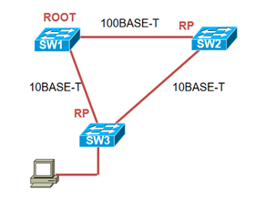

**根路径开销：** 交换机的某个端口到根桥的累计路径开销（即从该端口到根桥所经过的所有链路的路径开销的和）称为这个端口的根路径开销（Root Path Cost，RPC）

**思科路径开销：**

| Link Speed | Cost (New IEEE Specification) | Cost (Old IEEE Specification) |
| ---------- | ----------------------------- | ----------------------------- |
| 10 Gb/s    | 2                             | 1                             |
| 1 Gb/s     | 4                             | 1                             |
| 100 Mb/s   | 19                            | 10                            |
| 10 Mb/s    | 100                           | 100                           |

**华为路径开销：**

| 端口速率     | 路径开销（IEEE 802.1t标准） |
| ------------ | --------------------------- |
| 10   Gbit/s  | 2   000                     |
| 1   Gbit/s   | 20   000                    |
| 100   Mbit/s | 200   000                   |
| 10   Mbit/s  | 2   000                     |

##### 3.3.2.1思科选取根端口优先顺序

1、选择最低的BID;

2、选择最低的路径开销（一定是到根桥的路径）;

3、选择最低发送者的BID;

4、选择最低端口优先级;

5、选择最低端口的PID;

##### 3.3.2.2 华为选取根端口优先顺序

1、端口收到一个BPDU报文后，抽取该BPDU报文中根路径开销字段的值，加上该端口本身的端口开销即为本端口路径开销。如果有两个或两个以上的端口计算得到的累计路径开销相同，那么选择收到发送者BID最小的那个端口作为根端口。

2、如果两个或两个以上的端口连接到同一台交换机上，则选择发送者PID最小的那个端口作为根端口。如果两个或两个以上的端口通过Hub连接到同一台交换机的同一个接口上，则选择本交换机的这些端口中的PID最小的作为根端口。

#### 3.3.3 确定指定端口

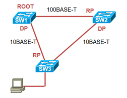

每个网段都应该有一个指定端口，根桥的所有端口都是指定端口（除非根桥在物理上存在环路）。

##### 3.3.3.1 思科设备指定端口比较

最低的根桥ID

最低的根路径代价

最低发送者桥ID

最低端口ID

##### 3.3.3.2 华为设备指定端口比较

根路径开销

端口所在交换机桥ID（BID）

端口ID（PID）

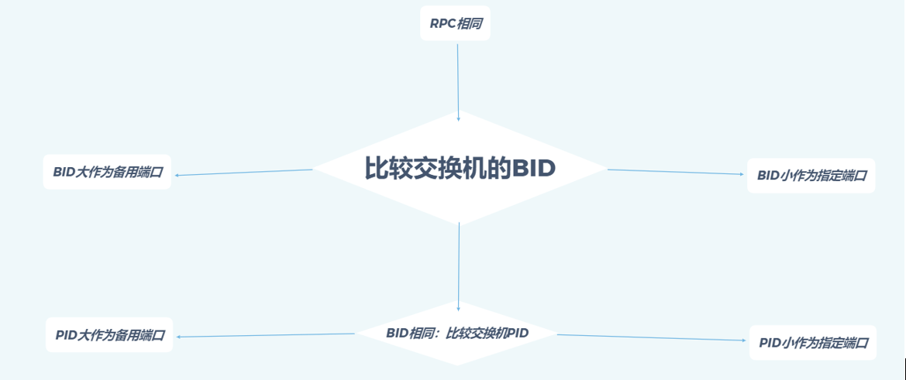

指定端口的选举也是首先比较累计路径开销，累计路径开销最小的端口就是指定端口。如果累计路径开销相同，则比较端口所在交换机的桥ID，所在桥ID最小的端口被选举为指定端口。如果通过累计路径开销和所在桥ID选举不出来，则比较端口ID，端口ID最小的被选举为指定端口。

#### 3.3.4 阻塞备用端口

**未被选举为根端口或指定端口的端口为预备端口，将会被阻塞。**

网络收敛后**，只有指定端口和根端口可以转发数据。**其他端口为预备端口，被阻塞，不能转发由终端计算机产生并发送的数据帧，但是可以接受并处理STP协议帧。只能够从所连网段的指定交换机接收到BPDU报文，并以此来监视链路的状态。

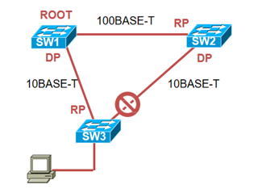

 

### 3.4 STP 报文格式

- STP通过交换STP协议帧来建立和维护STP树，在网络拓扑发生变化的时候重建新的STP树。

- STP协议帧是组播帧，组播地址为01-80-c2-00-00-00☆☆☆

- STP协议帧有采用IEEE802.3封装，有两种格式：Configuration BPDU和TCN BPDU

#### 3.4.1 Configuration BPDU

初始STP树的过程中，各STP交换机都会**周期性（****2s****）**主动发送Configuration BPDU。

在STP 稳定后只有根桥周期性发送Configuration BPDU；非根桥会在**根端口**收到根桥发来的Configuration BPDU，并触发产生自己的Configuration BPDU，且从**指定端口**发出。**（根端口接收，指定端口发出）**

4.1.1 BPDU报文格式：

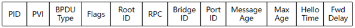

BPDU携带的参数可以分为三类：

1、第一类BPDU自身标识，包括协议标识、版本号、、BPDU类型和flags；

2、第二类是用于STP计算的参数，包括交换机BID，点前根桥BID，发送BPDU的PID和RPC；

3、第三类是时间参数；

| 字段                        | 字节数 | 说明                                                         |
| --------------------------- | ------ | ------------------------------------------------------------ |
| protocol identifier         | 2      | 总是 0x0000                                                  |
| protocol version identifier | 1      | 总是 0x00                                                    |
| BPDU type                   | 1      | 0x00:Configuration BPDU 0x80:TCN BPDU                        |
| Flags                       | 1      | 网络拓扑变化标志：仅使用了最高（TCA）最低（TC）              |
| 根桥ID                      | 8      | 由根桥的优先级和MAC地址组成，每个STP网络中有且仅有一个根桥   |
| 根路径开销                  | 4      | 到根桥的最短路径开销                                         |
| 指定桥ID                    | 8      | 由指定桥的优先级和MAC地址组成                                |
| 指定端口ID                  | 2      | 由指定端口的优先级和端口号组成                               |
| Message Age                 | 2      | 配置BPDU在网络中传播的生存期（每经过一个桥，-1）             |
| Max Age                     | 2      | 配置BPDU在设备中能够保存的最大生存期（缺省20s）              |
| Hello Time                  | 2      | 配置BPDU发送的周期（2s）                                     |
| Forward Delay               | 2      | 端口状态迁移的延时（缺省15s）。控制端口Listening和Learning状态持续时间，缺省15s |

##### 3.4.1.2 STP 计时器

- **Hello Time是指运行STP协议的设备发送配置BPDU的时间间隔，用于检测链路是否存在故障。**交换机每隔Hello Time时间会向周围的交换机发送配置BPDU报文，以确认链路是否存在故障。当网络拓扑稳定后，该值只有在根桥上修改才有效。
- **Message Age是从根桥发送到当前交换机接收到BPDU的总时间，包括传输延时等。**如果配置BPDU是根桥发出的，则Message Age为0。实际实现中，配置BPDU报文每经过一个交换机，Message Age增加1。
- **Forward Delay是指端口状态迁移时间**。STP生成树需要一定的时间，如果选出来的根端口或者指定端口马上进入转发状态的话，可能就会总成临时工作环路。forward delay机制：新选出来的根端口和指定端口需要经过两倍的forward delay时间延时后才可以进入用户数据帧的转发状态，保证此时工作拓扑已无环路。
- **Max Age是指BPDU报文的老化时间，可在根桥上通过命令人为改动这个值。**Max Age通过配置BPDU报文的传递，可以保证Max Age在整网中一致。非根桥设备收到配置BPDU报文后，会将报文中的Message Age和Max Age进行比较：如果Message Age小于等于Max Age，则该非根桥设备会继续转发配置BPDU报文。如果Message Age大于Max Age，则该配置BPDU报文将被老化掉。该非根桥设备将直接丢弃该配置BPDU，并认为是网络直径过大，导致了根桥连接失败。

#### 3.4.2 TCN BPDU

TCN BPDU是指下游交换机感知到拓扑发生变化时向上游发送的拓扑变化通知。

TCN BPDU 只有三个字段：**协议标识，协议版本号和类型。**

 

**TCN BPDU工作流程：**

**如果网络中某条链路发生故障，导致拓扑发上变化，位于故障点的交换机可以感知到变化，但是其他交换机无法感知。**

1、位于故障点的交换机会以Hello Time为周期通过根端口不断向上游交换机发送TCN BPDU，直到从上游交换机收到TCA 标志置1的configuration BPDU；

2、上游交换机收到TCN BPDU后，一方面通过指定端口回复下游交换机TCA置1的configuration BPDU，一方面以hello time为周期向上游交换机发送TCN BPDU；

3、根桥收到TCN BPDU后，发送TC 置1 的configuration BPDU通告所有交换机网络拓扑发生变化；

4、交换机收到TC标志置1的configuration BPDU，便意识到网络拓扑已经发生变化，说明自己MAC地址表项可能已经不正确。此时交换机会将MAC地址表的老化周期（缺省300s）置缩短为Forward relay时间长度（缺省15s）。

### 3.5 STP 端口状态

#### 3.5.1 端口状态

STP定义了五种端口状态：去能状态、阻塞状态、侦听状态、学习状态和转发状态。

| 端口状态           | 说明                                                         |
| ------------------ | ------------------------------------------------------------ |
| 去能（Disabled）   | 无法接受发送任何帧，端口处于关闭状态（Down）                 |
| 阻塞（Blocking）   | 可以接受并分析STP协议帧，但是不能发送STP协议帧，也不能转发用户数据帧 |
| 侦听（Listening）  | 可以接受并发送STP协议帧，但是不能学习MAC地址，也不能转发用户数据帧 |
| 学习（Learning）   | 可以接受并发送STP协议帧，可以学习MAC地址，也不能转发用户数据帧 |
| 转发（Forwarding） | 可以接受并发送STP协议帧，可以学习MAC地址，同时也能转发用户数据帧 |

#### 3.5.2端口状态迁移

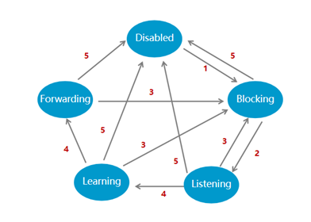

1、端口初始化或使能;

2、端口被选为根端口或指定端口。

3、端口不再是根端口或指定端口。

4、forward delay计时器超时(Listening和Learning之间转换）。

5、端口禁用或链路失效。

 

- STP在启动的时候，端口状态由Disabled转为Blocking，此时端口指定接收分析BPDU，不能发送；

- 如果Blocking状态端口被选为根端口或者指定端口，会进入Listening状态，此时端口接收并发送BPDU，这种状态会持续一个Forward Delay时间（缺省15s）；

- 没有意外情况回到Blocking，端口会进入Learning状态，并持续一个Forward Delay时间（缺省15s），此时端口可以收发BPDU，同时构建MAC地址表，为转发用户数据帧做准备；

- 没有意外，端口进入Forwarding状态，开始用户数据帧转发工作；

- 状态迁移过程中，一旦端口被关闭或者出现链路故障，进入去能状态；

- 状态迁移过程中，一旦端口不再是根端口或者指定端口，进入阻塞状态；

#### 3.5.3 端口状态转换举例

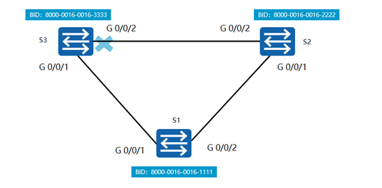

1、假设交换机S1，S2，S3同一时间启动。各个交换机从Disabled进入Blocking状态。由于处于Blocking状态只能接受分析BPDU，不能发送，所以任何端口都收不到BPDU。等待MAX Age（缺省20s）时间后，每台交换机都会认为自己是根桥，每个端口都是指定端口，端口状态迁移为Listening；

2、交换机进入learning状态后就会开始发送自己的Configuration BPDU，同时也会受到其他交换机发送的Configuration BPDU。 

1）假设S2先发送Configuration BPDU，S3从自己的G 0/0/2端口收到后，发现S2 的BID比自己的小，于是认为S2是根桥，将G0/0/2设置为根端口，然后将自己重新产生的根桥设置为S2的Configuration BPDU从G0/0/1端口发给S1；

2）S1收到S3发来的BPDU后，发现自己的BID是最小的，认为自己就是根桥。于是向S3发送Configuration BPDU，同样的也会在G0/0/2 端口受到S2 的Configuration BPDU，也会从G0/0/2端口发送自己的BPDU给S2；

3）端口在listening状态下持续15s，进入learning。此时S3的G0/0/2接口已经被阻塞。

3、各个端口相继进入Learning，持续Forward time（15s）后进入。在这段时间内构建MAC地址转发表，为用户数据帧转发做准备；

4、各端口进入Forwarding状态，开始转发用户数据帧。

### 3.6 STP 故障问题

#### 3.6.1 根桥故障

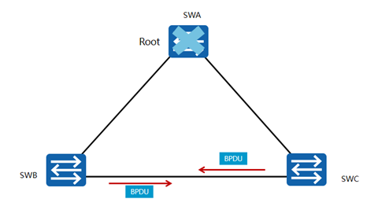

- 在稳定的STP拓扑里，非根桥会定期收到来自根桥的BPDU报文。

- 如果根桥发生了故障，停止发送BPDU报文，下游交换机就无法收到来自根桥的BPDU报文。

- 如果下游交换机一直收不到BPDU报文，Max Age定时器就会超时（Max Age的默认值为20秒），从而导致已经收到的BPDU报文失效，此时，非根交换机会互相发送配置BPDU报文，重新选举新的根桥。根桥故障会导致50秒左右☆☆☆的恢复时间，恢复时间约等于Max Age加上两倍的Forward Delay收敛时间。（max age + 2*Forwarding relay）

#### 3.6.2直连链路故障

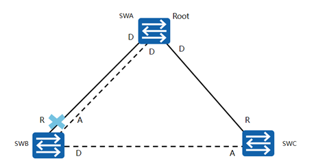

- SWB检测到直连链路物理故障后，会将预备端口转换为根端口；

- SWB新的根端口会在30 秒后恢复到转发状态。

此例中，SWA和SWB使用了两条链路互连，其中一条是主用链路，另外一条是备份链路。生成树正常收敛之后，如果SWB检测到根端口的链路发生物理故障，则其Alternate端口会迁移到Listening、Learning、Forwarding状态，经过两倍的Forward Delay后恢复到转发状态。

#### 3.6.3 非直连链路故障

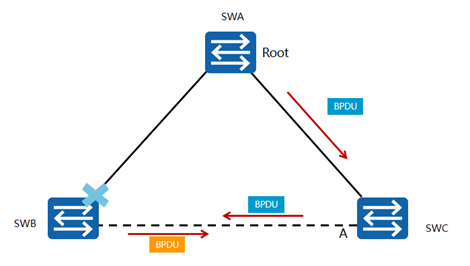

**非直连链路故障后，由于需要等待Max Age加上两倍的Forward Delay时间，端口需要大约50秒才能恢复到转发状态。**

本例中，SWB与SWA之间的链路发生了某种故障（非物理层故障），SWB因此一直收不到来自SWA的BPDU报文。

1、等待Max Age定时器超时后，SWB会认为根桥SWA不再有效，并认为自己是根桥，于是开始发送自己的BPDU报文给SWC，通知SWC自己作为新的根桥。

2、在此期间，由于SWC的Alternate端口再也不能收到包含原根桥ID的BPDU报文。其Max Age定时器超时后，SWC会切换Alternate端口为指定端口并且转发来自其根端口的BPDU报文给SWB。

3、所以，Max Age定时器超时后，SWB、SWC几乎同时会收到对方发来的BPDU。经过STP重新计算后，SWB放弃宣称自己是根桥并重新确定端口角色。

4、非直连链路故障后，SWC的预备端口恢复到转发状态大约需要50秒。

#### 3.6.4 拓扑改变导致MAC地址表错误

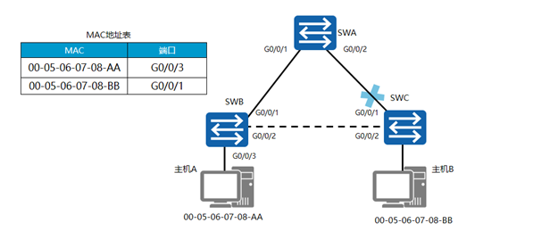

在交换网络中，交换机依赖MAC地址表转发数据帧。**缺省情况下，MAC地址表项的老化时间是300秒**。如果生成树拓扑发生变化，交换机转发数据的路径也会随着发生改变，此时MAC地址表中未及时老化掉的表项会导致数据转发错误，因此在拓扑发生变化后需要及时更新MAC地址表项。

本例中，SWB中的MAC地址表项定义了通过端口GigabitEthernet 0/0/3可以到达主机A，通过端口GigabitEthernet 0/0/1可以到达主机B。由于SWC的根端口产生故障，导致生成树拓扑重新收敛，在生成树拓扑完成收敛之后，从主机A到主机B的帧仍然不能到达目的地。这是因为MAC地址表项老化时间是300秒，主机A发往主机B的帧到达SWB后，SWB会继续通过端口GigabitEthernet 0/0/1转发该数据帧。

#### 3.6.5 拓扑改变导致MAC地址表变化

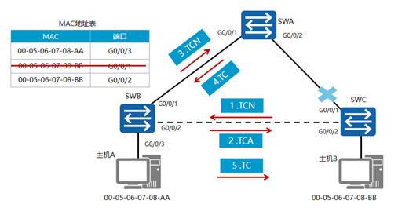

拓扑变化过程中，根桥通过TCN BPDU报文获知生成树拓扑里发生了故障。根桥生成TC用来通知其他交换机加速老化现有的MAC地址表项。

**拓扑变更以及MAC地址表项更新的具体过程如下：**

1、SWC感知到网络拓扑发生变化后，会不间断地向SWB发送TCN BPDU报文。

2、SWB收到SWC发来的TCN BPDU报文后，会把配置BPDU报文中的Flags的TCA位设置1，然后发送给SWC，告知SWC停止发送TCN BPDU报文。

3、SWB向根桥转发TCN BPDU报文。

4、SWA把配置BPDU报文中的Flags的TC位设置为1后发送，**通知下游设备把MAC地址表项的老化时间由默认的300秒修改为Forward Delay的时间（默认为15秒）。**☆
 最多等待15秒之后，SWB中的错误MAC地址表项会被自动清除。此后，SWB就能重新开始MAC表项的学习及转发操作。

### 3.7 RSTP（STP 优化）

#### 3.7.1 STP缺陷

STP生成树收敛需要依赖定时器计时，**端口状态从Blocking到Forwarding至少需要两个forward relay的时间长度**，收敛时间太长，一般都需要几十秒。IEEE 802.1w定义了RSTP（Rapid Spanning Tree Protocol）弥补了STP收敛时间慢的缺陷。

#### 3.7.2 RSTP

##### 3.7.2.1 RSTP端口角色

| 角色      | 描述                                                         |
| --------- | ------------------------------------------------------------ |
| Backup    | Backup端口作为指定端口的备份，提供了另外一条从根桥到非根桥的备份链路。 |
| Alternate | Alternate端口作为根端口的备份端口，提供了从指定桥到根桥的另一条备份路径。 |

##### 3.7.2.2 三种端口状态

RSTP中定义了三种端口状态：Discarding、Learning、Forwarding。

| RSTP    端口状态 | 对应STP端口状态               | 说明                                      |
| ---------------- | ----------------------------- | ----------------------------------------- |
| Forwarding       | Forwarding                    | 可以转发用户数据帧，可以学习MAC地址       |
| Learning         | Learning                      | 不可以转发用户数据帧，但是可以学习MAC地址 |
| Discarding       | Listening、Blocking、Disabled | 不可以转发用户数据帧，不可以学习MAC地址   |

##### 3.7.2.3 P/A机制

在RSTP中，一个端口被指定成为指定端口后，此端口会先进入discarding，然后通过**P/A（Proposal/Agreement）**机制主动与对端端口协商，通过协商后，就可以立即进入Forwarding状态。

##### 3.7.2.4 边缘端口

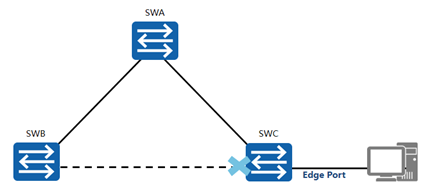

◎RSTP里，位于网络边缘的指定端口被称为边缘端口。

◎边缘端口一般与用户终端设备直接连接，不与任何交换设备连接。边缘端口不接收配置BPDU报文，不参与RSTP运算，可以由Disabled状态直接转到Forwarding状态，且不经历时延，就像在端口上将STP禁用了一样。但是，一旦边缘端口收到配置BPDU报文，就丧失了边缘端口属性，成为普通STP端口，并重新进行生成树计算，从而引起网络震荡。

##### 3.7.2.5 RSTP收敛过程

**RSTP BPDU：**RSTP对此进行了改进，即在拓扑稳定后，无论非根桥设备是否接收到根桥传来的配置BPDU报文，非根桥设备都会仍然按照Hello Timer规定的时间间隔发送配置BPDU，该行为完全由每台设备自主进行。

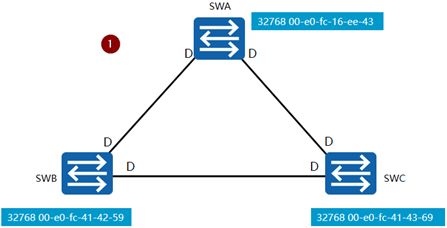

1、每一台交换机启动RSTP后，都认为自己是“根桥”，并且发送RST BPDU。所有端口都为指定端口，处于Discarding状态。

2、交换机互相发送Proposal置位的RST BPDU。每个认为自己是“根桥”的交换机生成一个RST BPDU报文来协商指定网段的端口状态，此RST BPDU报文的Flags字段里面的Proposal位需要置位。当一个端口收到RST BPDU报文时，此端口会比较收到的RST BPDU报文和本地的RST BPDU报文。如果本地的RST BPDU报文优于接收的RST BPDU报文，则端口会丢弃接收的RST BPDU报文，并发送Proposal置位的本地RST BPDU报文来回复对端设备。

3、**交换机使用同步机制来实现端口角色协商管理。**当收到Proposal置位并且优先级高的BPDU报文时，接收交换机必须设置所有下游指定端口为Discarding状态。如果下游端口是Alternate端口或者边缘端口，则端口状态保持不变。

4、当确认下游指定端口迁移到Discarding状态后，设备发送RST BPDU报文回复上游交换机发送的Proposal消息。在此过程中，端口已经确认为根端口，因此RST BPDU报文Flags字段里面设置了Agreement标记位和根端口角色。

5、在P/A进程的最后阶段，上游交换机收到Agreement置位的RST BPDU报文后，指定端口立即从Discarding状态迁移为Forwarding状态。然后，下游网段开始使用同样的P/A进程协商端口角色。

##### 3.7.2.6 链路故障/根桥失效

◎在STP中，当出现链路故障或根桥失效导致交换机收不到BPDU时，交换机需要等待Max Age时间后才能确认出现了故障。

◎而在RSTP中，如果交换机的端口在连续3次Hello Timer规定的时间间隔内没有收到上游交换机发送的RST BPDU，便会确认本端口和对端端口的通信失败，从而需要重新进行RSTP的计算来确定交换机及端口角色。

## 4、RSTP（STP 优化）

思维导图：

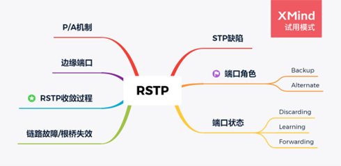

### 4.1. STP缺陷

STP生成树收敛需要依赖定时器计时，端口状态从Blocking到Forwarding至少需要两个forward relay的时间长度，**收敛时间太长**，一般都需要几十秒。IEEE 802.1w定义了RSTP（Rapid Spanning Tree Protocol）弥补了STP收敛时间慢的缺陷。

### 4.2. RSTP

#### 4.2.1 RSTP端口角色

| 角色      | 描述                                                         |
| --------- | ------------------------------------------------------------ |
| Backup    | Backup端口作为指定端口的备份，提供了另外一条从根桥到非根桥的备份链路。 |
| Alternate | Alternate端口作为根端口的备份端口，提供了从指定桥到根桥的另一条备份路径。 |

#### 4.2.2 三种端口状态

RSTP中定义了三种端口状态：Discarding、Learning、Forwarding。

| RSTP    端口状态 | 对应STP端口状态               | 说明                                      |
| ---------------- | ----------------------------- | ----------------------------------------- |
| Forwarding       | Forwarding                    | 可以转发用户数据帧，可以学习MAC地址       |
| Learning         | Learning                      | 不可以转发用户数据帧，但是可以学习MAC地址 |
| Discarding       | Listening、Blocking、Disabled | 不可以转发用户数据帧，不可以学习MAC地址   |

#### 4.2.3 P/A机制

在RSTP中，一个端口被指定成为指定端口后，此端口会先进入discarding，然后通过**P/A（Proposal/Agreement）**机制主动与对端端口协商，通过协商后，就可以立即进入Forwarding状态。

#### 4.2.4 边缘端口

◎RSTP里，位于网络边缘的指定端口被称为边缘端口。

◎边缘端口一般与用户终端设备直接连接，不与任何交换设备连接。边缘端口不接收配置BPDU报文，不参与RSTP运算，可以由Disabled状态直接转到Forwarding状态，且不经历时延，就像在端口上将STP禁用了一样。但是，一旦边缘端口收到配置BPDU报文，就丧失了边缘端口属性，成为普通STP端口，并重新进行生成树计算，从而引起网络震荡。

#### 4.2.5 RSTP收敛过程

RSTP BPDU：RSTP对此进行了改进，即在拓扑稳定后，无论非根桥设备是否接收到根桥传来的配置BPDU报文，非根桥设备都会仍然按照Hello Timer规定的时间间隔发送配置BPDU，该行为完全由每台设备自主进行。

1、每一台交换机启动RSTP后，都认为自己是“根桥”，并且发送RST BPDU。所有端口都为指定端口，处于Discarding状态。

2、交换机互相发送Proposal置位的RST BPDU。每个认为自己是“根桥”的交换机生成一个RST BPDU报文来协商指定网段的端口状态，此RST BPDU报文的Flags字段里面的Proposal位需要置位。当一个端口收到RST BPDU报文时，此端口会比较收到的RST BPDU报文和本地的RST BPDU报文。如果本地的RST BPDU报文优于接收的RST BPDU报文，则端口会丢弃接收的RST BPDU报文，并发送Proposal置位的本地RST BPDU报文来回复对端设备。

3、**交换机使用同步机制来实现端口角色协商管理。**当收到Proposal置位并且优先级高的BPDU报文时，接收交换机必须设置所有下游指定端口为Discarding状态。如果下游端口是Alternate端口或者边缘端口，则端口状态保持不变。

4、当确认下游指定端口迁移到Discarding状态后，设备发送RST BPDU报文回复上游交换机发送的Proposal消息。在此过程中，端口已经确认为根端口，因此RST BPDU报文Flags字段里面设置了Agreement标记位和根端口角色。

5、在P/A进程的最后阶段，上游交换机收到Agreement置位的RST BPDU报文后，指定端口立即从Discarding状态迁移为Forwarding状态。然后，下游网段开始使用同样的P/A进程协商端口角色。

#### 4.2.6 链路故障/根桥失效

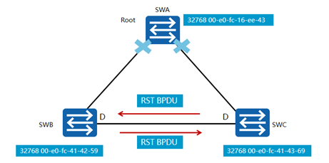

- 在STP中，当出现链路故障或根桥失效导致交换机收不到BPDU时，交换机需要等待Max Age时间后才能确认出现了故障。

- 而在RSTP中，如果交换机的端口在连续3次Hello Timer规定的时间间隔内没有收到上游交换机发送的RST BPDU，便会确认本端口和对端端口的通信失败，从而需要重新进行RSTP的计算来确定交换机及端口角色。

## 5、MSTP （多实例生成树协议）

思维导图：

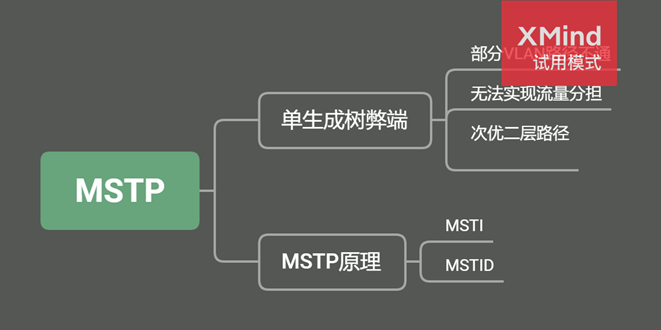

**RSTP的缺陷：**

​       RSTP在STP基础上进行了改进，实现了网络拓扑快速收敛。但由于局域网内所有的VLAN共享一棵生成树，因此被阻塞后链路将不承载任何流量，无法在VLAN间实现数据流量的负载均衡，从而造成带宽浪费。

 

**关于MSTP的解释：**

- IEEE 802.1s发布了MSTP（Multiple STP，多实例生成树协议）；

- MSTP 能够兼容RSTP 和 STP

- 生成树不是基于VLAN运行的，是基于Instance（实例）运行的。Instance是一个或多个VLAN的集合；

### 5.1. 单生成树实例弊端

#### 5.1.1 部分VLAN路径不通

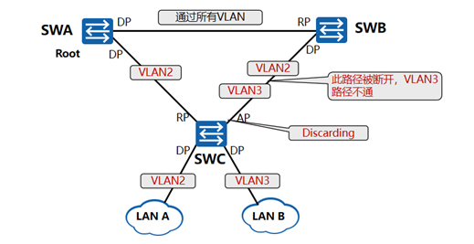

- 如图所示，网络中有SWA、SWB、SWC三台交换机。配置VLAN2通过两条上行链路，配置VLAN3只通过一条上行链路。
- 为了解决VLAN2的环路问题，需要运行生成树。在运行单个生成树的情况下，
- 假设SWC与SWB相连的端口成为预备端口（Discarding状态），那么VLAN3的路径就会被断开，无法上行到SWB。

#### 5.1.2 无法实现流量分担

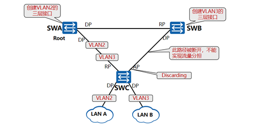

- 为了实现流量分担，需要配置两条上行链路为Trunk链路，允许通过所有VLAN；

- SWA和SWB之间的链路也配置为Trunk链路，允许通过所有VLAN。将VLAN2的三层接口配置在SWA上，将VLAN3的三层接口配置在SWB上。

- 我们希望VLAN2和VLAN3分别使用不同的链路上行到相应的三层接口，但是如果连接到**SWB的端口成为预备端口（Alternate Port）**并处于Discarding状态，则VLAN2和VLAN3的数据都只能通过一条上行链路上行到SWA，这样就不能实现流量分担。

#### 5.1.3 次优二层路径

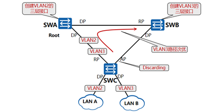

- 如图所示，SWC与SWA和SWB相连的链路配置为Trunk链路，允许通过所有VLAN；SWA与SWB之间的链路也配置为Trunk链路，允许通过所有VLAN。

- 运行单个生成树之后，环路被断开，VLAN2和VLAN3都直接上行到SWA。

- 在SWA上配置VLAN2的三层接口，在SWB上配置VLAN3的三层接口，那么，VLAN3到达三层接口的路径就是次优的。

### 5.2. MSTP 原理

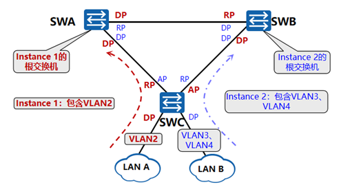

- 多生成树协议即MSTP（Multiple Spanning Tree Protocol）。

- MST域是多生成树域（Multiple Spanning Tree Region），由交换网络中的多台交换设备以及它们之间的网段所构成。

- 同一个MST域的设备具有下列特点：

1）都启动了MSTP。

2）具有相同的域名。

3）具有相同的VLAN到生成树实例映射配置。

4）具有相同的MSTP修订级别配置。

- 一个MST域内可以生成多棵生成树，每棵生成树都称为一个MSTI(Mulitiple Instance Spanning Tree Protocol)，每个MSTI都使用单独的RSTP算法，计算单独的生成树。

- 每个MSTI（MST Instance）都有一个标识（MSTID），MSTID是一个两字节的整数。**一个Instance可以包含多个VLAN，但是一个VLAN只能属于一个Instance。**

- **VLAN映射表**是MST域的属性，它描述了VLAN和MSTI之间的映射关系，MSTI可以与一个或多个VLAN对应，但一个VLAN只能与一个MSTI对应。
- **MSTP兼容STP和RSTP，**既可以快速收敛，又提供了数据转发的各个冗余路径，在数据转发过程中实现VLAN数据的负载均衡。

 