# 路由协议

## 1、IP路由选择原理，静态路由

### 1.1 路由中的基本概念

- **路由（route）：**是一个网络层的术语，指从某一网络设备出发去往某个目的地的路径。
- **路由表（routing table）：**是若干条路由信息的集合，一条路由信息也被称为一个路由项或者一个路由条目。
- **被动路由协议(Routed protocols )：**用来在路由器之间传递用户的信息
- **主动路由协议(Routing protocols )**：用于维护路由器的路由表
- 路由只存在终端计算机和路由器（以及三层交换机）中，二层交换机没有。
- 如果一个路由项的下 一跳IP地址与出接口的IP地址相同，说明该出接口已经直连到了该路由项所指的目的网络。

**路由器的功能**

连接到了目的网络，并且处于同一个二层网络（二层广播域）中。

- 检查数据包的目的地
- 确定信息源
- 发现可能的路由
- 选择最佳路由
- 验证和维护路由信息

 

**什么是路由？**

路由是指导IP报文发送的路径信息
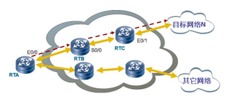

**路由表：**

路由器工作时依赖于路由表进行数据的转发。路由表犹如一张地图，它包含着去往各个目的的路径信息（路由条目）。每条信息至少应该包括下面3个内容：

- 目的网络——表明路由器可以到达的网络的地址，可理解为去哪里。
- 下一跳——通常情况下，下一跳(next hop)一般指向去往目的网络的下一个路由器的接口地址，该路由器称之为下一跳路由器。
- 出接口——表明数据包从本路由器的哪个接口发送出去。

 

**IP路由过程**

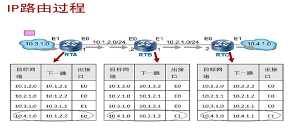

> 静态路由配置需双向配置路由表 否则接收不到返回数据包，链路不通

 

### 1.2路由的来源

- 直连路由 –直接连到路由器上的网络，链路层发现，各设备三层接口接起来就会自动发现路由，**Cost值为0**
- 静态路由 –管理员手工构建路由表
- 动态路由 –路由器之间动态学习到的路由表

### 1.3 路由表匹配原则

**1）最长掩码匹配原则:**

当一个IP报文匹配上了多个路由项时，路由器根据“最长匹配原则”来确定一条最优路由，匹配的掩码越多越优；

**例：**目的地址为2.1.0.1 的IP报文既能匹配上2.0.0.0/8 又能匹配上2.0.0.0/16，后者掩码长度长优先匹配。

**2）路由的优先级**

不同来源的路由规定了不同的优先级（Preference），并且优先级越小，则路由的优先级越高。（越小越优先）

**华为路由的优先级：**

| 路由来源 | 优先级的缺省值 |
| -------- | -------------- |
| 直连路由 | 0              |
| OSPF     | 10             |
| 静态路由 | 60             |
| RIP      | 100            |
| BGP      | 255            |

 

**思科路由的优先级（管理距离，AD）：**

| Routing   Protocols  | AD   | 备注        |
| -------------------- | ---- | ----------- |
| 直连接口             | 0    |             |
| 关联出接口的静态路由 | 1    | Metric   =0 |
| 关联下一跳的静态路由 | 1    | Metric   =0 |
| EIGRP   汇总路由     | 5    |             |
| 外部 BGP             | 20   |             |
| 内部EIGRP            | 90   |             |
| IGRP                 | 100  |             |
| OSPF                 | 110  |             |
| RIPv1、v2            | 120  |             |
| 外部EIGRP            | 170  |             |
| 内部BGP              | 200  |             |

**3）开销cost：**

- 一条路由的开销指的是到达这条路由目的地/掩码需要付出的代价值；
- 同一种路由协议发现有多条路由可以到达同一个目的地/掩码，选择开销最小的；
- 不同路由协议的开销值不同，RIP是以“跳数”（经过路由器的个数）为开销，OSPF是以度量值（OSPF有多种度量方式)作为开销；
- 如果去往同一个目的地的路由协议不相同，那么会先比较路由优先级，并将优先级最小的加入到路由表；
- 如果运行着相同的协议，去往同一个目的地/掩码具有相同的跳数，也就是说代价（开销）是相同的，称为等价路由；在这种情况下，两条路有都会被添加进入路由表，并进行负载分担。

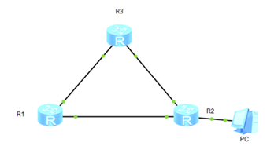

R1，R2，R3都运行着RIP协议，R1去往PC有两条路由。

一条需要3跳（中途经过R123三台路由器）；一条需要两跳（中途经过R12两台路由）

### 1.4 Loopback接口

1. Loopback接口，也叫回环口，是一个逻辑的、虚拟的接口
2. 创建完成后即可为接口配置IP地址
3. Loopback接口在手工创建后，除非人为shutdown，否则不会DOWN掉
4. Loopback接口常用于
   - 模拟路由器的直连网段，可用于测试
   - 可用于设备管理（Loopback接口比较稳定）
   - 供其他协议使用，例如OSPF、BGP、MPLS等
   - 其他用途（Loopback接口的用途十分广泛）

### 1.5 静态路由

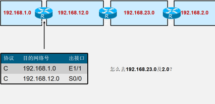

**R1 R2配置静态路由：**

1、[R1]ip route-static 192.168.2.0 255.255.255.0 12.0.0.2

2、[R2]ip route-static 192.168.1.0 24 12.0.0.1

 

**默认路由：**

- 目的地/掩码为0.0.0.0的路由称为默认路由或者缺省路由（Default Route），任何一个待发送或者待转发的IP报文都可以和默认路由匹配上；
- 如果默认路由是由路由协议产生的称为动态默认路由；
- 如果默认路由是由手工配置产生的称为静态默认路由；

## 2、动态路由

### 2.1 动态路由协议中的相关概念

**基于某种路由协议实现：**

特点：

减少了管理任务

占用了网络带宽

**动态路由协议概述：**

路由器之间用来交换信息的语言

**度量值：**

跳数、带宽、负载、时延、可靠性、成本

**收敛：**

是所有路由表都达到一致状态的过程

### 2.2 动态路由协议的分类：

**按照路由执行的算法分类** 

1）距离矢量路由协议 

- 依据从源网络到目标网络所经过的路由器的个数选择路由 
- RIP（距离矢量路由协议）、IGRP（思科私有的内部网关路由协议） 

2）链路状态路由协议 

- 综合考虑从源网络到目标网络的各条路径的情况选择路由
- OSPF（开放式最短路径优先链路状态路由协议）、IS-IS（中间系统到中间系统路由协议）

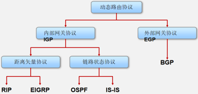

## 3、RIP

### 3.1 距离矢量路由协议概述

使用距离矢量路由协议的路由器并不了解网络的拓扑。

该路由器只知道：

- 自身与目的网络之间的距离
- 应该往哪个方向或使用哪个接口转发数据包

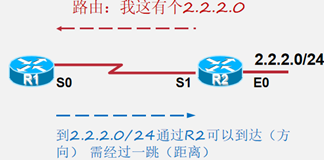

**距离矢量的特点：**

–周期性地更新（广播）整张路由表

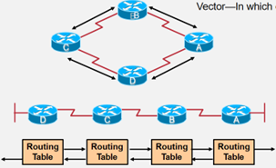

### 3.2 距离矢量路由协议的工作过程

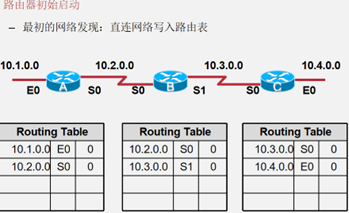

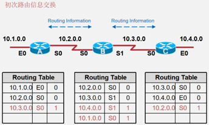

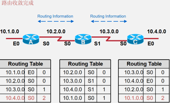

**路由器收敛完成**

- 当所有路由表包含相同网络可达性信息
- 网络（路由）进入一个稳态

**路由器继续交换路由信息**

- 当无新路由信息被更新时收敛结束
- 网络在达到收敛前无法完全正常工作

### 3.3 RIP概述

RIP（Routing Information Protocols，路由信息协议），是应用较早、 使用较普遍的内部网关协议(Interior Gateway Protocol,简称IGP)，

- 适用于小型网络，是典型的距离矢量协议。
- RIP是基于UDP，端口520的应用层协议。
- 管理性距离：120

> RIP以跳数（Hops）作为metric
>
> 管理距离（AD值）

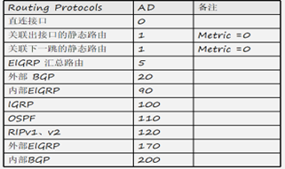

- 依照传闻的更新（广播、更新路由表） –逐跳更新

- RIP环路避免：

1）最大跳数（16跳为不可达），这注定了RIP只能适用于小型网络

2）水平分割（split Horizon）：默认开启，从接口收到的路由，不会再从该接口发送给邻居路由器

3）毒性反转（poison Reverse）：从接口学到的路由，将跳数设为16，发回给邻居路由器

4）路由中毒（Routing Poisoning）：

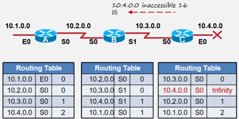

4.0出现故障，C感知到，将该路由跳数设为无穷大，将10.4.0.0设为16跳将其发出去，使A、B收到这条中毒的消息，将4.0去掉，将其隐藏在RIP数据后台，设计时器，如果在计时时间内恢复，还可以快速恢复该路由。

5）触发更新：不用等周期到来，直接更新拓扑变更信息

6）抑制计时器 Hold-Down Timers

为正在重新收敛的网络增加了应变能力

引入了某种程度的怀疑量

 

## 4、OSPF（Open Shortest Path First）开放式最短路径优先

思维导图：

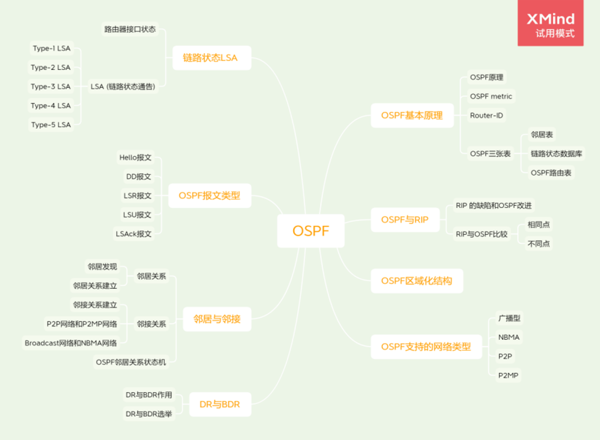

### 4.1 ospf基本原理

#### 4.1.1 OSPF原理

**原理：**

OSPF要求每台运行OSPF的路由器都了解整个网络的链路状态信息，这样才能计算出到达目的地的最优路径。OSPF的收敛过程由链路状态公告**LSA（Link State Advertisement）**泛洪开始，LSA中包含了路由器已知的接口IP地址、掩码、开销和网络类型等信息。收到LSA的路由器都可以根据LSA提供的信息建立自己的链路状态数据库**LSDB（Link State Database）**，并在LSDB的基础上使用SPF算法进行运算，建立起到达每个网络的最短路径树。**最后，通过最短路径树得出到达目的网络的最优路由，并将其加入到IP路由表中。**

 

- 什么叫链路(LINK) =路由器接口
- 什么叫状态(State) =描述接口以及其与邻居路由器之间的关系

 

- OSPF是一种基于链路状态的路由协议，它从设计上就保证了无路由环路。OSPF支持区域的划分，区域内部的路由器使用SPF最短路径算法保证了区域内部的无环路。OSPF还利用区域间的连接规则保证了区域之间无路由环路。
- OSPF支持触发更新，能够快速检测并通告自治系统内的拓扑变化。
- OSPF可以解决网络扩容带来的问题。当网络上路由器越来越多，路由信息流量急剧增长的时候，OSPF可以将每个自治系统划分为多个区域，并限制每个区域的范围。OSPF这种分区域的特点，使得OSPF特别适用于大中型网络。**OSPF可以提供认证功能。**OSPF路由器之间的报文可以配置成必须经过认证才能进行交换。

#### 4.1.2 OSPF metric

- OSPF使用开销cost作为路由的度量值
- 在每一个运行OSPF的接口上，都维护着一个接口COST，接口COST=100M/接口带宽，其中100M为OSPF的参考带宽。
- 一条路由的COST由该路由从来路由的起源一路过来的所有入接口cost值的总和

#### 4.1.3 Router-ID

用于在一个OSPF域中唯一地标识一台路由器

OSPF Router-ID的设定可以通过手工配置的方式，或者通过自动选取的方式。 自动选取的机制是：若有loopback口，则选最大的loopback口IP地址，若无则选活跃的物理接口中IP地址最大的作为RouterID（Router-ID不具有抢占性）

#### 4.1.4 OSPF三张表

**1、邻居表（neighbor table）：**

OSPF用邻居机制来发现和维持路由的存在，邻居表存储了双向通信的邻居关系OSPF路由器列表的信息。

**2、拓扑数据库（link-state database）：**

OSPF用LSA（link state Advertisement 链路状态通告）来描述网络拓扑信息，然后OSPF路由器用拓扑数据库来存储网络的这些LSA。

**3、OSPF路由表（routing table）：**

对链路状态数据库进行SPF（Dijkstra）计算，而得出的OSPF路由表。

### 4.2 RIP与OSPF

#### 2.1 RIP 的缺陷和OSPF改进

|     RIP特性      |          带来的问题          |                       优化或解决的方式                       |
| :--------------: | :--------------------------: | :----------------------------------------------------------: |
|     逐跳收敛     |    收敛慢，故障恢复时间长    | “收到更新->计算路由->发送更新”   改为“收到更新->发送更新->计算路由” |
| 传闻路由更新机制 |   缺少对全局网络拓扑的了解   |               路由器基于拓扑信息，独立计算路由               |
| 最多有效跳数为15 | 环形组网中，使远端路由不可达 |                          不限定跳数                          |
|  以“跳数”为度量  |    存在选择次优路径的风险    |                   将链路带宽作为选路参考值                   |

#### 2.2 RIP与OSPF比较

#### 2.2.1 相同点

- OSPF有两个版本ospf-1（还未正式发布就夭折）和ospf-2，RIP也是有两个版本RIP-1和RIP-2；
- OSPF-2与RIP-2一样是一种无类路由协议，支持VLSM、CIDR等特性；
- OSPF-2与RIP-2一样都支持认证功能；
- RIP封装在UDP报文中，OSPF封装在IP报文中，UDP和IP都是一种无连接、不可靠的通信方式；
- RIP和OSPF协议报文的安全传输都是靠协议本身；

#### 2.2.2 不同点☆☆☆

1. OSPF是基于链路状态（Link-State）的路由协议，而RIP是基于距离矢量路由协议（二者的根本性差别）；
2. RIP是一种“传话”的方式来传递路由有关的路由信息，OSPF是以一种“宣告”的方式，OSPF的收敛时间明显小于RIP；
3. RIP是一种“嘈杂”的路由协议，路由收敛后仍然周期性地持续地存在大量的RIP协议报文流量；OSPF是一种“安静”的路由协议，路由收敛后，OSPF网络中只存在一小部分OSPF报文；
4. RIP协议是以UDP作为其传输层协议的，RIP是封装在UDP报文中，端口号是520；OSPF没有传输层协议，OSPF是直接封装在IP报文中的；
5. RIP报文有两种：请求报文和响应报文；OSPF有五种：hello报文、数据库描述报文（DD）、链路状态请求报文（LSR）、链路状态更新报文（LSU）和链路状态确认报文（LSAck）；
6. RIP以“跳数”来作为路由开销的定义，OSPF理论上可以采取任何参量作文开销定义，最常见的就是采用链路带宽来定义路由开销；
7. OSPF具有区域化结构，RIP没有；
8. OSPF网路中路由器有角色之分，不同路由器有着不同的功能和作用，RIP没有角色之分；
9. OSPF每台路由器都有独一无二的路由器身份号（Router-ID），在RIP网络中是没有Router-ID的；

#### 2.2.3 OSPF区域化结构

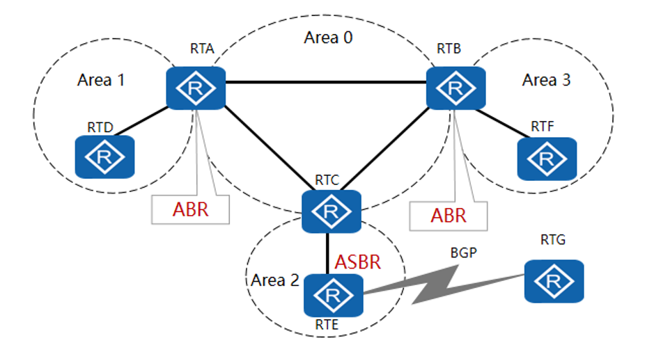

OSPF支持将一组网段组合在一起，这样的一个组合称为一个区域。一个OSPF网络可以划分成多个区域（Area）。如果一个OSPF网络只包含一个区域就称为单区域OSPF网络；如果一个OSPF网络包含了多个区域称为多区域OSPF网络。

 

1. OSPF网络中，如果一台路由器所有接口都属于同一个区域，则这样的路由器被称为内部路由器（Internal Router）；
2. OSPF网络中如果一台路由器包含属于Area 0 的接口，则这样的路由器被称为骨干路由器（Backbone Router）；
3. OSPF网络中如果一台路由器的某些接口属于Area 0 ，其他接口属于别的区域，则这样的路由器被称为区域边界路由器（ABR）；
4. 非骨干区域之间通信必须要要通过骨干区域中转才能进行；
5. 单区域只包含一个区域，这个区域必须是area 0；

 

- 划分OSPF区域可以缩小路由器的LSDB规模，减少网络流量；
- 区域内的详细拓扑信息不向其他区域发送，区域间传递的是抽象的路由信息，而不是详细的描述拓扑结构的链路状态信息。
- **每个区域都有自己的LSDB，不同区域的LSDB是不同的。**
- 路由器会为每一个自己所连接到的区域维护一个单独的LSDB。由于详细链路状态信息不会被发布到区域以外，因此LSDB的规模大大缩小了；

 

- 在OSPF网络中，每一个区域都有一个编号，称为Area-ID。Area 0为骨干区域，为了避免区域间路由环路，非骨干区域之间不允许直接相互发布路由信息。因此，每个区域都必须连接到骨干区域；
- 运行在区域之间的路由器叫做区域边界路由器ABR（Area Boundary Router），它包含所有相连区域的LSDB。自治系统边界路由器ASBR（Autonomous System Boundary Router）是指和其他AS中的路由器交换路由信息的路由器，这种路由器会向整个AS通告AS外部路由信息；

 

### 4.3 OSPF支持的网络类型

OSPF能够支持的网络类型，指的是OSPF能够支持的二层网络的类型，**OSPF能够支持广播网络、NBMA（Non-Boadcast Multi-Access）、点到点网络（P2P）和点到多点网络（P2MP）。**

 

**在广播网络和NBMA网络中:**

注意：OSPF路由器的某个接口的类型是与该接口直接相连的二层网络的类型是一致的。

比如，如果OSPF路由器某个接口连接的是一个广播网络，那么该接口就是一个广播接口；如果OSPF路由器某个接口连接的是一个P2P网络，那么该接口就是一个P2P网络接口；

#### 4.3.1 P2P网络

1、仅两台路由互连。

2、支持广播、组播。

#### 4.3.2 广播型网络

广播型网络支持两台及两台以上的设备接入同一共享链路且可以支持广播、组播报文的转发，是OSPF最常见的网络类型。

1、两台或两台以上的路由器通过共享介质互连。

2、支持广播、组播。

广播型网络的例子：通过以太网链路相连的路由器网络。

#### 4.3.3 NBMA网络

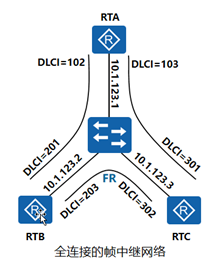

1、两台或两台以上路由器通过VC互连。

2、不支持广播、组播☆☆☆。

- 与广播型网络不同的是NBMA网络默认不支持广播与组播报文的转发。
- NBMA方式要求网络中的路由器组成全连接
- 在NBMA网络上，OSPF模拟在广播型网络上的操作，但是每个路由器的邻居需要手动配置。
- NBMA（non-broadcast multiple access）型网络的例子：通过全互连的帧中继链路相连的路由器网络.

#### 4.4.4 P2MP网络

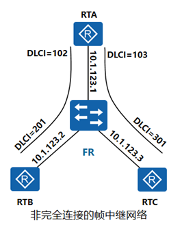

1、多个点到点网络的集合。

2、支持广播、组播☆☆☆。

- 将一个非广播网络看成是一组P2P网络，这样的非广播网络便成为了一个点到多点（P2MP）网络。在P2MP网络上，每个路由器的OSPF邻居可以使用反向地址解析协议（Inverse ARP）来发现。
- P2MP可以看作是多个P2P的集合，P2MP可以支持广播、组播的转发。
- 没有一种链路层协议默认属于P2MP类型网络，也就是说必须是由其他的网络类型强制更改为P2MP。常见的做法是将非完全连接的帧中继或ATM改为P2MP的网络。

### 4.5 链路状态与LSA

**OSPF是一种链路状态协议，所谓的链路状态，其实就是路由器的接口状态。**OSPF核心思想就是，每台路由器都将自己的各个接口的接口状态（即链路状态）共享给其他路由器。

#### 4.5.1 路由器接口状态

1、该接口的IP地址及掩码

2、该接口所属区域的Area-ID

3、该接口所属路由器的Router-ID

4、该接口的接口类型（也就是该接口的网络类型，如P2P，广播型）

5、该接口的接口开销（通常以接口带宽来定义接口开销，带宽越大，开销越小）

6、该接口所属的路由器的Router Priority（这个参数是用来选举DR与BDR的）

7、该接口所在二层网络中的DR

8、该接口所在二层网络中的BDR

9、该接口的HelloDeadInterval（接口发送Hello报文的间隔时间）

10、该接口的RouterDeadInterval（实效时间）

11、该接口所有邻居路由器

12、该接口认证类型

13、该接口秘钥等等

#### 4.5.2 LSA (链路状态通告)

LSA（Link State Advertisement）是路由器之间链路状态信息的载体。LSA是LSDB的最小组成单位，也就是说LSDB由一条条LSA构成的。LSA有十几种类型；

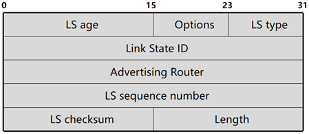

所有的LSA都拥有相同的头部，关键字段的含义如下：

- LS age：此字段表示LSA已经生存的时间，单位是秒。
- LS type：此字段标识了LSA的格式和功能。常用的LSA类型有五种。
- Link State ID：此字段是该LSA所描述的那部分链路的标识，例如Router ID等。
- Advertising Router：此字段是产生此LSA的路由器的Router ID。
- LS sequence number：此字段用于检测旧的和重复的LSA。

 

1、Type-1 LSA（Router LSA）；

2、Type-2 LSA（Network LSA）；

3、Type-3 LSA（Network Summary LSA）；

4、Type-4 LSA（ASBR Summary LSA）；

5、Type-5 LSA（ASExternal LSA）；

…

- 不同类型的LSA中所包含的链路状态的内容是不相同的；
- 不同类型的LSA的功能和作用也是不相同的；
- 不同类型的LSA通告范围也是不相同的；
- 不同角色的路由器能够产生的LSA的类型也是不同的；

###### 4.5.2.1 Type-1 LSA

- 每台路由器都会产生。Type-1LSA用来描述路由器各个接口的接口类型、IP地址、开销值等信息。
- 一个Type-1LSA只能在产生它的Area 内泛洪，不能泛洪到其他Area。

###### 4.5.2.2 Type-2 LSA

- 由DR产生。主要用来描述该DR所在的二层网络的网络掩码以及该二层网络中总共包含哪些路由器你。
- 一个Type-2 LSA只能在产生他的Area内泛洪，不能泛洪到其他区域。

###### 4.5.2.3 Type-3 LSA

- 由ABR产生。ABR路由器将自己所在的多个Area中的Type-1和Type-2 LSA转换成为Type-3 LSA，这些Type-3 LSA描述了Area之间的路由信息。
- Type-3可以泛洪到这个自治系统（整个OSPF网络）内部，但是不能泛洪到Totally Stub Area和Totally Not-So-Stubby Area。

###### 4.5.2.4 Type-4 LSA

- 由ASBR产生所在的Area的ABR产生。用来描述去往ASBR的路由信息。
- Type-4可以泛洪到整个自治系统（整个OSPF网络）内部，但是不能泛洪到Stub Area、Totally Stub Area、NOt-So-Stubby Area和Totally NOt-So-Stubby Area

###### 4.5.2.5 Type-5 LSA

- 由ASBR产生。用来描述去往自治系统外部的路由。
- Type-5 LSA可以泛洪到整个自治系统（整个OSPF网络）内部，但是不能泛洪到Stub Area、Totally Stub Area、NOt-So-Stubby Area和Totally NOt-So-Stubby Area

### 4.6 OSPF报文类型

OSPF的协议报文是直接封装在IP报文中 的，IP报文头部中的协议字段必须为89。

OSPF 本身5种类型，分别是Hello报文、DD报文、LSR报文、LSU报文、LSAck报文，各种不同类型的LSA其实只是包含在LSU报文中。

 

其他类型的OSPF报文中虽然没有携带LSA，但是仍然会携带一些链路状态信息，当然也会携带一些其他的信息。

| Type | 报文名称               | 报文功能               |
| ---- | ---------------------- | ---------------------- |
| 1    | Hello                  | 发现和维护邻居关系     |
| 2    | Database   Description | 交互链路状态数据库摘要 |
| 3    | Link   State Request   | 请求特定的链路状态信息 |
| 4    | Link   State Update    | 发送详细的链路状态信息 |
| 5    | Link   State Ack       | 发送确认报文           |

#### 4.6.1 OSPF协议报文头部

Version ：对于当前所使用的OSPFv2，该字段的值为2。

Type：OSPF报文类型。

Packet length：表示整个OSPF报文的长度，单位是字节。

Router ID：表示生成此报文的路由器的Router ID。

Area ID：表示此报文需要被通告到的区域。

Checksum：校验字段，其校验的范围是整个OSPF报文，包括OSPF报文头部。

Auth Type：为0时表示不认证；为1时表示简单的明文密码认证；为2时表示加密（MD5）认证。

Authentication：认证所需的信息。该字段的内容随AuType的值不同而不同。

#### 4.6.2 路由器接口hello报文信息

**Hello报文的作用：**

- 邻居发现：自动发现邻居路由器,并建立相邻关系，通过组播地址:224.0.0.5发送给ALLSPFRouters,通告两台路由器建立相邻关系所必需统一的参数
- 邻居建立：完成Hello报文中的参数协商，建立邻居关系。
- 邻居保持：通过Keepalive机制，检测邻居运行状态。

**OSPF的版本号**

该接口所属的路由器的Router-ID

该接口所属的区域ID

该接口的认证类型

该接口的秘钥

该接口的IP地址和掩码

该接口所属的路由器的Router Priority（这个参数是用来选举DR与BDR的）

该接口所在二层网络中的DR

该接口所在二层网络中的BDR

该接口的HelloDeadInterval（接口发送Hello报文的间隔时间）

该接口的RouterDeadInterval（实效时间）

该接口所有邻居路由器

### 4.7 邻居关系与邻接关系

在RIP网络中，如果路由器A与路由器B位于同一个二层网络，那么就说路由器A与路由器B是“邻居关系”；

在OSPF网络中，如果路由器A与路由器B位于同一个二层网络，只能说路由器A与路由器B“相邻”，不能说是“邻居关系”。相邻不等于邻居关系更不等于“邻接关系”

运行OSPF的路由器之间需要交换链路状态信息和路由信息，在交换这些信息之前路由器之间首先需要建立邻接关系。

#### 4.7.1 邻居关系

OSPF路由器启动后，便会通过OSPF接口向外发送Hello报文用于发现邻居。收到Hello报文的OSPF路由器会检查报文中所定义的一些参数，如果双方的参数一致，就会彼此形成邻居关系，状态到达2-way 即可称为建立了邻居关系。如果参数不一致，不能形成邻居关系。

##### 4.7.1.1 邻居发现

Hello报文用来发现和维持OSPF邻居关系

Hello报文的作用：

1、邻居发现：自动发现邻居路由器。

2、邻居建立：完成Hello报文中的参数协商，建立邻居关系。

3、邻居保持：通过Keepalive机制，检测邻居运行状态。

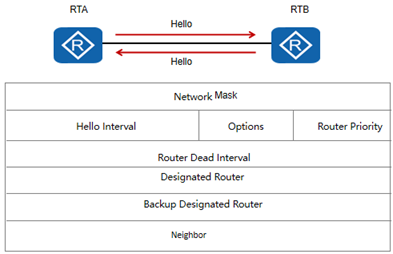

Network Mask：发送Hello报文的接口的网络掩码。

Hello Interval：发送Hello报文的时间间隔，单位为秒。

Options：标识发送此报文的OSPF路由器所支持的可选功能。

Router Priority：发送Hello报文的接口的Router Priority，用于选举DR和BDR。

Router Dead Interval：失效时间。如果在此时间内未收到邻居发来的Hello报文，则认为邻居失效；单位为秒，通常为四倍Hello Interval。

Designated Router：发送Hello报文的路由器所选举出的DR的IP地址。如果设置为0.0.0.0，表示未选举DR路由器。

Backup Designated Router：发送Hello报文的路由器所选举出的BDR的IP地址。如果设置为0.0.0.0，表示未选举BDR。

Neighbor：邻居的Router ID列表，表示本路由器已经从这些邻居收到了合法的Hello报文。

##### 4.7.1.2 邻居关系建立

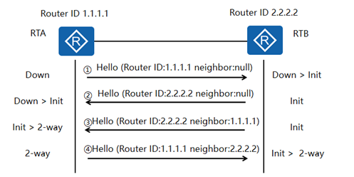

**状态含义：**

| 状态     | 含义                                                         | 状态     |
| -------- | ------------------------------------------------------------ | -------- |
| Down     | 这是邻居的初始状态，表示没有从邻居收到任何信息               | Down     |
| Init     | 在此状态下，路由器已经从邻居收到了Hello报文，但是自己的Router ID不在所收到的Hello报文的邻居列表中，表示尚未与邻居建立双向通信关系。 | Init     |
| 2-   Way | 在此状态下，路由器发现自己的Router ID存在于收到的Hello报文的邻居列表中，已确认可以双向通信。 | 2-   Way |

**邻居建立过程如下：**

1. RTA和RTB的Router ID分别为1.1.1.1和2.2.2.2。当RTA启动OSPF后，RTA会发送第一个Hello报文。此报文中邻居列表为空，此时状态为Down，RTB收到
2. RTA的这个Hello报文，状态置为Init。
3. RTB发送Hello报文，此报文中邻居列表为空，RTA收到RTB的Hello报文，状态置为Init。
4. RTB向RTA发送邻居列表为1.1.1.1的Hello报文，RTA在收到的Hello报文邻居列表中发现自己的Router ID，状态置为2-way。
5. RTA向RTB发送邻居列表为2.2.2.2的Hello报文，RTB在收到的Hello报文邻居列表中发现自己的Router ID，状态置为2-way。

因为邻居都是未知的，所以Hello报文的目的IP地址不是某个特定的单播地址。邻居从无到有，OSPF采用组播的形式发送Hello报文（目的地址224.0.0.5）。

对于不支持组播的网络可以通过手动配置实现邻居的发现与维护。

#### 4.7.2 邻接关系

形成邻居关系的双方不一定都能形成邻接关系，这要根据网络类型而定。只有当双方成功交换DD报文，并同步LSDB后，才形成真正意义上的邻接关系。

##### 4.7.2.1 邻接关系的建立（LSDB同步）

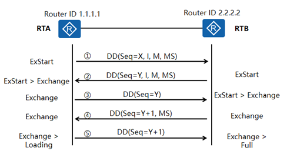

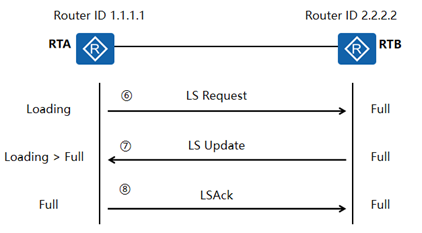

**状态含义：**

| 状态     | 含义                                                         | 状态     |
| -------- | ------------------------------------------------------------ | -------- |
| ExStart  | 邻居状态变成此状态以后，路由器开始向邻居发送DD报文。Master/Slave关系是在此状态下形成的，初始DD序列号也是在此状态下确定的。在此状态下发送的DD报文不包含链路状态描述。 | ExStart  |
| Exchange | 在此状态下，路由器与邻居之间相互发送包含链路状态信息摘要的DD报文。 | Exchange |
| Loading  | 在此状态下，路由器与邻居之间相互发送LSR报文、LSU报文、LSAck报文。 | Loading  |
| Full     | LSDB同步过程完成，路由器与邻居之间形成了完全的邻接关系。     | Full     |

 

**LSDB同步过程如下：**

1、RTA和RTB的Router ID分别为1.1.1.1和2.2.2.2并且二者已建立了邻居关系。当RTA的邻居状态变为ExStart后，RTA会发送第一个DD报文。此报文中，DD序列号被随机设置为X，I-bit设置为1，表示这是第一个DD报文，M-bit设置为1，表示后续还有DD报文要发送，MS-bit设置为1，表示RTA宣告自己为Master。

2、当RTB的邻居状态变为ExStart后，RTB会发送第一个DD报文。此报文中，DD序列号被随机设置为Y（I-bit=1，M-bit=1，MS-bit=1，含义同上）。由于RTB的Router ID较大，所以RTB将成为真正的Master。收到此报文后，RTA会产生一个Negotiation-Done事件，并将邻居状态从ExStart变为Exchange。

3、当RTA的邻居状态变为Exchange后，RTA会发送一个新的DD报文，此报文中包含了LSDB的摘要信息，序列号设置为RTB在步骤2中使用的序列号Y，I-bit=0，表示这不是第一个DD报文，M-bit=0，表示这是最后一个包含LSDB摘要信息的DD报文，MS-bit=0，表示RTA宣告自己为Slave。收到此报文后，RTB会产生一个Negotiation-Done事件，并将邻居状态从ExStart变为Exchange。

4、当RTB的邻居状态变为Exchange后，RTB会发送一个新的DD报文，此报文包含了LSDB的摘要信息，DD序列号设置为Y+1, MS-bit=1，表示RTB宣告自己为Master。

5、虽然RTA不需要发送新的包含LSDB摘要信息的DD报文，但是作为Slave，RTA需要对Master发送的每一个DD报文进行确认。所以，RTA向RTB发送一个新的DD报文，序列号为Y+1，该报文内容为空。发送完此报文后，RTA产生一个Exchange-Done事件，将邻居状态变为Loading。RTB收到此报文后，会将邻居状态变为Full（假设RTB的LSDB是最新最全的，不需要向RTA请求更新）。

6、RTA开始向RTB发送LSR报文，请求那些在Exchange状态下通过DD报文发现的、并且在本地LSDB中没有的链路状态信息。

7、RTB向RTA发送LSU报文，LSU报文中包含了那些被请求的链路状态的详细信息。RTA在完成LSU报文的接收之后，会将邻居状态从Loading变为Full。

8、RTA向RTB发送LSAck报文，作为对LSU报文的确认。RTB收到LSAck报文后，双方便建立起了完全的邻接关系。

##### 4.7.2.2 P2P网络和P2MP网络

- 如果两台邻居路由器之间的二层网络是P2P网络或P2MP网络，则这两台邻居路由器之间一定会进入LSDB同步的过程；
- 当这两台路由器之间完成了LSDB同步的过程说明他们之间建立了邻接关系，彼此之间成为了对方的邻接路由器；
- LSDB同步的过程是为了保证参与LSDB同步的路由器最终能够拥有完全一样的LSDB。
- LSDB同步是交互DD报文，LSR报文和LSU报文来实现的；

##### 4.7.2.3 Broadcast网络和NBMA网络

- 如果两台邻居路由器之间的二层网络是P2P网络或P2MP网络，并且其中一台路由器是这个二层网络的DR或BDR，那么这两台邻居路由器一定会进入彼此之间的LSDB同步的过程；
- 当这两台路由器之间完成了LSDB同步之后，他们之间建立了邻接关系；
- 如果这两台路由器都不是这个二层网络的DR或BDR，那么这两台路由器就不会进入彼此之间的LSDB的同步过程，也就是说，彼此之间是不可能建立起邻居关系；
- 一个OSPF网络中的邻接关系一定是小于等于邻居关系的；

#### 4.7.3 OSPF邻居关系状态机

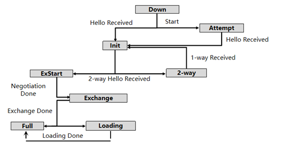

Down：这是邻居的初始状态，表示没有从邻居收到任何信息。在NBMA网络上，此状态下仍然可以向静态配置的邻居发送Hello报文，发送间隔为PollInterval，通常和Router DeadInterval间隔相同。

Attempt：此状态只在NBMA网络上存在，表示没有收到邻居的任何信息，但是已经周期性的向邻居发送报文，发送间隔为HelloInterval。如果Router DeadInterval间隔内未收到邻居的Hello报文，则转为Down状态。

Init：在此状态下，路由器已经从邻居收到了Hello报文，但是自己不在所收到的Hello报文的邻居列表中，表示尚未与邻居建立双向通信关系。在此状态下的邻居要被包含在自己所发送的Hello报文的邻居列表中。

2-Way Received：此事件表示路由器发现与邻居的双向通信已经开始（发现自己在邻居发送的Hello报文的邻居列表中）。Init状态下产生此事件之后，如果需要和邻居建立邻接关系则进入ExStart状态，开始数据库同步过程，如果不能与邻居建立邻接关系则进入2-Way。

2-Way：在此状态下，双向通信已经建立，但是没有与邻居建立邻接关系。这是建立邻接关系以前的最高级状态。

1-Way Received：此事件表示路由器发现自己没有在邻居发送Hello报文的邻居列表中，通常是由于对端邻居重启造成的。

ExStart：这是形成邻接关系的第一个步骤，邻居状态变成此状态以后，路由器开始向邻居发送DD报文。主从关系是在此状态下形成的；初始DD序列号是在此状态下决定的。在此状态下发送的DD报文不包含链路状态描述。

Exchange：此状态下路由器相互发送包含链路状态信息摘要的DD报文，描述本地LSDB的内容。

Loading：相互发送LS Request报文请求LSA，发送LS Update通告LSA。

Full：两台路由器的LSDB已经同步。

### 4.8 DR与BDR

在P2P或P2MP网络中完全不存在DR与BDR的概念，DR与BDR只适用于Broadcast网络或NBMA网络。

| 网络类型 | 是否和邻居建立邻接关系                                       | 网络类型          |
| :------------------------ | ------------------------------------------------------------ | ------------------ -----------|
| P2P / P2MP       | 是                                                           | P2P   / P2MP       |
| Broadcast / NBMA | DR与BDR 、DRother建立邻接关系——BDR与DR 、DRother建立邻接关系 ——DRother之间只建立邻居关系 | Broadcast   / NBMA |

#### 4.8.1 DR与BDR的作用

- 每一个含有至少两个路由器的广播型网络和NBMA网络都有一个DR和BDR。

- DR和BDR可以减少邻接关系的数量，从而减少链路状态信息以及路由信息的交换次数，这样可以节省带宽，降低对路由器处理能力的压力。在没有DR的广播网络上，邻接关系的数量可以根据公式n(n-1)/2计算出，n代表参与OSPF的路由器接口的数量。

- BDR作用：当DR发生故障的时候，BDR能够迅速代替DR的角色；

#### 4.8.2 DR与BDR的选举

- 在邻居发现完成之后，路由器会根据网段类型进行DR选举。在广播和NBMA网络上，路由器会根据参与选举的每个接口的优先级进行DR选举。

- 优先级取值范围为0-255，值越高越优先。缺省情况下，接口优先级为1。**如果一个接口优先级为0，那么该接口将不会参与DR或者BDR的选举。**如果优先级相同时，则比较Router ID，值越大越优先被选举为DR。（越大越优先）

- BDR与DR的选举规则是一样的，同一个网络中同一台路由器 不会即作为DR又作为BDR；

- DR与BDR具有非抢占性。为了维护网络上邻接关系的稳定性，如果网络中已经存在DR和BDR，则新添加进该网络的路由器不会成为DR和BDR，不管该路由器的Router Priority是否最大。如果当前DR发生故障，则当前BDR自动成为新的DR，网络中重新选举BDR；如果当前BDR发生故障，则DR不变，重新选举BDR；

- 实质上，DR与BDR只是路由器的某个接口的属性，而不是路由器本身的属性；

