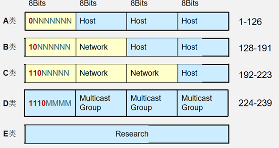

# 通信基础

## 1、OSI七层模型

### 1.1 OSI七层模型结构及各层常见设备

​	    模型把网络通信的工作分为7层。1至4层被认为是低层，这些层与数据移动密切相关。5至7层是高层，包含应用程序级的数据。每一层负责一项具体的工作，然后把数据传送到下一层。由低到高具体分为：物理层、数据链路层、网络层、传输层、会话层、表示层和应用层。

7）应用层—直接对应用程序提供服务，应用程序可以变化，但要包括电子消息传输

6）表示层—格式化数据，以便为应用程序提供通用接口。这可以包括加密服务

5）会话层—在两个节点之间建立端连接。此服务包括建立连接是以全双工还是以半双工的方式进行设置，尽管可以在层4中处理双工方式

4）传输层—常规数据递送－面向连接或无连接。包括全双工或半双工、流控制和错误恢复服务 

3）网络层—本层通过寻址来建立两个节点之间的连接，它包括通过互连网络来路由和中继数据

2）数据链路层—在此层将数据分帧，并处理流控制。本层指定拓扑结构并提供硬件寻址

1）物理层—原始比特流的传输电子信号传输和硬件接口数据发送时，从第七层传到第一层，接受方则相反。

 

**各层常见设备：**

应用层——计算机：应用程序，如FTP，SMTP，HTTP

表示层——计算机：编码方式，图像编解码、URL字段传输编码

会话层——计算机：建立会话，SESSION认证、断点续传

传输层——计算机：进程和端口

网络层——网络：路由器，防火墙、多层交换机

数据链路层——网络：网卡，网桥，交换机

物理层——网络：中继器，集线器、网线、HUB

### 1.2 七层结构详解

7）应用层

**作用**：为应用软件提供接口，使应用程序能够使用网络服务

常见的应用层协议：http(80)、ftp(20/21)、smtp(25)、pop3(110)、telnet(23)、dns(53)等

6）表示层

**作用**：数据的解码和编码、数据的加密和解密、数据的压缩和解压缩

常见的标准如：ASCI、IJPEG、……

5）会话层

**作用**：负责建立、管理和终止表示层实体之间的会话连接

在各节点之间提供会话控制

它在系统之间协调通信过程,并提供3种不同的方式 来组织它们之间的通信:单工、半双工和全双工

4）传输层：

**作用**：负责建立端到端的连接，保证报文在端到端之间的传输。

服务点编址、分段与重组、连接控制、流量控制、 差错控制。

3）网络层

**作用**：为网络设备提供逻辑地址（三层地址）

进行路由选择、维护路由表

负责将分组数据从源端传输到目的端

**设备：路由器（Router）**

广播、组播隔绝

寻址及转发，选择到达目的网络的最佳路径

流量管理

连接广域网(WAN)

**逻辑地址：IP地址（三层、不同网络间通信时关注）**

2）数据链路层的作用：

**作用**：在不可靠的物理链路上，提供可靠的数据传输服务，把帧从一跳（结点）移动到另一跳（结点）。

组帧、物理编址、流量控制、差错控制、接入控制

**设备：交换机**

每个端口是一个冲突域

整台交换机属于一个广播域

**物理地址（硬件地址）：MAC地址（二层，烧录在网卡上不变，本地有效，同一网段内关注，到了LAN局域网里才考虑MAC）**

1）物理层的作用：

- 负责把逐个的比特从一跳（结点）移动到另一跳（结点）。

物理层功能：

- 定义接口和媒体的物理特性
- 定义比特的表示、数据传输速率、信号的传输模式（单工、半双工、全双工）
- 定义网络物理拓扑（网状、星型、环型、总线型等拓扑）

**设备：集线器**

- 整台设备在同一个冲突域 (collision domain)
- 整台设备都在同一个广播域( broadcast domain)
- 设备共享带宽

### 1.3理解数据通信的过程

**通信过程详解：**

**主机A：**应用层telnet进程产生数据包，经过表示层加密，会话层建立会话到达传输层，将数据分段，建立端到端的连接。并添加tcp头部，包括源端口（随机）和目的端口（23）。到达网络层，添加IP报头，包括源目的IP地址。并将数据打包成数据分组。到达数据链路层，添加帧头以及校验尾，帧头包括源目的MAC，如果没有目的MAC还要通过ARP请求获取目的MAC，如果是跨网段则目的mac为网关的接口mac。到达物理层，将数据转变成比特流在链路上传输。

**路由器：**数据包到达路由器，先将比特流转变为数据帧，检查帧头中的目的MAC，发现为自身的网卡mac，拆掉帧头帧尾，送到网络层，检查目的IP，发现是主机B的IP地址。则重新封装上IP报头，到达数据链路层将源mac换成自己的出口网卡mac，封装上目的主机B的mac，加上帧尾。送往物理层转变为比特流，继续传输。

**主机B：**主机B物理层收到比特流，同上路由器解封装的过程，网络层解封装后发现目的IP是自己的IP。去掉报头，送往传输层，传输层检查目的端口，发现为23，去掉TCP头部后送往应用层的telnet协议处理数据。

**以上便是数据通信的整个过程，总结一句，数据通信的过程中，IP不变，MAC变。（注：NAT情况特殊）**

### 1.4 OSI模型的优点

1. 将网络的通信过程划分为小一些、简单一些的部件,因此有助于各个部件的开发、设计和故障排除
2. 通过网络组件的标准化,允许多个供应商进行开发
3. 通过定义在模型的每一层实现什么功能,鼓励产业的标准化
4. 允许各种类型的网络硬件和软件相互通信
5. 防止对某一层所做的改动影响到其他的层,这样就有利于开发

## 2、TCP/IP参考模型

### 2.1 结构

TCP/IP各层协议：

### 2.2 四层结构详解

4）应用层协议

HTTP      80：超文本传输协议，提供浏览网页服务

Telnet    23：远程登陆协议，提供远程管理服务

FTP 20、21：文件传输协议，提供互联网文件资源共享服务

SMTP     25：简单邮件传输协议，提供互联网电子邮件服务

POP3     110：邮局协议，提供互联网电子邮件服务

TFTP      69 (UDP)：简单文件传输协议，提供简单的文件传输服务

3）主机到主机层

**a.TCP(传输控制协议)属于面向连接的网络协议：**

- 面向连接 可靠传输
- 流控及窗口机制 
- 使用TCP的应用：Web浏览器；电子邮件；文件传输程序

**报文格式：**

**b.UDP(用户报文协议)属于无连接的网络协议：**

- 无连接
- 不可靠传输
- 尽力而为的传输 使用UDP的应用：域名系统 (DNS)；视频流；IP语音(VoIP)

**报文格式：**

**TCP/UDP端口号：**

- 源端口随机分配，目标端口使用知名端口
- 应用客户端使用的源端口号一般为系统中未使用的且大于1023；
- 目的端口号为服务器端应用服务的进程。如telnet为23。

 

**TCP三次握手：**

 

**TCP窗口机制：**

 

2）因特网层

网络层也叫Internet层

- 负责将分组报文从源端发送到目的端

网络层作用

- 为网络中的设备提供逻辑地址
- 负责数据包的寻径和转发

**协议：**

 

**IP报文格式：**

 

**ARP** **协议具有两项基本功能：**

- 将IPv4地址解析为 MAC 地址
- 维护映射的缓存

 

**ICMP：**

1. Ping是个应用程序，它的作用及工作原理

   目的：测试网络层的连通性 （在网络层模拟应用的双向通信）

   工作原理：

   - 发送ICMP的echo request

   - ICMP被IP封装,中间网络设备看到的是IP包
   - 目标主机接收到echo request发送echo  reply

2. tracert：记录到达目标网络所经过的每一跳地址。

## 3、VLSM

### 3.1 IP地址简述

 

**IP地址分类：**

- 网络地址：指代网络的地址。在网络的 IPv4 地址范围内，最小地址保留为网络地址。此地址的主机部分的每个主机位均为0。
- 广播地址：用于向网络中的所有主机发送数据的特殊地址。广播地址使用该网络范围内的最大地址。即主机部分的各比特位全部为1的地址。
- 主机地址：可分配给网络中终端设备的地址。

### 3.2如何进行子网划分

1）判断类别 找掩码

2）变更掩码 找子网

3）得出子网号

4）得出主机段

5）得出广播号

借用m位主机位：产生2^m个子网

剩n位主机位：2^n-2个可用主机地址

主机块大小：2^n

### 3.3 私有IP地址范围

私有IP地址范围包括：

A类：10.0.0.0/8

B类：172.16.0.0/12 即172.16.0.1-172.31.255.254共16个B类网络

C类：192.168.0.0/16即192.168.0.1-192.168.255.254共256个C类网络